# 🧩 PR 64 — Fase 2: Fundação Relacional Mínima para ID Resolution
## Alinhamento da referência mínima ao modelo real da API principal

---

---

> [!IMPORTANT]
> Esta PR redesenha o recorte da PR 64 para refletir a estrutura real utilizada na classificação de questões na base principal.
>
> - substitui premissas indevidas sobre o schema anterior
> - ancora a referência mínima nas tabelas corretas
> - preserva recorte pequeno e sem lookup expandido nesta etapa
> - prepara evolução posterior sobre base aderente ao legado
>
> **Esta PR não implementa fuzzy matching, cache, múltiplas estratégias ou pipeline avançado de classificação.**

## Sumário

1. [Síntese Executiva](#1-síntese-executiva)
2. [Objetivo do PR](#2-objetivo-do-pr)
3. [Decisão Arquitetural](#3-decisão-arquitetural)
4. [Escopo](#4-escopo)
5. [Fora de Escopo](#5-fora-de-escopo)
6. [Fluxo Arquitetural](#6-fluxo-arquitetural)
7. [Contratos Mínimos](#7-contratos-mínimos)
8. [Regras de Implementação](#8-regras-de-implementação)
9. [Critérios de Review](#9-critérios-de-review)
10. [Critérios de Aceite](#10-critérios-de-aceite)
11. [Conclusão](#11-conclusão)

## 1. Síntese Executiva

Durante o review foi identificado que a foundation proposta inicialmente não refletia a estrutura real da base principal. O eixo correto para suportar classificação está associado às tabelas `filters` e `question_sub_matters`, e não ao modelo previamente assumido.

Esta PR corrige essa direção arquitetural no menor recorte possível: ajusta a referência relacional mínima para espelhar a fonte real de dados e remove premissas incorretas antes de qualquer expansão funcional.

## 2. Objetivo do PR

- alinhar a base relacional ao modelo real da API principal
- corrigir a foundation da trilha de classificação
- introduzir apenas a estrutura mínima necessária para evolução futura
- evitar continuidade sobre premissa incorreta
- manter mudança pequena e revisável

## 3. Decisão Arquitetural

A decisão desta PR é corrigir primeiro a fundação relacional antes de ampliar comportamento. Em vez de insistir em um schema artificial, o projeto passa a se apoiar nas estruturas reais já existentes no legado.

Com isso, futuras evoluções de lookup e classificação avançada poderão crescer sobre um boundary aderente, reduzindo retrabalho e ruído arquitetural.

## 4. Escopo

- ajustar tipos e acesso da base principal para o modelo real
- introduzir referência mínima baseada em `filters`
- introduzir referência mínima baseada em `question_sub_matters`
- remover premissas incompatíveis com o legado
- manter compatibilidade do restante do fluxo atual

## 5. Fora de Escopo

- lookup funcional completo
n- fuzzy matching
- heurísticas de classificação
- cache Redis
- sincronização local
- múltiplas tabelas além do necessário
- refatoração ampla de módulos
- agentes avançados nesta entrega

## 6. Fluxo Arquitetural

```mermaid
%%{init: {
  "theme": "base",
  "themeVariables": {
    "background": "#050b16",
    "primaryColor": "#0b1220",
    "primaryTextColor": "#ffffff",
    "primaryBorderColor": "#22d3ee",
    "lineColor": "#94a3b8",
    "secondaryColor": "#0b1220",
    "tertiaryColor": "#0b1220",
    "fontFamily": "Inter, Arial, sans-serif"
  },
  "flowchart": {
    "htmlLabels": true,
    "curve": "linear",
    "nodeSpacing": 34,
    "rankSpacing": 44
  }
}}%%
flowchart LR
    A["Metadata atual"] --> B["Boundary relacional corrigido"]
    B --> C["filters"]
    B --> D["question_sub_matters"]
    C --> E["Base correta para evolução"]
    D --> E
    E --> F["Próximos slices funcionais"]

    classDef step1 fill:#0b1325,stroke:#3b82f6,stroke-width:2px,color:#ffffff;
    classDef step2 fill:#0a1a22,stroke:#22d3ee,stroke-width:2px,color:#ffffff;
    classDef step3 fill:#201d10,stroke:#eab308,stroke-width:2px,color:#ffffff;
    classDef step4 fill:#181629,stroke:#a78bfa,stroke-width:2px,color:#ffffff;
    classDef step5 fill:#112015,stroke:#84cc16,stroke-width:2px,color:#ffffff;
    classDef step6 fill:#1e293b,stroke:#f8fafc,stroke-width:2px,color:#ffffff;
    classDef decision fill:#181629,stroke:#a78bfa,stroke-width:2px,color:#ffffff;
    classDef successBox fill:#112015,stroke:#84cc16,stroke-width:2px,color:#ffffff;
    classDef failureBox fill:#2a160f,stroke:#fb7185,stroke-width:2px,color:#ffffff;
    classDef outputBox fill:#1e293b,stroke:#f8fafc,stroke-width:2px,color:#ffffff;
    classDef foundationBox fill:#1e293b,stroke:#f8fafc,stroke-width:2px,color:#ffffff;
    classDef coreBox fill:#1e293b,stroke:#f8fafc,stroke-width:2px,color:#ffffff;

    class A step1;
    class B step2;
    class C step3;
    class D step4;
    class E step5;
    class F step6;

    linkStyle 0 stroke:#9ca3af,stroke-width:2px;
    linkStyle 1 stroke:#9ca3af,stroke-width:2px;
    linkStyle 2 stroke:#9ca3af,stroke-width:2px;
    linkStyle 3 stroke:#9ca3af,stroke-width:2px;
    linkStyle 4 stroke:#9ca3af,stroke-width:2px;
```

## 7. Contratos Mínimos

Nenhum contrato externo precisa ser expandido nesta etapa. O foco é correção estrutural interna da fonte relacional.

## 8. Regras de Implementação

- refletir o schema real disponível
- evitar abstrações desnecessárias
- alterar apenas o necessário para corrigir a base
- preservar comportamento atual onde possível
- não antecipar regras de negócio futuras
- manter leitura simples e objetiva

## 9. Critérios de Review

- a estrutura reflete o modelo real informado no review
- uso correto de `filters` e `question_sub_matters`
- recorte permanece pequeno
- ausência de expansão funcional indevida
- código simples e aderente ao momento do projeto
- base preparada para próximos passos

## 10. Critérios de Aceite

- [ ] schema anterior incorreto foi removido ou ajustado
- [ ] referência mínima usa estruturas reais do legado
- [ ] restante do fluxo segue estável
- [ ] suíte de testes permanece verde
- [ ] PR continua pequena e revisável

## 11. Conclusão

A PR 64 redesenhada deixa de abrir evolução sobre uma fundação artificial e reposiciona a trilha de classificação na estrutura real do sistema principal. O ganho principal desta entrega é arquitetural: corrigir a base antes de acelerar os próximos passos.

