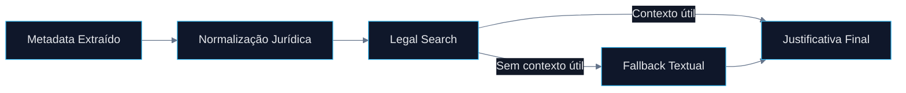

# 🤖 PR 75 — Fase 2: Robustez Controlada da Referência Jurídica no Fluxo Avançado

## Aproveitamento mais resiliente do contexto legal antes da composição final da resposta

---

> [!IMPORTANT]
> Esta PR dá continuidade direta à evolução funcional dos agents avançados após a PR 74. O foco agora não está na composição textual final, mas em aumentar a robustez da etapa jurídica que abastece essa composição. O recorte permanece pequeno, incremental e concentrado em elevar a resiliência do pipeline atual sem reabrir decisões arquiteturais anteriores.

---

# 1. Síntese Executiva

Após consolidar a utilização do contexto jurídico na resposta final, o próximo passo natural é reduzir perdas de valor quando a referência legal chega parcial, imperfeita ou com pequenas variações textuais.

A PR 75 fortalece o aproveitamento da referência jurídica dentro do fluxo avançado, aumentando a chance de recuperar contexto útil antes do fallback textual, sem introduzir nova orquestração, novos agents ou complexidade paralela.

---

# 2. Objetivo do PR

Tornar a etapa jurídica mais resiliente para que o pipeline consiga extrair valor mesmo quando os metadados legais não estiverem no formato ideal.

Objetivos diretos:

* normalizar melhor referências jurídicas recebidas
* evitar perda precoce de contexto legal válido
* melhorar a taxa de uso de `legalSearch`
* preservar fallback simples quando não houver contexto utilizável
* manter o contrato público atual intacto

---

# 3. Decisão Arquitetural

A robustez será adicionada **dentro do fluxo existente**, priorizando evolução localizada do comportamento atual.

Não haverá:

* novo agent dedicado
* nova camada de resolução
* redesign do orchestrator
* múltiplos pipelines paralelos
* expansão indevida de contratos públicos

A decisão é fortalecer os pontos já responsáveis pela leitura e uso da referência jurídica.

---

# 4. Escopo da PR

## Incluído

* refinamento da normalização de `article` e `law`
* tratamento mais robusto de referência parcial controlada
* melhor critério para considerar contexto jurídico utilizável
* fallback mínimo e previsível quando necessário
* ajustes proporcionais de testes unitários

## Fora de Escopo

* busca semântica avançada
* novo provider externo
* redesign da classificação
* múltiplas estratégias complexas de matching
* alterações no shape final da resposta
* expansão estrutural da fase 2

---

# 5. Fluxo Arquitetural

---

# 6. Contratos Mínimos

Nenhuma alteração obrigatória de contrato público é esperada.

O comportamento evolui internamente preservando:

* `legalSearch`
* `adaptedStatement`
* `answerKey`
* `metadata`
* `ids`

Caso algum tipo interno precise ajuste, ele deve ser mínimo e restrito ao slice.

---

# 7. Estratégia de Implementação

Ordem recomendada:

1. `initial-question-processing.agent.ts`
2. `legal-search.agent.ts` (se necessário)
3. specs do processing
4. specs do legal search
5. validação regressiva do fluxo existente

Princípio central:

> fortalecer o caminho atual antes de criar qualquer novo caminho.

---

# 8. Critérios de Review

Validar se:

* o recorte permaneceu pequeno
* houve ganho funcional real
* não surgiram branches excessivos
* o fallback continua simples
* contratos públicos foram preservados
* a robustez adicionada é objetiva e testável
* não houve overengineering

---

# 9. Critérios de Aceite

* referências jurídicas parciais têm melhor aproveitamento
* contexto útil deixa de ser perdido prematuramente
* fallback continua funcionando
* testes cobrindo novos cenários passam
* suíte regressiva permanece íntegra

---

# 10. Impacto Esperado

Melhora incremental na qualidade do fluxo avançado em casos reais onde os metadados chegam imperfeitos, sem custo estrutural relevante.

A plataforma passa a aproveitar melhor sinais jurídicos já existentes antes de desistir para o fallback textual.

---

# 11. Conclusão

A PR 75 representa o próximo passo maduro da fase 2: depois de consolidar a composição final, fortalecer a qualidade do insumo jurídico que alimenta essa composição.

É um avanço funcional, incremental e coerente com a linha evolutiva construída até aqui.
