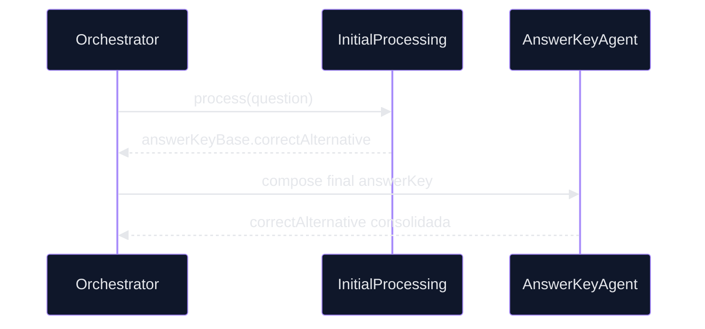

# 🤖 PR 77 — Fase 2: Consolidação Funcional da Alternativa Correta

## Fortalecimento do uso de `correctAnswer` na composição final do fluxo avançado

> [!IMPORTANT]
> Esta PR redireciona o eixo evolutivo da fase avançada para evitar redundância com as PRs 75 e 76. O foco deixa de ser refinamento contextual e passa a ser a integridade funcional da alternativa correta no resultado final processado, preservando o recorte incremental e a arquitetura vigente.

---

##     

## 1. Síntese Executiva

O pipeline já recebe `correctAnswer` no input e o propaga entre etapas. Entretanto, a utilização desse dado no fechamento do `answerKey` pode ser tornada mais explícita, previsível e resiliente.

Esta PR consolida regras mínimas para a alternativa correta durante a montagem do resultado final, elevando consistência sem introduzir novos componentes.

## 2. Objetivo do PR

Fortalecer a utilização de `correctAnswer` como dado funcional do fluxo avançado, reduzindo dependência de fallback implícito e reforçando a integridade de `answerKey.correctAlternative`.

## 3. Decisão Arquitetural

A responsabilidade permanece distribuída entre os serviços já existentes. Não há novos agents, módulos ou camadas.


Princípios aplicados:

* recorte pequeno
* prioridade explícita da alternativa correta
* fallback controlado quando ausente
* preservação do contrato final

## 4. Escopo

### Incluído

* revisar uso de `correctAnswer` no fluxo avançado
* explicitar regra de prioridade para `correctAlternative`
* garantir consistência entre valor intermediário e output final
* reforçar testes de presença e ausência da alternativa correta
* reduzir inferência implícita no fechamento do answer key

### Fora de Escopo

* inferência automática por IA
* validação semântica entre alternativas e justificativa
* novos agents
* redesign do orchestrator
* score de confiança

## 5. Fluxo Arquitetural



## 6. Contratos Mínimos

Sem alteração estrutural obrigatória no output:

```ts
{
  answerKey: {
    correctAlternative,
    justification,
    source
  }
}
```

A evolução está na consistência de preenchimento e priorização do campo.

## 7. Regras de Implementação

* preferir ajustes locais aos agents existentes
* evitar abstrações prematuras
* manter compatibilidade com specs atuais quando possível
* tratar ausência de `correctAnswer` de forma explícita
* manter legibilidade das regras de fallback

## 8. Critérios de Review

* a alternativa correta ficou mais previsível no fluxo?
* houve redução de fallback implícito?
* o output final permaneceu estável?
* o recorte permaneceu pequeno?
* a fase avançada evitou expansão desnecessária?

## 9. Critérios de Aceite

* `correctAlternative` consolidada corretamente
* cenários com e sem `correctAnswer` cobertos
* testes verdes
* nenhuma regressão no orchestrator
* output final consistente

## 10. Riscos e Mitigações

| Risco                        | Mitigação                      |
| ---------------------------- | ------------------------------ |
| Regressão no answerKey       | ampliar cobertura de specs     |
| Mudança indevida no contrato | preservar shape atual          |
| Complexidade desnecessária   | limitar ajustes ao fluxo atual |

## 11. Conclusão

A PR 77 reposiciona a evolução do pipeline avançado para um eixo funcional: integridade da resposta final. Ao fortalecer o tratamento da alternativa correta, o sistema ganha previsibilidade prática sem repetir ciclos anteriores de refinamento.
