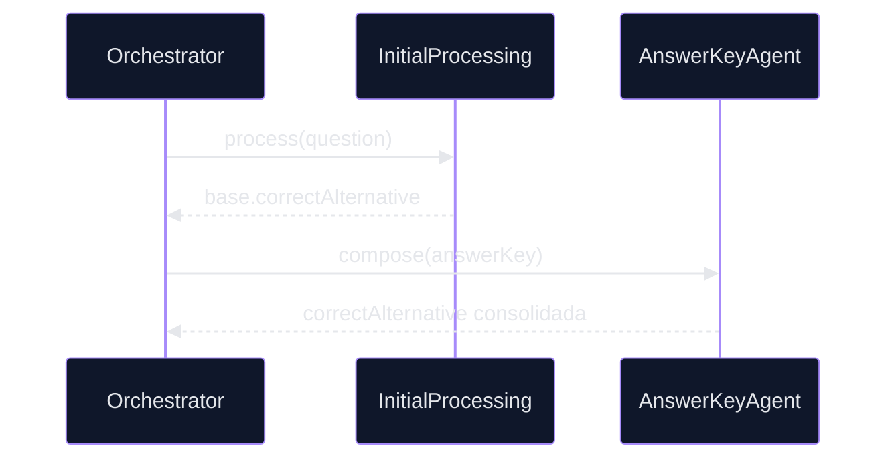

# 🤖 PR 77 — Fase 2: Consolidação Funcional da Alternativa Correta

## Fortalecimento do uso de `correctAnswer` na composição final do fluxo avançado

---

    

> [!IMPORTANT]
> Esta PR reposiciona a evolução da fase avançada para um eixo funcional: integridade da alternativa correta no resultado final. O foco sai de refinamentos contextuais anteriores e entra na previsibilidade de `answerKey.correctAlternative`, preservando o recorte incremental e a arquitetura vigente.

## 1. Síntese Executiva

O pipeline já recebe `correctAnswer` no input e o propaga entre etapas intermediárias. Entretanto, a consolidação desse valor no fechamento do `answerKey` ainda pode ser tornada mais explícita e resiliente.

Esta PR fortalece a prioridade funcional de `correctAnswer` durante a composição final do resultado processado, reduzindo dependência de fallback implícito e elevando consistência sem expansão arquitetural.

## 2. Objetivo do PR

Consolidar o uso de `correctAnswer` como fonte prioritária para preenchimento de `answerKey.correctAlternative`, mantendo compatibilidade com o fluxo atual e previsibilidade operacional.

## 3. Decisão Arquitetural

A responsabilidade permanece distribuída entre os componentes já existentes. Não há criação de novos agents, módulos, camadas ou contratos paralelos.


Diretrizes aplicadas:

* recorte pequeno
* prioridade explícita da alternativa correta
* fallback controlado quando ausente
* preservação do contrato final
* zero sobreengenharia

## 4. Escopo da PR

### Incluído

* revisar uso de `correctAnswer` no fluxo avançado
* explicitar prioridade de preenchimento para `correctAlternative`
* garantir consistência entre valor intermediário e output final
* reforçar cenários com presença e ausência da alternativa correta
* reduzir inferência implícita no fechamento do answer key

### Fora de Escopo

* inferência automática por IA
* validação semântica entre alternativas e justificativa
* novos agents
* redesign do orchestrator
* score de confiança
* mudanças amplas de contrato

## 5. Fluxo Arquitetural



## 6. Contratos Mínimos

Sem alteração estrutural obrigatória no output final.

```ts
{
  answerKey: {
    correctAlternative,
    justification,
    source
  }
}
```

A evolução ocorre na regra de priorização e consistência de preenchimento do campo.

## 7. Estratégia de Implementação

* preferir ajustes locais nos services/agents existentes
* evitar abstrações prematuras
* manter compatibilidade com specs atuais
* tratar ausência de `correctAnswer` de forma explícita
* manter regras de fallback legíveis e testáveis

## 8. Critérios de Review

* a alternativa correta ficou mais previsível no fluxo?
* houve redução de fallback implícito?
* o output final permaneceu estável?
* o recorte permaneceu pequeno?
* a solução evitou expansão desnecessária?

## 9. Critérios de Aceite

* `correctAlternative` consolidada corretamente
* cenários com e sem `correctAnswer` cobertos
* testes verdes
* nenhuma regressão no orchestrator
* output final consistente

## 10. Impacto Esperado

| Vetor        | Resultado                            |
| ------------ | ------------------------------------ |
| Consistência | Maior previsibilidade do campo final |
| Manutenção   | Regras mais claras e localizadas     |
| Risco        | Baixo, sem mudança estrutural        |
| Evolução     | Base funcional mais sólida           |

## 11. Conclusão

A PR 77 fortalece um ponto funcional crítico do pipeline avançado: a integridade da resposta correta no resultado final. O ganho principal é previsibilidade prática com baixo risco e sem repetir ciclos anteriores de refinamento contextual.
