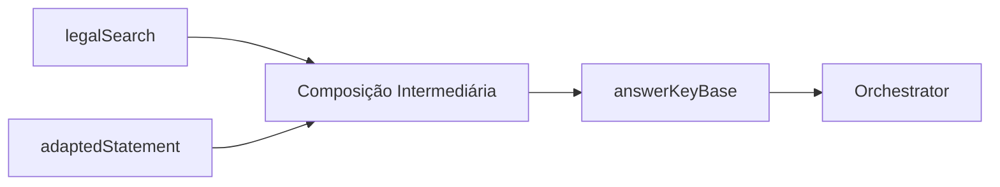
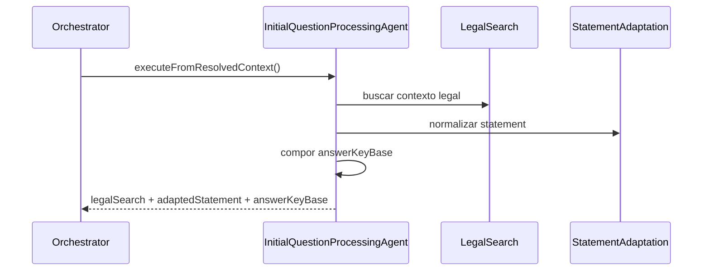

# 🤖 PR 77 — Fase 2: Consolidação da Composição Intermediária do Contexto Jurídico

## Priorização explícita do contexto legal estruturado antes da composição final da resposta

> [!IMPORTANT]
> Esta PR dá continuidade direta às PRs 75 e 76. O foco não é expandir a arquitetura, e sim tornar explícita e coesa a decisão interna que converte contexto jurídico recuperado em `answerKeyBase`, preservando o contrato final já estabilizado.

---

## 1. Síntese Executiva

Após fortalecer a robustez das referências legais (PR 75) e estruturar o resultado do `legalSearch` (PR 76), o próximo passo natural é consolidar a camada intermediária de decisão dentro do `InitialQuestionProcessingAgent`.

Esta PR centraliza a priorização entre:

* contexto jurídico utilizável
  n- fallback textual
* origem efetiva da justificativa
* composição consistente de `answerKeyBase`

Sem novos agents, sem redesign do pipeline e sem alterar o shape público final.

---

## 2. Objetivo do PR

Tornar explícita e previsível a lógica interna que transforma `legalSearch` + `adaptedStatement` em `answerKeyBase`, reduzindo inferências dispersas e acoplamento implícito.

---

## 3. Decisão Arquitetural

A responsabilidade permanece no `InitialQuestionProcessingAgent`, porém organizada em uma unidade coesa de composição intermediária.



Princípios:

* decisão em um único ponto
* prioridade explícita do contexto jurídico válido
* fallback textual previsível
* zero impacto no contrato final do orchestrator

---

## 4. Escopo

### Incluído

* refatorar internamente a montagem de `answerKeyBase`
* consolidar regras de prioridade entre jurídico e fallback
* explicitar origem da justificativa usada
  n- reduzir branches dispersos no agent
* atualizar testes proporcionais ao novo comportamento

### Fora de Escopo

* novos agents
* alteração do output final público
* score jurídico
* múltiplas estratégias de ranking
* redesign do orchestrator

---

## 5. Fluxo Arquitetural



---

## 6. Contratos Mínimos

Sem alteração no contrato público final.

Estrutura interna continua retornando:

```ts
{
  legalSearch,
  adaptedStatement,
  answerKeyBase
}
```

A mudança está na forma de compor `answerKeyBase`, não no shape exposto.

---

## 7. Regras de Implementação

* manter recorte pequeno
* preferir funções privadas coesas a expansão estrutural
* evitar abstrações prematuras
* preservar compatibilidade com testes existentes quando aplicável
* explicitar regras de prioridade em código legível

---

## 8. Critérios de Review

* a lógica intermediária ficou mais clara?
* houve redução de condicionais dispersas?
* fallback continua previsível?
* contrato final permaneceu intacto?
* recorte seguiu incremental e pequeno?

---

## 9. Critérios de Aceite

* `answerKeyBase` montado por fluxo centralizado
* contexto jurídico utilizável segue prioritário
* fallback textual preservado
* testes verdes
* nenhuma regressão no orchestrator

---

## 10. Riscos e Mitigações

| Risco                       | Mitigação                   |
| --------------------------- | --------------------------- |
| Regressão na composição     | cobertura de specs do agent |
| Mudança implícita no output | preservar contrato final    |
| Refactor excessivo          | limitar ao agent atual      |

---

## 11. Conclusão

A PR 77 amadurece a camada intermediária do pipeline avançado sem ampliar escopo. O ganho principal é clareza operacional: a transformação entre contexto jurídico recuperado e insumo final da resposta passa a ocorrer de forma mais explícita, previsível e sustentável.
