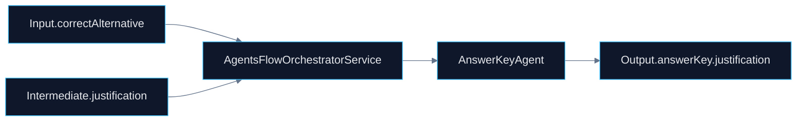

# 🤖 PR 78 — Fase 2: Consolidação Funcional da Justificativa do Answer Key

## Fortalecimento da coerência entre alternativa correta e justificativa final

---

<div align="left">


</div>

> [!IMPORTANT]
> Esta PR dá continuidade direta à PR 77. Após consolidar a alternativa correta no output final, o foco evolutivo passa a ser a integridade funcional da justificativa associada ao `answerKey`, preservando o recorte incremental e a arquitetura vigente.

---

# 1. Síntese Executiva

O pipeline já produz justificativas em diferentes etapas do fluxo. Entretanto, a composição final de `answerKey.justification` pode ser tornada mais explícita, previsível e coerente com a alternativa correta consolidada na PR 77.

A PR 78 fortalece a consistência funcional da justificativa final sem introduzir novos componentes, novas camadas ou expansão indevida da fase 2.

---

# 2. Objetivo do PR

Fortalecer a montagem de `answerKey.justification`, garantindo maior coerência com `answerKey.correctAlternative` e reduzindo dependência de fallback implícito.

Objetivos diretos:

* explicitar prioridade da justificativa principal no fechamento do answer key
* reforçar coerência entre alternativa correta e justificativa final
* manter fallback controlado quando conteúdo principal estiver ausente
* tornar a resolução final mais previsível
* preservar o contrato já consumido pelo pipeline

---

# 3. Decisão Arquitetural

A responsabilidade permanece distribuída entre os serviços já existentes. A evolução acontece dentro do fluxo atual, sem criação de novos agents, módulos ou camadas.

Não haverá:

* novo agent
* nova camada de orchestration
* redesign do orchestrator
* scoring adicional
* validação semântica por IA
* expansão estrutural da fase 2

A decisão é consolidar a regra funcional da justificativa no ponto já responsável pela composição final do `answerKey`, preservando simplicidade e continuidade arquitetural.

---

# 4. Escopo da PR

## Incluído

* revisão do uso de justificativas no fluxo avançado
* explicitação da prioridade da justificativa principal sobre fallback intermediário
* consolidação de `justification` no fechamento do `answerKey`
* tratamento explícito de ausência de justificativa principal
* atualização proporcional dos testes unitários relacionados
* preservação do shape final do output

## Fora de Escopo

* geração automática de justificativa por IA
* validação semântica profunda
* novos agents
* redesign do orchestrator
* score de confiança
* expansão indevida da fase 2

---

# 5. Fluxo Arquitetural



---

# 6. Contratos Mínimos

Sem alteração estrutural obrigatória no output final da API.

```ts
{
  answerKey: {
    correctAlternative,
    justification,
    source
  }
}
```

A evolução ocorre na consistência de preenchimento e priorização do campo, não na expansão do contrato público.

---

# 7. Estratégia de Implementação

Ordem recomendada:

1. `answer-key.agent.ts`
2. `answer-key.agent.spec.ts`
3. `agents-flow-orchestrator.service.ts`
4. `agents-flow-orchestrator.service.spec.ts`
5. validação do contrato central
6. regressão da suíte completa

Princípio central:

> fortalecer a integridade funcional da justificativa sem ampliar a complexidade do sistema.

---

# 8. Critérios de Review

Validar se:

* a justificativa ficou mais previsível no fluxo
* houve redução de fallback implícito
* a relação entre alternativa correta e justificativa ficou explícita
* o output final permaneceu estável
* o recorte permaneceu pequeno
* não houve overengineering

---

# 9. Critérios de Aceite

* `justification` é consolidada corretamente no output final
* cenários com e sem justificativa principal estão cobertos
* fallback permanece controlado e explícito
* nenhuma regressão no orchestrator
* suíte de testes permanece verde

---

# 10. Impacto Esperado

Maior previsibilidade funcional no fechamento do `answerKey` e maior coerência entre alternativa correta e justificativa final.

O fluxo passa a tratar a justificativa de forma mais madura, explícita e confiável, sem alterar a arquitetura vigente.

---

# 11. Conclusão

A PR 78 dá sequência ao eixo funcional iniciado na PR 77: após consolidar a resposta correta, consolida-se agora a justificativa final.

Ao fortalecer o tratamento de `justification`, o sistema ganha consistência prática e clareza operacional sem ampliar escopo ou repetir ciclos anteriores.
