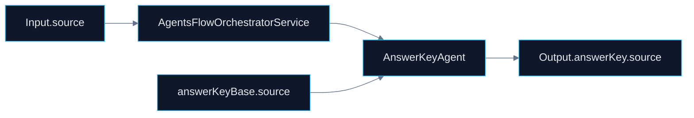

# 🤖 PR 79 — Fase 2: Consolidação Funcional da Fonte do Answer Key

## Fortalecimento do uso de `source` na composição final do fluxo avançado

---

<div align="left">


</div>

> [!IMPORTANT]
> Esta PR dá continuidade direta às PRs 77 e 78. Após consolidar a alternativa correta e a justificativa final, o foco passa a ser a integridade funcional da origem informada no `answerKey`, preservando o recorte incremental e a arquitetura vigente.

---

# 1. Síntese Executiva

O pipeline já propaga a origem utilizada durante o processamento. Entretanto, a utilização desse dado no fechamento de `answerKey.source` ainda pode ser tornada mais explícita, previsível e resiliente.

A PR 79 consolida regras mínimas para a fonte durante a montagem do resultado final, elevando consistência sem introduzir novos componentes, novas camadas ou expansão indevida da fase 2.

---

# 2. Objetivo do PR

Fortalecer a utilização de `source` como dado funcional do fluxo avançado, reduzindo dependência de fallback implícito e reforçando a integridade de `answerKey.source`.

Objetivos diretos:

* explicitar a prioridade de `source` no fechamento do answer key
* manter fallback controlado quando o valor prioritário estiver ausente
* garantir consistência entre valor intermediário e output final
* tornar a resolução da origem mais previsível
* preservar o contrato final já consumido pelo pipeline

---

# 3. Decisão Arquitetural

A responsabilidade permanece distribuída entre os serviços já existentes. A evolução acontece dentro do fluxo atual, sem criação de novos agents, módulos ou camadas.

Não haverá:

* novo agent
* nova camada de orchestration
* redesign do orchestrator
* scoring adicional
* rastreabilidade avançada
* expansão estrutural da fase 2

A decisão é consolidar a regra funcional da fonte final no ponto já responsável pela composição final do `answerKey`, preservando a simplicidade do pipeline.

---

# 4. Escopo da PR

## Incluído

* revisão do uso de `source` no fluxo avançado
* explicitação da prioridade de `source` sobre fallback intermediário
* consolidação de `source` no fechamento do `answerKey`
* tratamento explícito de ausência de origem principal
* atualização proporcional dos testes unitários relacionados
* preservação do shape final do output

## Fora de Escopo

* enum global de sources
* metadata adicional de rastreabilidade
* score de confiança
* novos agents
* redesign do orchestrator
* expansão indevida da fase 2

---

# 5. Fluxo Arquitetural



---

# 6. Contratos Mínimos

Sem alteração estrutural obrigatória no output final da API.

```ts
{
  answerKey: {
    correctAlternative,
    justification,
    source
  }
}
```

A evolução ocorre na consistência de preenchimento e priorização do campo, não na expansão do contrato público.

---

# 7. Estratégia de Implementação

Ordem recomendada:

1. `answer-key.agent.ts`
2. `answer-key.agent.spec.ts`
3. `agents-flow-orchestrator.service.ts`
4. `agents-flow-orchestrator.service.spec.ts`
5. validação do contrato central
6. regressão da suíte completa

Princípio central:

> fortalecer a integridade funcional da fonte final sem ampliar a complexidade do sistema.

---

# 8. Critérios de Review

Validar se:

* a origem ficou mais previsível no fluxo
* houve redução de fallback implícito
* a prioridade de `source` ficou explícita
* o output final permaneceu estável
* o recorte permaneceu pequeno
* não houve overengineering

---

# 9. Critérios de Aceite

* `source` é consolidada corretamente no output final
* cenários com e sem `source` estão cobertos
* fallback permanece controlado e explícito
* nenhuma regressão no orchestrator
* suíte de testes permanece verde

---

# 10. Impacto Esperado

Maior previsibilidade funcional no fechamento do `answerKey` e menor dependência de inferência implícita entre etapas intermediárias do pipeline.

O fluxo passa a tratar a origem final de forma mais madura, explícita e confiável, sem alterar a arquitetura vigente.

---

# 11. Conclusão

A PR 79 conclui o eixo funcional do `answerKey`: após consolidar a resposta correta e a justificativa final, consolida-se agora a origem final utilizada no resultado processado.

Ao fortalecer o tratamento de `source`, o sistema ganha previsibilidade prática sem repetir ciclos anteriores de refinamento contextual.
