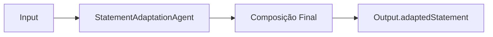

# 🤖 PR 81 — Fase 2: Consolidação Controlada do Statement Adaptado

## Fortalecimento da consistência final de `adaptedStatement` no output avançado

---

<div align="left">


</div>

---

> [!IMPORTANT]
> Esta PR fortalece a composição final de `adaptedStatement` no fluxo avançado, preservando arquitetura e contrato público.
>
> - consolida montagem final do statement
> - reduz ruído estrutural
> - mantém compatibilidade do output
>
> **Este PR não adiciona novos agentes, novos contratos ou redesign do pipeline.**

## Sumário

1. [Síntese Executiva](#1-síntese-executiva)
2. [Objetivo do PR](#2-objetivo-do-pr)
3. [Decisão Arquitetural](#3-decisão-arquitetural)
4. [Escopo](#4-escopo)
5. [Fora de Escopo](#5-fora-de-escopo)
6. [Fluxo Arquitetural](#6-fluxo-arquitetural)
7. [Contratos Mínimos](#7-contratos-mínimos)
8. [Regras de Implementação](#8-regras-de-implementação)
9. [Critérios de Review](#9-critérios-de-review)
10. [Critérios de Aceite](#10-critérios-de-aceite)
11. [Conclusão](#11-conclusão)

# 1. Síntese Executiva

Após a evolução de partes centrais do resultado avançado, o próximo passo mínimo foi fortalecer a montagem final de `adaptedStatement`, campo já existente e relevante para o consumo downstream.

A mudança consolida a composição no ponto correto do fluxo, elevando previsibilidade sem ampliar escopo funcional.

# 2. Objetivo do PR

- consolidar composição final de `adaptedStatement`
- reduzir ruídos textuais residuais
- preservar compatibilidade do contrato público
- manter progressão incremental da fase 2

# 3. Decisão Arquitetural

A responsabilidade permanece no componente já encarregado da adaptação do enunciado. A PR reforça comportamento no fluxo vigente, sem novas camadas, sem reorquestração e sem expansão estrutural.

# 4. Escopo

- ajuste da composição final de `adaptedStatement`
- normalização proporcional do texto final
- testes unitários compatíveis com o slice

# 5. Fora de Escopo

- novos campos de output
- nova estratégia de IA
- alteração de contratos
- redesign do pipeline
- expansão da fase 2

# 6. Fluxo Arquitetural



# 7. Contratos Mínimos

Sem alteração estrutural no contrato final.

```ts
{
  adaptedStatement,
  answerKey,
  metadata,
  ids
}
```

# 8. Regras de Implementação

- concentrar ajuste no agente existente
- evitar abstrações adicionais
- manter orchestrator fora do recorte
- preservar simplicidade

# 9. Critérios de Review

- statement final está mais consistente
- contrato permanece igual
- recorte segue pequeno
- ausência de overengineering

# 10. Critérios de Aceite

- [ ] `adaptedStatement` retorna composição consolidada
- [ ] compatibilidade preservada
- [ ] testes verdes
- [ ] nenhuma regressão no fluxo avançado

# 11. Conclusão

A PR 81 mantém a progressão incremental da fase 2 ao fortalecer `adaptedStatement` sem ampliar arquitetura ou escopo.
