# 🤖 PR 84 — Fase 2: Observabilidade Mínima do Fluxo Avançado

## Registro técnico das etapas principais do processamento avançado

---

<div align="left">


</div>

---

> [!IMPORTANT]
> Esta PR desloca a evolução da fase avançada para observabilidade mínima do fluxo, evitando repetir os ciclos recentes de normalização de output.
>
> - registra início e fim das etapas principais
> - melhora troubleshooting sem alterar comportamento funcional
> - mantém baixo ruído operacional
>
> **Este PR não introduz tracing distribuído, métricas externas, persistência de auditoria ou redesign do orchestrator.**

## Sumário

1. [Síntese Executiva](#1-síntese-executiva)
2. [Objetivo do PR](#2-objetivo-do-pr)
3. [Decisão Arquitetural](#3-decisão-arquitetural)
4. [Escopo](#4-escopo)
5. [Fora de Escopo](#5-fora-de-escopo)
6. [Fluxo Arquitetural](#6-fluxo-arquitetural)
7. [Contratos Mínimos](#7-contratos-mínimos)
8. [Regras de Implementação](#8-regras-de-implementação)
9. [Critérios de Review](#9-critérios-de-review)
10. [Critérios de Aceite](#10-critérios-de-aceite)
11. [Conclusão](#11-conclusão)

# 1. Síntese Executiva

As PRs anteriores fortaleceram campos específicos do resultado avançado, incluindo `answerKey`, `adaptedStatement`, `metadata` e `ids`. Com esses eixos de output mais previsíveis, o próximo passo mínimo é melhorar a leitura operacional do fluxo sem alterar sua lógica.

A PR 84 adiciona observabilidade técnica mínima nas etapas principais do processamento avançado. A intenção é facilitar troubleshooting, review e validação de execução, mantendo a arquitetura vigente e evitando qualquer expansão indevida de infraestrutura.

# 2. Objetivo do PR

- registrar início e fim das etapas principais do fluxo avançado
- facilitar troubleshooting durante desenvolvimento e review
- melhorar a leitura operacional do pipeline
- manter baixo ruído de logs
- preservar contratos públicos e comportamento funcional

# 3. Decisão Arquitetural

A responsabilidade permanece no `AgentsFlowOrchestratorService`, componente já responsável por coordenar a execução das etapas do fluxo avançado.

A decisão é instrumentar o ponto central do fluxo com logs objetivos e proporcionais. Não há criação de camada de observabilidade, novo módulo, tracing distribuído, métricas externas ou reestruturação do orchestrator.

# 4. Escopo

- log de início e fim da classificação
- log de início e fim da resolução de IDs
- log de início e fim do processamento inicial
- log de início da composição final
- log de encerramento do fluxo avançado
- testes unitários proporcionais ao slice
- preservação integral do contrato público

# 5. Fora de Escopo

- tracing distribuído
- métricas Prometheus
- dashboards
- persistência de auditoria
- correlação avançada de spans
- alteração de regra de negócio
- alteração de contratos públicos
- redesign do pipeline ou do orchestrator

# 6. Fluxo Arquitetural

```mermaid
%%{init: {
  "theme": "base",
  "themeVariables": {
    "background": "#050b16",
    "primaryColor": "#0b1220",
    "primaryTextColor": "#ffffff",
    "primaryBorderColor": "#22d3ee",
    "lineColor": "#94a3b8",
    "secondaryColor": "#0b1220",
    "tertiaryColor": "#0b1220",
    "fontFamily": "Inter, Arial, sans-serif"
  },
  "flowchart": {
    "htmlLabels": true,
    "curve": "linear",
    "nodeSpacing": 34,
    "rankSpacing": 44
  }
}}%%
flowchart LR
    A["Start Flow"] --> B["Classification"]
    B --> C["ID Resolution"]
    C --> D["Initial Processing"]
    D --> E["Final Composition"]
    E --> F["Final Output"]

    L["Logs mínimos<br/>start/end"] -.-> B
    L -.-> C
    L -.-> D
    L -.-> E

    classDef step1 fill:#0b1325,stroke:#3b82f6,stroke-width:2px,color:#ffffff;
    classDef step2 fill:#0a1a22,stroke:#22d3ee,stroke-width:2px,color:#ffffff;
    classDef step3 fill:#201d10,stroke:#eab308,stroke-width:2px,color:#ffffff;
    classDef step4 fill:#181629,stroke:#a78bfa,stroke-width:2px,color:#ffffff;
    classDef step5 fill:#25170f,stroke:#f97316,stroke-width:2px,color:#ffffff;
    classDef step6 fill:#112015,stroke:#84cc16,stroke-width:2px,color:#ffffff;
    classDef step7 fill:#10243a,stroke:#38bdf8,stroke-width:2px,color:#ffffff;
    classDef step8 fill:#221b2f,stroke:#f472b6,stroke-width:2px,color:#ffffff;
    classDef step9 fill:#14281d,stroke:#34d399,stroke-width:2px,color:#ffffff;
    classDef step10 fill:#2a160f,stroke:#fb7185,stroke-width:2px,color:#ffffff;
    classDef step11 fill:#1e293b,stroke:#f8fafc,stroke-width:2px,color:#ffffff;
    classDef decision fill:#181629,stroke:#a78bfa,stroke-width:2px,color:#ffffff;
    classDef successBox fill:#112015,stroke:#84cc16,stroke-width:2px,color:#ffffff;
    classDef failureBox fill:#2a160f,stroke:#fb7185,stroke-width:2px,color:#ffffff;
    classDef outputBox fill:#1e293b,stroke:#f8fafc,stroke-width:2px,color:#ffffff;
    classDef foundationBox fill:#1e293b,stroke:#f8fafc,stroke-width:2px,color:#ffffff;
    classDef coreBox fill:#1e293b,stroke:#f8fafc,stroke-width:2px,color:#ffffff;

    class A step1;
    class B step2;
    class C step3;
    class D step4;
    class E step5;
    class F outputBox;
    class L foundationBox;

    linkStyle 0 stroke:#9ca3af,stroke-width:2px;
    linkStyle 1 stroke:#9ca3af,stroke-width:2px;
    linkStyle 2 stroke:#9ca3af,stroke-width:2px;
    linkStyle 3 stroke:#9ca3af,stroke-width:2px;
    linkStyle 4 stroke:#9ca3af,stroke-width:2px;
    linkStyle 5 stroke:#22d3ee,stroke-width:2px,stroke-dasharray: 5 5;
    linkStyle 6 stroke:#22d3ee,stroke-width:2px,stroke-dasharray: 5 5;
    linkStyle 7 stroke:#22d3ee,stroke-width:2px,stroke-dasharray: 5 5;
    linkStyle 8 stroke:#22d3ee,stroke-width:2px,stroke-dasharray: 5 5;
```



# 7. Contratos Mínimos

Sem alteração estrutural no output final.

```ts
{
  legalSearch,
  adaptedStatement,
  answerKey,
  metadata,
  ids
}
```

A evolução ocorre apenas em observabilidade operacional, não em expansão de contrato público, payload de resposta ou modelagem de domínio.

# 8. Regras de Implementação

- concentrar os logs no `AgentsFlowOrchestratorService`
- registrar apenas etapas principais do fluxo
- evitar payload sensível ou dumps completos nos logs
- manter baixo volume de mensagens
- não introduzir novo módulo, interceptor ou provider de observabilidade
- não preparar tracing, métricas ou auditoria dentro desta PR

# 9. Critérios de Review

- logs são claros, objetivos e proporcionais ao slice
- não há vazamento de payload sensível
- comportamento funcional permanece inalterado
- contrato final permanece igual
- recorte continua pequeno e revisável
- não há overengineering ou foundation paralela de observabilidade

# 10. Critérios de Aceite

- [ ] etapas principais geram logs esperados
- [ ] fluxo avançado permanece funcionalmente idêntico
- [ ] contrato público não sofre alteração
- [ ] logs não expõem payload sensível
- [ ] testes unitários permanecem verdes
- [ ] nenhuma regressão é introduzida no pipeline avançado

# 11. Conclusão

A PR 84 mantém a progressão incremental da fase 2 ao fortalecer a leitura operacional do fluxo avançado.

Sem alterar contratos, regras de negócio ou arquitetura, o pipeline passa a oferecer visibilidade mínima entre etapas críticas, melhorando troubleshooting e review sem inflar a solução.
