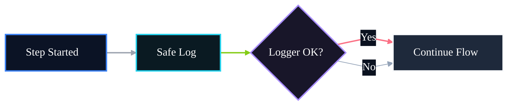

# 🤖 PR 85 — Fase 2: Resiliência Controlada da Observabilidade no Fluxo Avançado

## Isolamento de falhas de logging sem impacto no processamento principal

---

<div align="left">


</div>

---

> [!IMPORTANT]
> Esta PR evolui a observabilidade introduzida na PR 84 para garantir que falhas de logging não impactem o processamento principal do fluxo avançado.
>
> - isola exceções do logger
> - preserva propagação de erros reais dos agents
> - mantém comportamento funcional do pipeline
>
> **Este PR não introduz middleware, interceptor, fila de logs, tracing distribuído ou redesign do orchestrator.**

## Sumário

1. [Síntese Executiva](#1-síntese-executiva)
2. [Objetivo do PR](#2-objetivo-do-pr)
3. [Decisão Arquitetural](#3-decisão-arquitetural)
4. [Escopo](#4-escopo)
5. [Fora de Escopo](#5-fora-de-escopo)
6. [Fluxo Arquitetural](#6-fluxo-arquitetural)
7. [Contratos Mínimos](#7-contratos-mínimos)
8. [Regras de Implementação](#8-regras-de-implementação)
9. [Critérios de Review](#9-critérios-de-review)
10. [Critérios de Aceite](#10-critérios-de-aceite)
11. [Conclusão](#11-conclusão)

# 1. Síntese Executiva

A PR 84 adicionou logs mínimos no `AgentsFlowOrchestratorService`, ampliando a visibilidade operacional do pipeline avançado. O próximo passo mínimo é garantir que essa camada de suporte não se torne ponto de falha do fluxo principal.

A PR 85 introduz resiliência controlada na observabilidade. Erros de logging passam a ser isolados, enquanto falhas reais do processamento continuam seguindo o comportamento esperado do sistema.

# 2. Objetivo do PR

- impedir que exceções do logger interrompam o pipeline
- preservar propagação de erros reais dos agents
- manter comportamento funcional do processamento
- consolidar observabilidade segura
- manter baixo acoplamento e simplicidade

# 3. Decisão Arquitetural

A responsabilidade permanece no `AgentsFlowOrchestratorService`, sem novas abstrações globais.

A solução consiste em um helper interno de log seguro reutilizado pelos pontos já instrumentados. A escolha mantém a correção no boundary atual, evita dispersão de responsabilidade e preserva a arquitetura vigente.

# 4. Escopo

- criar helper interno de safe logging
- encapsular chamadas de `logger.info`
- ignorar falhas de observabilidade
- preservar execução principal
- testes cobrindo falha do logger
- manter contrato final inalterado

# 5. Fora de Escopo

- alterar regras de negócio
- mudar payload final
- métricas externas
- tracing distribuído
- persistência de auditoria
- retry externo de logs
- redesign do orchestrator

# 6. Fluxo Arquitetural



# 7. Contratos Mínimos

Sem alterações no output público:

```ts
{
  legalSearch,
  adaptedStatement,
  answerKey,
  metadata,
  ids
}
```

A evolução ocorre apenas no comportamento interno de observabilidade, sem impacto no contrato final.

# 8. Regras de Implementação

- concentrar helper no `AgentsFlowOrchestratorService`
- manter helper pequeno e coeso
- capturar apenas falhas de logging
- não interceptar erros reais dos agents
- evitar abstrações adicionais
- não preparar próximos passos nesta PR

# 9. Critérios de Review

- logger falhando não quebra `execute()`
- erros dos agents continuam propagando
- helper ficou simples e legível
- recorte permaneceu pequeno
- ausência de overengineering

# 10. Critérios de Aceite

- [ ] fluxo executa com logger saudável
- [ ] fluxo executa com logger falhando
- [ ] erros reais dos agents continuam propagando
- [ ] output final permanece preservado
- [ ] testes permanecem verdes

# 11. Conclusão

A PR 85 conclui o ciclo iniciado pela PR 84: além de observar o fluxo, o sistema passa a fazê-lo com segurança operacional.

O ganho é objetivo e proporcional ao slice: resiliência de suporte sem qualquer inflação arquitetural.
