# 🤖 PR 86 — Fase 2: Guardrails de Entrada do Fluxo Avançado

## Validação mínima do input antes da orquestração dos agents

---

<div align="left">


</div>

---

> [!IMPORTANT]
> Esta PR redireciona o próximo passo evolutivo da fase avançada para robustez de entrada, evitando redundância com as PRs 84 e 85.
>
> - valida o payload mínimo antes da orquestração
> - impede execução desnecessária dos agents
> - preserva o contrato atual em cenários válidos
>
> **Este PR não introduz validator global, pipe customizado, schema externo, novo agent ou redesign do pipeline.**

## Sumário

1. [Síntese Executiva](#1-síntese-executiva)
2. [Objetivo do PR](#2-objetivo-do-pr)
3. [Decisão Arquitetural](#3-decisão-arquitetural)
4. [Escopo](#4-escopo)
5. [Fora de Escopo](#5-fora-de-escopo)
6. [Fluxo Arquitetural](#6-fluxo-arquitetural)
7. [Contratos Mínimos](#7-contratos-mínimos)
8. [Regras de Implementação](#8-regras-de-implementação)
9. [Critérios de Review](#9-critérios-de-review)
10. [Critérios de Aceite](#10-critérios-de-aceite)
11. [Conclusão](#11-conclusão)

# 1. Síntese Executiva

As PRs 84 e 85 consolidaram a observabilidade mínima do fluxo avançado e sua resiliência operacional. Com o pipeline mais legível e seguro em termos de logging, o próximo passo mínimo é proteger a fronteira de entrada contra payloads estruturalmente inválidos.

A PR 86 adiciona guardrails simples no `AgentsFlowOrchestratorService`, impedindo a execução dos agents quando `question.statement` ou `question.alternatives` não atendem ao mínimo necessário para iniciar a orquestração.

# 2. Objetivo do PR

- exigir `question.statement` utilizável
- exigir `question.alternatives` como array
- impedir execução dos agents com input inválido
- retornar erro explícito e previsível
- preservar contrato atual em cenários válidos

# 3. Decisão Arquitetural

A validação permanece no `AgentsFlowOrchestratorService`, na fronteira de entrada do fluxo avançado.

A decisão é manter o guardrail próximo do ponto de orquestração, sem deslocar uma regra simples para pipes, validators globais, schemas externos ou novos agentes. Entrada inválida falha antes da execução do pipeline; entrada válida segue o fluxo atual sem alteração de contrato.

# 4. Escopo

- validar `statement` vazio, nulo ou composto apenas por espaços
- validar `alternatives` como array
- impedir chamadas aos agents quando o input for inválido
- adicionar testes cobrindo os guardrails
- manter output de sucesso inalterado

# 5. Fora de Escopo

- validação semântica de alternativas
- quantidade mínima de alternativas
- deduplicação de alternativas
- normalização avançada de payload
- alteração do contrato público
- novo validator global
- redesign do pipeline

# 6. Fluxo Arquitetural

```mermaid
%%{init: {
  "theme": "base",
  "themeVariables": {
    "background": "#050b16",
    "primaryColor": "#0b1220",
    "primaryTextColor": "#ffffff",
    "primaryBorderColor": "#22d3ee",
    "lineColor": "#94a3b8",
    "secondaryColor": "#0b1220",
    "tertiaryColor": "#0b1220",
    "fontFamily": "Inter, Arial, sans-serif"
  },
  "flowchart": {
    "htmlLabels": true,
    "curve": "linear",
    "nodeSpacing": 34,
    "rankSpacing": 44
  }
}}%%
flowchart LR
    A["Input"] --> B{"Payload válido?"}
    B -->|Não| X["Throw Error"]
    B -->|Sim| C["Advanced Flow"]
    C --> D["Agents Execution"]
    D --> E["Output Final"]

    classDef step1 fill:#0b1325,stroke:#3b82f6,stroke-width:2px,color:#ffffff;
    classDef step2 fill:#0a1a22,stroke:#22d3ee,stroke-width:2px,color:#ffffff;
    classDef step3 fill:#201d10,stroke:#eab308,stroke-width:2px,color:#ffffff;
    classDef step4 fill:#181629,stroke:#a78bfa,stroke-width:2px,color:#ffffff;
    classDef step5 fill:#25170f,stroke:#f97316,stroke-width:2px,color:#ffffff;
    classDef step6 fill:#112015,stroke:#84cc16,stroke-width:2px,color:#ffffff;
    classDef step7 fill:#10243a,stroke:#38bdf8,stroke-width:2px,color:#ffffff;
    classDef step8 fill:#221b2f,stroke:#f472b6,stroke-width:2px,color:#ffffff;
    classDef step9 fill:#14281d,stroke:#34d399,stroke-width:2px,color:#ffffff;
    classDef step10 fill:#2a160f,stroke:#fb7185,stroke-width:2px,color:#ffffff;
    classDef step11 fill:#1e293b,stroke:#f8fafc,stroke-width:2px,color:#ffffff;
    classDef decision fill:#181629,stroke:#a78bfa,stroke-width:2px,color:#ffffff;
    classDef successBox fill:#112015,stroke:#84cc16,stroke-width:2px,color:#ffffff;
    classDef failureBox fill:#2a160f,stroke:#fb7185,stroke-width:2px,color:#ffffff;
    classDef outputBox fill:#1e293b,stroke:#f8fafc,stroke-width:2px,color:#ffffff;
    classDef foundationBox fill:#1e293b,stroke:#f8fafc,stroke-width:2px,color:#ffffff;
    classDef coreBox fill:#1e293b,stroke:#f8fafc,stroke-width:2px,color:#ffffff;

    class A step1;
    class B decision;
    class X failureBox;
    class C step3;
    class D step4;
    class E outputBox;

    linkStyle 0 stroke:#9ca3af,stroke-width:2px;
    linkStyle 1 stroke:#fb7185,stroke-width:2px;
    linkStyle 2 stroke:#84cc16,stroke-width:2px;
    linkStyle 3 stroke:#9ca3af,stroke-width:2px;
    linkStyle 4 stroke:#9ca3af,stroke-width:2px;
```



# 7. Contratos Mínimos

Sem alteração estrutural no output final:

```ts
{
  legalSearch,
  adaptedStatement,
  answerKey,
  metadata,
  ids
}
```

A PR adiciona apenas falha antecipada para entradas inválidas. O contrato de sucesso permanece preservado.

# 8. Regras de Implementação

- concentrar validação no `AgentsFlowOrchestratorService`
- validar antes de qualquer chamada aos agents
- manter mensagens de erro objetivas
- não adicionar schema externo ou pipe customizado
- não criar helper global prematuro
- não alterar fluxo de sucesso

# 9. Critérios de Review

- input inválido falha antes dos agents
- nenhum agent é executado em erro de entrada
- mensagens de erro são claras e objetivas
- fluxo válido permanece igual
- recorte pequeno foi mantido
- não há overengineering ou reestruturação indevida

# 10. Critérios de Aceite

- [ ] `statement` vazio, nulo ou branco falha antes da orquestração
- [ ] `alternatives` inválido falha antes da orquestração
- [ ] agents não executam em input inválido
- [ ] fluxo válido preserva o comportamento atual
- [ ] output de sucesso permanece inalterado
- [ ] suíte permanece verde

# 11. Conclusão

A PR 86 evolui a robustez do fluxo avançado no ponto correto: a fronteira de entrada do orchestrator.

Sem ampliar arquitetura ou contrato, o pipeline passa a rejeitar entradas estruturalmente inválidas antes de acionar os agents, reduzindo processamento desnecessário e tornando falhas de entrada mais previsíveis.
