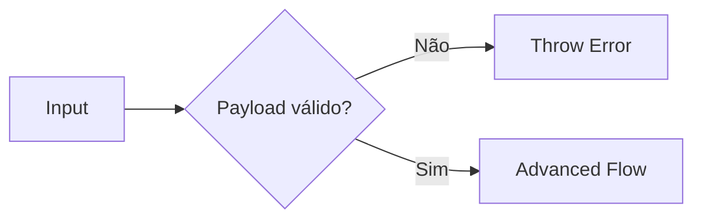

# 🤖 PR 86 — Fase 2: Guardrails de Entrada do Fluxo Avançado

## Validação mínima do input antes da orquestração dos agents

---

<div align="left">


</div>

> [!IMPORTANT]
> Esta PR redireciona o próximo passo evolutivo da fase avançada para evitar redundância com as PRs 84 e 85. O foco passa a ser robustez de entrada: validar o payload mínimo antes de iniciar a orquestração dos agents, preservando recorte incremental e arquitetura vigente.

---

## Índice

- [1. Síntese Executiva](#1-síntese-executiva)
- [2. Objetivo do PR](#2-objetivo-do-pr)
- [3. Decisão Arquitetural](#3-decisão-arquitetural)
- [4. Escopo da PR](#4-escopo-da-pr)
- [5. Fluxo Arquitetural](#5-fluxo-arquitetural)
- [6. Contratos Mínimos](#6-contratos-mínimos)
- [7. Estratégia de Implementação](#7-estratégia-de-implementação)
- [8. Critérios de Review](#8-critérios-de-review)
- [9. Critérios de Aceite](#9-critérios-de-aceite)
- [10. Impacto Esperado](#10-impacto-esperado)
- [11. Conclusão](#11-conclusão)

---

# 1. Síntese Executiva

O fluxo avançado já possui encadeamento funcional e resiliência operacional. O próximo passo natural é impedir execução desnecessária quando a entrada mínima já é inválida.

A PR 86 adiciona guardrails no `AgentsFlowOrchestratorService` para rejeitar inputs inconsistentes antes de acionar qualquer agent.

---

# 2. Objetivo do PR

Garantir validação mínima do payload recebido pelo orchestrator.

Objetivos diretos:

- exigir `question.statement` utilizável
- exigir `question.alternatives` como array
- impedir execução dos agents com input inválido
- retornar erro explícito e previsível
- preservar contrato atual em cenários válidos

---

# 3. Decisão Arquitetural

A validação permanece no próprio `AgentsFlowOrchestratorService`, na fronteira de entrada do fluxo.

Não haverá:

- novo validator global
- pipe customizado
- schema externo
- novo agent
- redesign do pipeline

A regra é simples: entrada inválida falha antes da orquestração.

---

# 4. Escopo da PR

## Incluído

- validar statement vazio/nulo/branco
- validar alternatives como array
- impedir chamadas aos agents quando inválido
- testes cobrindo guardrails
- manter output de sucesso inalterado

## Fora de Escopo

- validação semântica de alternativas
- quantidade mínima de alternativas
- deduplicação de alternativas
- normalização avançada de payload
- mudanças no contrato público

---

# 5. Fluxo Arquitetural



---

# 6. Contratos Mínimos

Sem alteração estrutural no output final:

```ts
{
  legalSearch,
  adaptedStatement,
  answerKey,
  metadata,
  ids
}
```

---

# 7. Estratégia de Implementação

Ordem sugerida:

1. `agents-flow-orchestrator.service.spec.ts`
2. `agents-flow-orchestrator.service.ts`
3. regressão completa

---

# 8. Critérios de Review

Validar se:

- input inválido falha antes dos agents
- nenhum agent é executado em erro de entrada
- mensagens de erro são objetivas
- fluxo válido permanece igual
- recorte pequeno mantido

---

# 9. Critérios de Aceite

- statement vazio falha
- alternatives inválido falha
- agents não executam em input inválido
- suíte verde
- comportamento atual preservado

---

# 10. Impacto Esperado

Menor processamento desnecessário, falhas mais previsíveis e fronteira de entrada mais robusta.

---

# 11. Conclusão

A PR 86 evolui a robustez do fluxo avançado atacando o ponto correto: a qualidade mínima da entrada antes da execução do pipeline.
