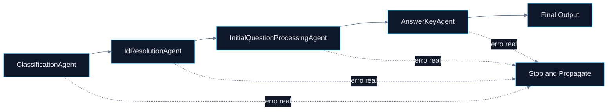

# 🤖 PR 86 — Fase 2: Propagação Segura de Erros do Fluxo Avançado

## Preservação da falha real dos agents sem execução indevida de etapas posteriores

---

<div align="left">


</div>

> [!IMPORTANT]
> Esta PR dá continuidade direta às PRs 84 e 85. Após adicionar observabilidade mínima e isolar falhas de logging, o foco passa a ser garantir que erros reais dos agents continuem sendo propagados corretamente, interrompendo o fluxo no ponto certo e preservando previsibilidade operacional.

---

## Índice

- [1. Síntese Executiva](#1-síntese-executiva)
- [2. Objetivo do PR](#2-objetivo-do-pr)
- [3. Decisão Arquitetural](#3-decisão-arquitetural)
- [4. Escopo da PR](#4-escopo-da-pr)
- [5. Fluxo Arquitetural](#5-fluxo-arquitetural)
- [6. Contratos Mínimos](#6-contratos-mínimos)
- [7. Estratégia de Implementação](#7-estratégia-de-implementação)
- [8. Critérios de Review](#8-critérios-de-review)
- [9. Critérios de Aceite](#9-critérios-de-aceite)
- [10. Impacto Esperado](#10-impacto-esperado)
- [11. Conclusão](#11-conclusão)

---

# 1. Síntese Executiva

O fluxo avançado já possui encadeamento funcional, observabilidade mínima e proteção contra falhas de logging.

A PR 86 fecha esse ciclo reforçando um ponto complementar: falhas reais dos agents não devem ser mascaradas nem permitir execução indevida de etapas posteriores.

A evolução é focada em segurança operacional do orchestrator, sem alterar contrato público, sem introduzir fallback artificial e sem redesenhar o pipeline.

---

# 2. Objetivo do PR

Garantir que o `AgentsFlowOrchestratorService` preserve corretamente a propagação de erros reais das etapas internas do fluxo avançado.

Objetivos diretos:

* propagar erro de classificação sem executar etapas posteriores
* propagar erro de resolução de IDs sem executar processamento inicial
* propagar erro de processamento inicial sem executar composição do answer key
* propagar erro de geração do answer key sem alterar o erro original
* manter a separação entre erro real e falha acessória de logging
* preservar o output final em cenários de sucesso

---

# 3. Decisão Arquitetural

A responsabilidade permanece concentrada no `AgentsFlowOrchestratorService`.

A decisão é não criar fallback artificial para falhas reais dos agents. O fluxo deve parar no ponto da falha e devolver a exceção ao chamador.

Não haverá:

* novo agent
* retry automático
* circuit breaker
* compensação assíncrona
* fallback silencioso
* alteração no contrato final
* redesign do orchestrator

O comportamento desejado é simples: **erro real interrompe o fluxo; log falhando não interrompe o fluxo**.

---

# 4. Escopo da PR

## Incluído

* reforço dos testes de propagação de erro por etapa
* validação de short-circuit após falha
* garantia de não execução das etapas seguintes
* preservação do erro original
* manutenção da resiliência de logging introduzida na PR 85
* preservação integral do contrato público

## Fora de Escopo

* retry automático
* política de fallback funcional
* fila de compensação
* persistência de falhas
* tracing distribuído
* alteração na arquitetura do pipeline

---

# 5. Fluxo Arquitetural



---

# 6. Contratos Mínimos

Sem alteração estrutural no output final.

```ts
{
  legalSearch,
  adaptedStatement,
  answerKey,
  metadata,
  ids
}
```

A evolução ocorre na garantia de comportamento em falha, não no formato do contrato público.

---

# 7. Estratégia de Implementação

Ordem recomendada:

1. `agents-flow-orchestrator.service.spec.ts`
2. validação dos testes já existentes de erro
3. reforço das expectativas de não execução de etapas posteriores
4. regressão da suíte completa

Princípio central:

> falha real deve permanecer visível e interromper o fluxo no ponto correto.

---

# 8. Critérios de Review

Validar se:

* erros reais continuam sendo propagados
* nenhuma etapa posterior roda após falha anterior
* falha de logger continua isolada
* não há fallback artificial
* o contrato final permanece inalterado
* o recorte permanece pequeno
* não houve overengineering

---

# 9. Critérios de Aceite

* erro de classificação interrompe o fluxo
* erro de resolução de IDs interrompe o fluxo
* erro de processamento inicial interrompe o fluxo
* erro de answer key é propagado
* falha de logging não quebra o fluxo
* suíte permanece verde

---

# 10. Impacto Esperado

Maior previsibilidade operacional do fluxo avançado em cenários de falha.

O sistema passa a diferenciar com clareza falhas acessórias de observabilidade e falhas reais de processamento.

---

# 11. Conclusão

A PR 86 consolida a robustez do `AgentsFlowOrchestratorService` após as evoluções de observabilidade.

Sem alterar arquitetura, contrato ou regras de negócio, o fluxo passa a garantir interrupção segura diante de erros reais e continuidade apenas quando a falha for acessória.
