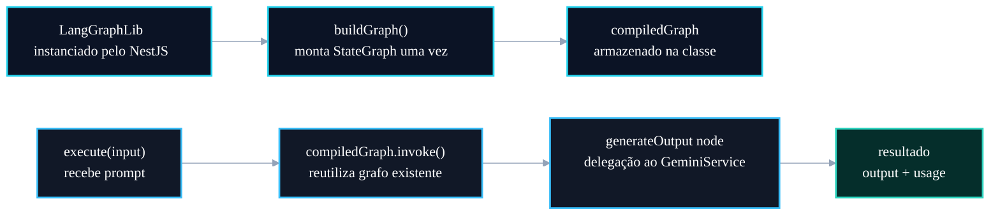

# 🤖 PR 87 — Correção: Reutilização do Grafo Compilado no LangGraph

## Ajuste mínimo no ciclo de vida do StateGraph sem redesenhar o fluxo de IA

---

<div align="left">


</div>

> [!IMPORTANT]
> Esta PR inaugura a sequência de correções estruturais apontadas no review do fluxo de IA.  
> O recorte é intencionalmente pequeno: corrigir o ciclo de vida do `StateGraph`, evitando reconstrução e recompilação do grafo a cada chamada, sem alterar a responsabilidade dos agentes, sem trocar LangGraph por chamada direta ao LLM e sem redesenhar a arquitetura aprovada.

---

## Sumário

1. [Síntese Executiva](#1-síntese-executiva)
2. [Objetivo do PR](#2-objetivo-do-pr)
3. [Decisão Arquitetural](#3-decisão-arquitetural)
4. [Escopo da PR](#4-escopo-da-pr)
5. [Fora de Escopo](#5-fora-de-escopo)
6. [Fluxo Arquitetural](#6-fluxo-arquitetural)
7. [Contratos Mínimos](#7-contratos-mínimos)
8. [Regras de Implementação](#8-regras-de-implementação)
9. [Critérios de Review](#9-critérios-de-review)
10. [Critérios de Aceite](#10-critérios-de-aceite)
11. [Conclusão](#11-conclusão)

---

## 1. Síntese Executiva

Esta PR corrige o uso atual do `LangGraphLib`, que vinha construindo e compilando um novo `StateGraph` dentro do método `execute()` a cada chamada de IA.

O comportamento funcional permanece o mesmo: o fluxo continua recebendo um prompt, delegando a geração ao `GeminiService` e retornando `output` e `usage`.

A mudança desta PR é exclusivamente estrutural: o grafo passa a ser construído uma única vez durante o ciclo de vida da instância de `LangGraphLib`, sendo reutilizado nas execuções subsequentes.

Esse ajuste reduz overhead desnecessário, melhora previsibilidade e prepara o fluxo para correções futuras sem ampliar o escopo desta entrega.

---

## 2. Objetivo do PR

O objetivo desta PR é corrigir o ciclo de vida do grafo utilizado pela camada de IA.

Antes desta alteração, cada chamada para `LangGraphLib.execute()` recriava:

- uma nova instância de `StateGraph`;
- o nó de geração;
- as arestas entre `START`, `generateOutput` e `END`;
- o grafo compilado.

Esse comportamento é desnecessário para o fluxo atual, pois a topologia do grafo é estática.

Após esta PR, o grafo passa a ser montado e compilado uma única vez, mantendo o método `execute()` responsável apenas por validar a entrada e invocar o grafo já preparado.

---

## 3. Decisão Arquitetural

A decisão desta PR é preservar temporariamente o uso de LangGraph, mas corrigir sua utilização mínima.

Embora o fluxo atual ainda possua apenas um nó e não explore branching, loops ou estado avançado, esta PR não remove LangGraph. A remoção ou substituição por chamada direta ao `GeminiService` é uma decisão maior e deve ser tratada em outra PR, caso o time opte por simplificar a stack.

Nesta etapa, a correção aplicada é:

- manter `LangGraphLib` como boundary de execução;
- extrair a construção do grafo para um método privado;
- armazenar o grafo compilado como propriedade da classe;
- reutilizar a instância compilada em cada chamada de `execute()`.

Essa abordagem responde ao problema apontado no review sem misturar correção estrutural com redesenho arquitetural.

---

## 4. Escopo da PR

Esta PR contempla:

- ajuste em `src/shared/ai/lib/langgraph.lib.ts`;
- extração da montagem do `StateGraph` para método privado;
- compilação única do grafo no ciclo de vida da classe;
- reutilização do grafo compilado em `execute()`;
- preservação do contrato público de `LangGraphLib`;
- preservação do retorno atual com `output` e `usage`;
- manutenção da delegação para `GeminiService`.

A PR não altera o contrato dos agentes, não muda prompts, não altera parsing de resposta e não introduz novos fluxos de orquestração.

---

## 5. Fora de Escopo

Ficam explicitamente fora desta PR:

- remover LangGraph do projeto;
- substituir `LangGraphLib` por chamada direta ao `GeminiService`;
- criar branching, loops ou conditional edges;
- persistir estado do grafo;
- alterar agentes;
- alterar orquestrador;
- alterar prompts;
- alterar contratos de entrada e saída dos agentes;
- revisar cache Redis;
- paralelizar resolução de IDs;
- centralizar normalização textual;
- reorganizar arquivos de serviços ou contracts.

Esses pontos pertencem à sequência de correções posteriores e não devem ser incorporados neste recorte.

---

## 6. Fluxo Arquitetural



O fluxo continua simples e linear. A diferença central é que a estrutura do grafo deixa de ser recriada dentro da execução e passa a existir como dependência interna estável da classe.

---

## 7. Contratos Mínimos

O contrato público da lib permanece preservado.

```typescript
export interface ExecuteLangGraphInput {
  prompt: string;
}

export interface ExecuteLangGraphResult {
  output: string;
  usage?: unknown;
}
```

A chamada externa continua usando:

```typescript
await langGraphLib.execute({ prompt });
```

A mudança esperada está apenas na implementação interna:

```typescript
@Injectable()
export class LangGraphLib {
  private readonly graph: CompiledGraph;

  constructor(private readonly geminiService: GeminiService) {
    this.graph = this.buildGraph();
  }

  async execute(input: ExecuteLangGraphInput): Promise<ExecuteLangGraphResult> {
    return this.graph.invoke({ prompt: input.prompt });
  }
}
```

A tipagem concreta de `CompiledGraph` deve seguir a forma exportada pela versão instalada de LangGraph no projeto, evitando `any` desnecessário quando houver tipo disponível e evitando uma abstração local artificial apenas para satisfazer a PR.

---

## 8. Regras de Implementação

A implementação deve seguir estas regras:

1. O `StateGraph` não deve ser criado dentro de `execute()`.
2. O grafo deve ser compilado uma única vez por instância de `LangGraphLib`.
3. O método `execute()` deve permanecer pequeno e previsível.
4. O contrato público de entrada e saída não deve mudar.
5. A delegação para `GeminiService` deve ser preservada.
6. Não deve haver nova abstração para builder, factory ou provider adicional.
7. Não deve haver mudança no fluxo dos agentes.
8. Não deve haver tentativa de resolver todos os problemas do review nesta PR.
9. Não deve haver paralelismo, cache ou normalização textual neste recorte.
10. Não deve haver redesenho do workflow de IA.

A PR deve ser uma correção localizada e revisável.

---

## 9. Critérios de Review

Durante o review, validar se:

- `execute()` não recompila mais o grafo;
- a topologia do grafo continua equivalente à anterior;
- `GeminiService.execute()` continua sendo chamado com o mesmo prompt;
- o retorno continua expondo `output` e `usage`;
- não houve alteração indevida em agentes ou orquestrador;
- não foi introduzida complexidade extra;
- o ajuste permanece proporcional ao problema apontado;
- o código continua compatível com injeção de dependência do NestJS.

O ponto principal de validação é garantir que esta PR corrige o overhead estrutural sem expandir o escopo.

---

## 10. Critérios de Aceite

Esta PR pode ser aceita quando:

- o projeto compilar sem erros;
- os testes existentes continuarem passando;
- chamadas para `LangGraphLib.execute()` preservarem o comportamento anterior;
- o grafo for construído fora do método `execute()`;
- o grafo compilado for reutilizado;
- não houver alteração funcional no fluxo de IA;
- não houver mudança em contracts externos;
- não houver refactor não relacionado.

O aceite desta PR deve confirmar apenas a correção do ciclo de vida do LangGraph.

---

## 11. Conclusão

Esta PR aplica a primeira correção estrutural no fluxo de IA a partir do review recebido.

O ajuste reduz overhead desnecessário, torna o uso de LangGraph mais adequado ao ciclo de vida da aplicação NestJS e mantém o comportamento atual intacto.

A decisão é deliberadamente conservadora: corrigir a recompilação por chamada antes de avaliar mudanças maiores, como remover LangGraph, simplificar a lib ou redesenhar o workflow.

Com isso, a base fica mais limpa para as próximas correções da sequência: normalização textual centralizada, ajuste do `ClassificationAgent`, paralelização segura no `IdResolutionAgent` e cache Redis mínimo para resolução de IDs.
