# 🤖 PR 87 — Fase 2: Guardrails Estruturais das Alternativas

## Validação mínima das alternativas antes da execução do fluxo avançado

---

<div align="left">


</div>

---

> [!IMPORTANT]
> Esta PR dá continuidade direta à PR 86, mantendo o foco em robustez mínima de entrada antes da orquestração dos agents.
>
> - valida a utilidade estrutural mínima de `question.alternatives`
> - impede execução do fluxo avançado com alternativas vazias ou insuficientes
> - preserva o contrato atual em cenários válidos
>
> **Este PR não introduz validação semântica, deduplicação, normalização avançada, validator global, pipe customizado, novo agent ou redesign do pipeline.**

## Sumário

1. [Síntese Executiva](#1-síntese-executiva)
2. [Objetivo do PR](#2-objetivo-do-pr)
3. [Decisão Arquitetural](#3-decisão-arquitetural)
4. [Escopo](#4-escopo)
5. [Fora de Escopo](#5-fora-de-escopo)
6. [Fluxo Arquitetural](#6-fluxo-arquitetural)
7. [Contratos Mínimos](#7-contratos-mínimos)
8. [Regras de Implementação](#8-regras-de-implementação)
9. [Critérios de Review](#9-critérios-de-review)
10. [Critérios de Aceite](#10-critérios-de-aceite)
11. [Conclusão](#11-conclusão)

# 1. Síntese Executiva

A PR 86 consolidou os primeiros guardrails de entrada do fluxo avançado, rejeitando payloads sem `statement` utilizável ou sem `alternatives` como array antes da execução dos agents.

A PR 87 avança no mesmo eixo, ainda sem ampliar arquitetura, adicionando validação estrutural mínima sobre o conteúdo das alternativas. O objetivo é impedir que o fluxo avançado seja iniciado quando a lista de alternativas, embora presente como array, não possui condições mínimas de uso para processamento posterior.

# 2. Objetivo do PR

- exigir quantidade mínima de alternativas
- rejeitar alternativas vazias, nulas ou compostas apenas por espaços
- impedir execução dos agents com alternativas estruturalmente inválidas
- manter erro explícito e previsível
- preservar contrato atual em cenários válidos

# 3. Decisão Arquitetural

A validação permanece no `AgentsFlowOrchestratorService`, como continuação direta da fronteira de entrada protegida pela PR 86.

A decisão é manter o guardrail próximo do ponto real de orquestração, sem antecipar uma camada global de validação. Como a regra ainda é simples, estrutural e localizada no fluxo avançado, extraí-la para pipe, schema externo, DTO adicional ou helper global criaria granularidade desnecessária para o recorte atual.

Entrada inválida falha antes da execução dos agents; entrada válida segue o fluxo atual sem alteração de contrato.

# 4. Escopo

- validar quantidade mínima de alternativas
- validar alternativas vazias, nulas ou brancas
- impedir chamadas aos agents quando as alternativas forem inválidas
- adicionar testes cobrindo os novos guardrails
- manter output de sucesso inalterado

# 5. Fora de Escopo

- deduplicação de alternativas
- validação semântica das alternativas
- normalização avançada do payload
- validação de alternativa correta
- reordenação de alternativas
- alteração do contrato público
- novo validator global
- pipe customizado
- novo agent
- redesign do pipeline

# 6. Fluxo Arquitetural

```mermaid
%%{init: {
  "theme": "base",
  "themeVariables": {
    "background": "#050b16",
    "primaryColor": "#0b1220",
    "primaryTextColor": "#ffffff",
    "primaryBorderColor": "#22d3ee",
    "lineColor": "#94a3b8",
    "secondaryColor": "#0b1220",
    "tertiaryColor": "#0b1220",
    "fontFamily": "Inter, Arial, sans-serif"
  },
  "flowchart": {
    "htmlLabels": true,
    "curve": "linear",
    "nodeSpacing": 34,
    "rankSpacing": 44
  }
}}%%
flowchart LR
    A["Input"] --> B{"Payload base válido?"}
    B -->|Não| X["Throw Error"]
    B -->|Sim| C{"Alternativas válidas?"}
    C -->|Não| Y["Throw Error"]
    C -->|Sim| D["Advanced Flow"]
    D --> E["Agents Execution"]
    E --> F["Output Final"]

    classDef step1 fill:#0b1325,stroke:#3b82f6,stroke-width:2px,color:#ffffff;
    classDef step2 fill:#0a1a22,stroke:#22d3ee,stroke-width:2px,color:#ffffff;
    classDef step3 fill:#201d10,stroke:#eab308,stroke-width:2px,color:#ffffff;
    classDef step4 fill:#181629,stroke:#a78bfa,stroke-width:2px,color:#ffffff;
    classDef step5 fill:#25170f,stroke:#f97316,stroke-width:2px,color:#ffffff;
    classDef step6 fill:#112015,stroke:#84cc16,stroke-width:2px,color:#ffffff;
    classDef step7 fill:#10243a,stroke:#38bdf8,stroke-width:2px,color:#ffffff;
    classDef step8 fill:#221b2f,stroke:#f472b6,stroke-width:2px,color:#ffffff;
    classDef step9 fill:#14281d,stroke:#34d399,stroke-width:2px,color:#ffffff;
    classDef step10 fill:#2a160f,stroke:#fb7185,stroke-width:2px,color:#ffffff;
    classDef step11 fill:#1e293b,stroke:#f8fafc,stroke-width:2px,color:#ffffff;
    classDef decision fill:#181629,stroke:#a78bfa,stroke-width:2px,color:#ffffff;
    classDef successBox fill:#112015,stroke:#84cc16,stroke-width:2px,color:#ffffff;
    classDef failureBox fill:#2a160f,stroke:#fb7185,stroke-width:2px,color:#ffffff;
    classDef outputBox fill:#1e293b,stroke:#f8fafc,stroke-width:2px,color:#ffffff;
    classDef foundationBox fill:#1e293b,stroke:#f8fafc,stroke-width:2px,color:#ffffff;
    classDef coreBox fill:#1e293b,stroke:#f8fafc,stroke-width:2px,color:#ffffff;

    class A step1;
    class B decision;
    class X failureBox;
    class C decision;
    class Y failureBox;
    class D step3;
    class E step4;
    class F outputBox;

    linkStyle 0 stroke:#9ca3af,stroke-width:2px;
    linkStyle 1 stroke:#fb7185,stroke-width:2px;
    linkStyle 2 stroke:#84cc16,stroke-width:2px;
    linkStyle 3 stroke:#fb7185,stroke-width:2px;
    linkStyle 4 stroke:#84cc16,stroke-width:2px;
    linkStyle 5 stroke:#9ca3af,stroke-width:2px;
    linkStyle 6 stroke:#9ca3af,stroke-width:2px;
```



# 7. Contratos Mínimos

Sem alteração estrutural no output final:

```ts
{
  legalSearch,
  adaptedStatement,
  answerKey,
  metadata,
  ids
}
```

A PR adiciona apenas falha antecipada para listas de alternativas estruturalmente inválidas. O contrato de sucesso permanece preservado.

# 8. Regras de Implementação

- manter validação no `AgentsFlowOrchestratorService`
- validar alternativas antes de qualquer chamada aos agents
- exigir quantidade mínima de alternativas
- tratar alternativas nulas, vazias ou brancas como inválidas
- manter mensagens de erro objetivas
- não adicionar schema externo ou pipe customizado
- não criar helper global prematuro
- não alterar fluxo de sucesso

# 9. Critérios de Review

- alternativas insuficientes falham antes dos agents
- alternativas vazias ou brancas falham antes dos agents
- nenhum agent é executado em erro de entrada
- mensagens de erro são claras e objetivas
- fluxo válido permanece igual
- recorte pequeno foi mantido
- não há overengineering ou reestruturação indevida

# 10. Critérios de Aceite

- [ ] lista com quantidade insuficiente de alternativas falha antes da orquestração
- [ ] alternativa vazia, nula ou branca falha antes da orquestração
- [ ] agents não executam em input inválido
- [ ] fluxo válido preserva o comportamento atual
- [ ] output de sucesso permanece inalterado
- [ ] suíte permanece verde

# 11. Conclusão

A PR 87 conclui mais uma etapa mínima de robustez na entrada do fluxo avançado, complementando a proteção introduzida pela PR 86.

Sem ampliar arquitetura ou contrato, o pipeline passa a rejeitar listas de alternativas estruturalmente inválidas antes de acionar os agents, reduzindo processamento desnecessário e mantendo falhas de entrada previsíveis, localizadas e proporcionais ao recorte atual.
