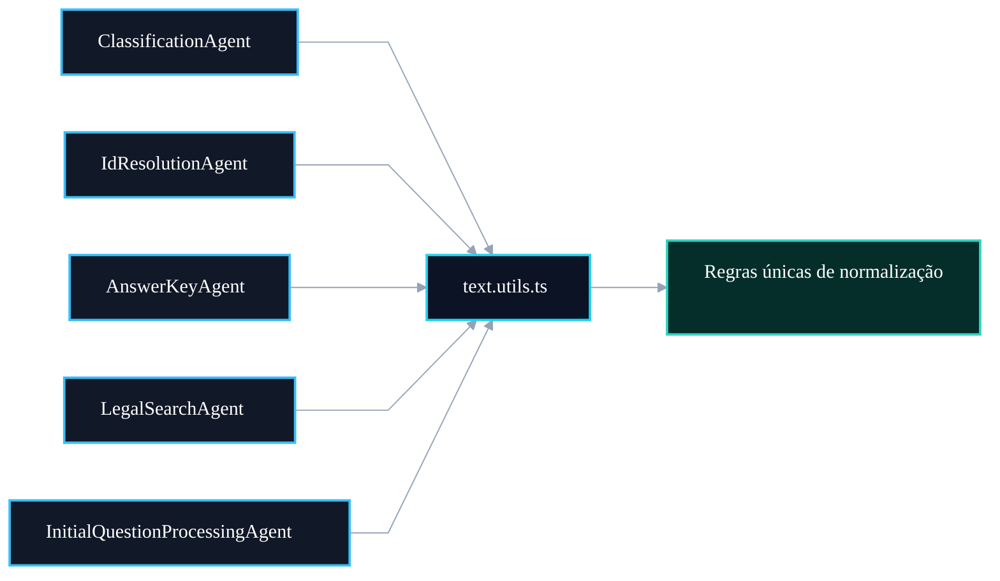

# 🧠 PR 88 — Correção: Centralização de Normalização Textual no Fluxo de IA

## Extração de utilitários puros para remover duplicação e padronizar comparações textuais

---

<div align="left">


</div>

> [!IMPORTANT]
> Esta PR aplica a segunda correção estrutural do review técnico do fluxo de IA.  
> O objetivo é eliminar duplicações de normalização textual espalhadas entre agentes, consolidando regras em utilitários puros reutilizáveis, sem alterar comportamento funcional, prompts ou contratos externos.

---

## Sumário

1. Síntese Executiva
2. Objetivo do PR
3. Decisão Arquitetural
4. Escopo da PR
5. Fora de Escopo
6. Fluxo Arquitetural
7. Contratos Mínimos
8. Regras de Implementação
9. Critérios de Review
10. Critérios de Aceite
11. Conclusão

---

## 1. Síntese Executiva

O fluxo atual possui múltiplas implementações locais para operações equivalentes de normalização textual, como:

- trim de espaços;
- colapso de espaços internos;
- lowercase;
- remoção de acentos;
- padronização de referências como artigo / Art.

Essas regras estavam distribuídas entre diversos agentes, aumentando ruído, risco de divergência futura e custo de manutenção.

Esta PR centraliza essas transformações em utilitários puros compartilhados e substitui implementações duplicadas pelos helpers comuns.

---

## 2. Objetivo do PR

O objetivo desta PR é criar uma fonte única para regras de normalização textual usadas no workflow de IA.

Com isso, o projeto passa a ter:

- comportamento mais previsível;
- menor duplicação de código;
- manutenção simplificada;
- leitura mais limpa nos agents;
- base preparada para evoluções futuras sem espalhar regex pelo codebase.

---

## 3. Decisão Arquitetural

A decisão adotada é criar utilitários funcionais em camada compartilhada, sem introduzir service, provider ou dependência de NestJS.

Arquivo proposto:

```text
src/shared/ai/utils/text.utils.ts
```

Motivos:

- funções puras são suficientes;
- não há estado;
- não há dependência externa;
- evita overengineering;
- fácil reutilização em qualquer agent.

---

## 4. Escopo da PR

Incluído nesta PR:

- criação de `text.utils.ts`;
- extração de funções reutilizáveis;
- substituição de duplicações nos agents afetados;
- preservação do comportamento atual.

Funções esperadas:

```ts
normalizeWhitespace()
normalizeForComparison()
normalizeArticleReference()
```

---

## 5. Fora de Escopo

Não faz parte desta PR:

- alterar prompts;
- mudar classificação;
- cache Redis;
- paralelismo;
- alterar queries SQL;
- fuzzy search;
- reorganização ampla de pastas;
- mudanças no orchestrator;
- refactor de contracts.

---

## 6. Fluxo Arquitetural



---

## 7. Contratos Mínimos

Exemplo esperado:

```ts
export function normalizeWhitespace(value: string): string

export function normalizeForComparison(value: string): string

export function normalizeArticleReference(value: string): string
```

Sem classes, sem decorators, sem side effects.

---

## 8. Regras de Implementação

1. Manter funções puras.
2. Não alterar semântica atual.
3. Não introduzir abstrações desnecessárias.
4. Regex centralizadas.
5. Agents devem consumir utilitários.
6. Não misturar outras correções nesta PR.
7. Código pequeno e revisável.

---

## 9. Critérios de Review

Validar se:

- duplicações relevantes foram removidas;
- agents continuam funcionando;
- comportamento textual foi preservado;
- utilitários estão coesos;
- não houve expansão indevida de escopo.

---

## 10. Critérios de Aceite

A PR pode ser aceita quando:

- projeto compilar;
- testes passarem;
- agents utilizarem helpers compartilhados;
- nenhuma regressão funcional ocorrer;
- código ficar mais simples que antes.

---

## 11. Conclusão

Esta PR consolida uma responsabilidade transversal recorrente no fluxo de IA: normalização textual.

É um refactor pequeno, seguro e de alto valor estrutural, reduzindo duplicação sem alterar a lógica de negócio.
