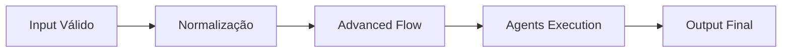

# 🤖 PR 88 — Fase 2: Normalização Mínima do Input do Fluxo Avançado

## Higienização básica do payload válido antes da execução dos agents

---

---

> [!IMPORTANT]
> Esta PR evolui a qualidade operacional do fluxo avançado ao normalizar inputs já considerados válidos antes da execução dos agents.
>
> - aplica higienização textual mínima
> - remove ruído estrutural simples
> - preserva comportamento atual em cenários válidos
>
> **Este PR não introduz correção semântica, deduplicação inteligente, schema externo, novo agent ou redesign do pipeline.**

## Sumário

1. Síntese Executiva
2. Objetivo do PR
3. Decisão Arquitetural
4. Escopo
5. Fora de Escopo
6. Fluxo Arquitetural
7. Contratos Mínimos
8. Regras de Implementação
9. Critérios de Review
10. Critérios de Aceite
11. Conclusão

# 1. Síntese Executiva

Após estabelecer guardrails mínimos de entrada, o próximo passo natural é garantir que dados válidos cheguem aos agents em formato minimamente limpo e previsível.

A PR 88 adiciona normalização simples no orchestrator, reduzindo ruído sem alterar a lógica funcional do pipeline.

# 2. Objetivo do PR

- aplicar trim em statement
- aplicar trim nas alternatives
- remover alternativas vazias após trim
- entregar input mais consistente aos agents
- preservar fluxo feliz atual

# 3. Decisão Arquitetural

A normalização permanece no `AgentsFlowOrchestratorService`, imediatamente antes da execução do pipeline.

Evita-se criar helpers globais, camada paralela de sanitation ou abstrações prematuras para uma regra local e simples.

# 4. Escopo

- normalizar `question.statement`
- normalizar textos de alternativas
- remover entradas vazias após trim
- manter contrato público inalterado
- adicionar testes cobrindo normalização

# 5. Fora de Escopo

- deduplicação de alternativas
- correção gramatical
- NLP
- reordenação de alternativas
- schema externo
- validator global
- redesign do pipeline

# 6. Fluxo Arquitetural

# 7. Contratos Mínimos

Sem alteração estrutural no output final.

A PR apenas melhora a qualidade do input entregue internamente ao fluxo.

# 8. Regras de Implementação

- centralizar normalização no orchestrator
- executar antes dos agents
- manter transformação simples e explícita
- não adicionar abstrações novas
- preservar recorte pequeno

# 9. Critérios de Review

- trims aplicados corretamente
- alternativas vazias removidas
- fluxo válido permanece igual
- testes verdes
- sem overengineering

# 10. Critérios de Aceite

- [ ] statement é normalizado
- [ ] alternativas são normalizadas
- [ ] entradas vazias são removidas
- [ ] fluxo atual preservado
- [ ] suíte verde
- [ ] recorte pequeno mantido

# 11. Conclusão

A PR 88 melhora a qualidade do fluxo avançado no ponto correto: antes da execução dos agents. Com uma higienização mínima e localizada, o pipeline recebe dados mais consistentes sem aumento indevido de complexidade.
