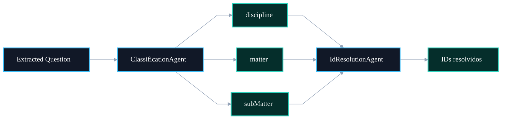

# 🧭 PR 89 — Correção: Extração de Hierarquia de Metadados no ClassificationAgent

## Inclusão de discipline, matter e subMatter para habilitar resolução completa de IDs

---

<div align="left">


</div>

> [!IMPORTANT]
> Esta PR corrige uma lacuna funcional do pipeline de IA: o fluxo já tenta resolver IDs hierárquicos no `IdResolutionAgent`, porém o `ClassificationAgent` ainda não extrai os campos necessários para isso.
> O objetivo desta entrega é habilitar a classificação de `discipline`, `matter` e `subMatter`, preservando a arquitetura atual e mantendo o recorte pequeno.

---

# Sumário

1. [Síntese Executiva](#1-síntese-executiva)
2. [Objetivo do PR](#2-objetivo-do-pr)
3. [Decisão Arquitetural](#3-decisão-arquitetural)
4. [Escopo da PR](#4-escopo-da-pr)
5. [Fora de Escopo](#5-fora-de-escopo)
6. [Fluxo Arquitetural](#6-fluxo-arquitetural)
7. [Contratos Mínimos](#7-contratos-mínimos)
8. [Regras de Implementação](#8-regras-de-implementação)
9. [Critérios de Review](#9-critérios-de-review)
10. [Critérios de Aceite](#10-critérios-de-aceite)
11. [Conclusão](#11-conclusão)

---

# 1. Síntese Executiva

O fluxo atual possui uma inconsistência funcional:

- o `ClassificationAgent` extrai metadados básicos;
- o `IdResolutionAgent` tenta resolver IDs hierárquicos;
- porém os campos `discipline`, `matter` e `subMatter` não são fornecidos na etapa anterior.

Na prática, isso reduz a capacidade de enriquecimento estrutural da questão processada.

Esta PR corrige essa lacuna adicionando os campos hierárquicos ao processo de classificação.

---

# 2. Objetivo do PR

Permitir que o `ClassificationAgent` também classifique:

- `discipline`
- `matter`
- `subMatter`

Com isso, o pipeline passa a fornecer insumos reais para:

```txt
disciplineId
matterId
subMatterId
```

na etapa de resolução.

---

# 3. Decisão Arquitetural

A correção será aplicada **na origem do dado**, mantendo o fluxo atual:

```txt
Question -> ClassificationAgent -> IdResolutionAgent
```

Em vez de adaptar o resolvedor ou inserir heurísticas posteriores, a decisão é enriquecer a classificação inicial.

Benefícios:

- menor acoplamento;
- responsabilidade correta;
- sem mudanças no orchestrator;
- sem retrabalho nas etapas seguintes.

---

# 4. Escopo da PR

Incluído nesta PR:

- adicionar novos campos no prompt do `ClassificationAgent`;
- expandir `ClassificationAiResponse`;
- parsear novos campos;
- normalizar novos campos;
- atualizar `allowedKeys`;
- atualizar specs da classificação.

Arquivos principais:

```txt
src/shared/ai/infra/agents/classification.agent.ts
src/__tests__/shared/ai/infra/agents/classification.agents.spec.ts
```

---

# 5. Fora de Escopo

Não faz parte desta PR:

- cache Redis;
- paralelismo no `IdResolutionAgent`;
- LangGraph;
- refactor estrutural amplo;
- mudança de prompts de outros agentes;
- fuzzy matching;
- reorganização de pastas.

---

# 6. Fluxo Arquitetural



---

# 7. Contratos Mínimos

```ts
type ClassificationAiResponse = {
  discipline?: unknown;
  matter?: unknown;
  subMatter?: unknown;
  article?: unknown;
  law?: unknown;
  bank?: unknown;
  year?: unknown;
  position?: unknown;
  organization?: unknown;
};
```

```ts
discipline?: string;
matter?: string;
subMatter?: string;
```

---

# 8. Regras de Implementação

1. Manter compatibilidade com campos atuais.
2. Preservar tratamento de `null`.
3. Reusar normalização existente.
4. Não alterar contratos não relacionados.
5. Não expandir escopo além da classificação.
6. Atualizar testes de forma objetiva.

---

# 9. Critérios de Review

Validar se:

- prompt pede os novos campos;
- JSON parseia corretamente;
- campos são normalizados;
- `allowedKeys` aceita novas propriedades;
- specs cobrem a mudança;
- sem regressões nos campos antigos.

---

# 10. Critérios de Aceite

A PR pode ser aceita quando:

- testes passarem;
- novos campos forem retornados pelo classification flow;
- `IdResolutionAgent` receber dados reais;
- comportamento anterior permanecer estável.

---

# 11. Conclusão

Esta PR corrige uma falha funcional relevante com baixo risco técnico.

Ao incluir a hierarquia de metadados na classificação, o pipeline passa a aproveitar melhor a estrutura já existente de resolução de IDs, sem reabrir decisões arquiteturais e sem inflar escopo.
