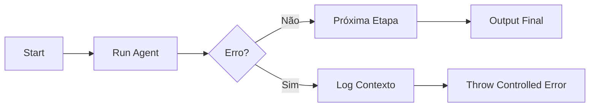

# 🤖 PR 89 — Fase 2: Tratamento Controlado de Falhas dos Agents

## Isolamento mínimo de erro por etapa do fluxo avançado

---

---

> [!IMPORTANT]
> Esta PR evolui a robustez operacional do fluxo avançado ao tratar falhas de execução dos agents com previsibilidade e rastreabilidade.
>
> - captura erro por etapa
> - registra contexto mínimo da falha
> - preserva comportamento atual em cenários válidos
>
> **Este PR não introduz retry, fallback, fila, circuit breaker, novo agent ou redesign da orquestração.**

## Sumário

1. Síntese Executiva
2. Objetivo do PR
3. Decisão Arquitetural
4. Escopo
5. Fora de Escopo
6. Fluxo Arquitetural
7. Contratos Mínimos
8. Regras de Implementação
9. Critérios de Review
10. Critérios de Aceite
11. Conclusão

# 1. Síntese Executiva

Após proteger a entrada do fluxo, o próximo passo incremental é tornar falhas internas dos agents observáveis e controladas. Hoje, erros internos tendem a emergir sem contexto suficiente.

A PR 89 adiciona tratamento mínimo no orchestrator para identificar a etapa que falhou e responder de forma explícita.

# 2. Objetivo do PR

- capturar erro por agent
- identificar etapa com falha
- registrar contexto mínimo em log
- retornar erro previsível
- preservar fluxo feliz atual

# 3. Decisão Arquitetural

O tratamento permanece concentrado no `AgentsFlowOrchestratorService`, ponto natural de coordenação do pipeline.

Evita-se espalhar `try/catch` entre agents ou criar camadas prematuras de resiliência.

# 4. Escopo

- envolver execução de cada etapa com tratamento mínimo
- anexar nome da etapa ao erro
- logar falha com contexto essencial
- manter sucesso inalterado
- adicionar testes do cenário de erro

# 5. Fora de Escopo

- retry automático
- fallback entre providers
- compensação transacional
- circuit breaker
- métricas avançadas
- paralelismo
- redesign do pipeline

# 6. Fluxo Arquitetural

# 7. Contratos Mínimos

Sem alteração no contrato de sucesso.

Em erro, resposta passa a conter mensagem previsível com referência da etapa.

# 8. Regras de Implementação

- centralizar tratamento no orchestrator
- manter mensagens objetivas
- não alterar interfaces dos agents sem necessidade
- não adicionar abstrações novas
- preservar recorte pequeno

# 9. Critérios de Review

- falha identifica etapa correta
- erro é rastreável
- sucesso permanece igual
- testes verdes
- sem overengineering

# 10. Critérios de Aceite

- [ ] erro em agent informa etapa
- [ ] falha gera log mínimo
- [ ] fluxo válido inalterado
- [ ] suíte verde
- [ ] recorte pequeno mantido

# 11. Conclusão

A PR 89 adiciona maturidade operacional ao fluxo avançado: quando um agent falhar, o sistema falha melhor — com contexto, previsibilidade e sem ampliar arquitetura.
