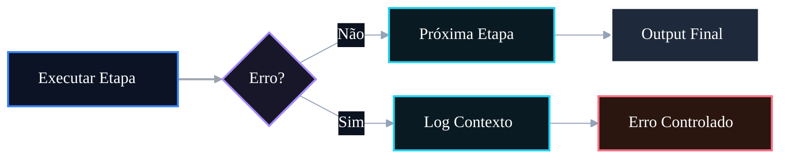

# 🤖 PR 89 — Fase 2: Tratamento Controlado de Falhas dos Agents

## Isolamento mínimo de erro por etapa do fluxo avançado

---

---

> [!IMPORTANT]
> Esta PR adiciona tratamento mínimo e centralizado de falhas no fluxo avançado, tornando erros internos mais previsíveis e revisáveis.
>
> - identifica a etapa que falhou
> - registra contexto operacional mínimo
> - preserva contrato de sucesso atual
>
> **Este PR não introduz retry, fallback, fila, circuit breaker, paralelismo ou redesign da orquestração.**

## Sumário

1. [Síntese Executiva](#1-síntese-executiva)
2. [Objetivo do PR](#2-objetivo-do-pr)
3. [Decisão Arquitetural](#3-decisão-arquitetural)
4. [Escopo](#4-escopo)
5. [Fora de Escopo](#5-fora-de-escopo)
6. [Fluxo Arquitetural](#6-fluxo-arquitetural)
7. [Contratos Mínimos](#7-contratos-mínimos)
8. [Regras de Implementação](#8-regras-de-implementação)
9. [Critérios de Review](#9-critérios-de-review)
10. [Critérios de Aceite](#10-critérios-de-aceite)
11. [Conclusão](#11-conclusão)

# 1. Síntese Executiva

Após a normalização de entrada da PR anterior, o próximo passo mínimo é qualificar a forma como o pipeline reage a erros internos. Falhas continuam possíveis, mas deixam de emergir sem contexto útil.

A PR 89 concentra no orchestrator a identificação da etapa com erro e a emissão de resposta previsível, mantendo o fluxo feliz inalterado.

# 2. Objetivo do PR

- capturar exceções por etapa executada
- anexar identificação da etapa ao erro
- registrar contexto essencial em log
- manter saída de sucesso atual
- cobrir cenário de falha com testes

# 3. Decisão Arquitetural

O tratamento permanece no `AgentsFlowOrchestratorService`, que já coordena a sequência operacional. O ponto de coordenação continua sendo o local correto para encapsular erro de etapa.

Evita-se espalhar `try/catch` nos agents, criar wrappers genéricos ou antecipar camadas de resiliência fora do recorte atual.

# 4. Escopo

- tratar falha durante execução de cada etapa
- informar etapa associada ao erro
- registrar contexto mínimo
- preservar caminho de sucesso
- adicionar testes objetivos de erro

# 5. Fora de Escopo

- retry automático
- fallback entre providers
- DLQ
- circuit breaker
- métricas avançadas
- compensações
- refatoração ampla do pipeline

# 6. Fluxo Arquitetural

# 7. Contratos Mínimos

Sem alteração no contrato de sucesso existente.

Em cenários de falha, a resposta expõe mensagem previsível contendo a referência da etapa afetada, sem ampliar payload além do necessário.

# 8. Regras de Implementação

- centralizar tratamento no orchestrator
- mensagens objetivas e consistentes
- não alterar contratos dos agents sem necessidade real
- não criar abstrações genéricas prematuras
- manter implementação simples e rastreável

# 9. Critérios de Review

- etapa com erro é identificada corretamente
- logs contêm contexto mínimo útil
- caminho de sucesso permanece intacto
- testes cobrem cenário de falha
- recorte continua pequeno e aderente

# 10. Critérios de Aceite

- [ ] erro em agent informa a etapa correspondente
- [ ] falha gera log mínimo
- [ ] contrato de sucesso permanece igual
- [ ] suíte permanece verde
- [ ] não houve expansão indevida do escopo

# 11. Conclusão

A PR 89 melhora a confiabilidade operacional no ponto correto: quando uma etapa falha, o sistema responde com contexto suficiente e comportamento previsível, sem inflar arquitetura nem alterar o fluxo válido.
