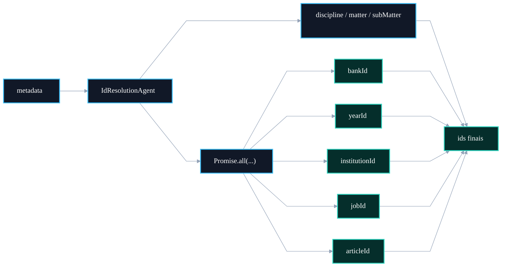

# ⚡ PR 90 — Correção: Paralelização Segura de Lookups no IdResolutionAgent

## Execução concorrente de resoluções independentes com Promise.all

---

<div align="left">


</div>

> [!IMPORTANT]
> Esta PR aplica uma otimização pontual no `IdResolutionAgent`.
> Lookups independentes estavam sendo executados em sequência, aumentando latência sem necessidade.
> A correção introduz paralelismo controlado com `Promise.all`, preservando contratos e comportamento funcional.

---

# Sumário

1. [Síntese Executiva](#1-síntese-executiva)
2. [Objetivo do PR](#2-objetivo-do-pr)
3. [Decisão Arquitetural](#3-decisão-arquitetural)
4. [Escopo da PR](#4-escopo-da-pr)
5. [Fora de Escopo](#5-fora-de-escopo)
6. [Fluxo Arquitetural](#6-fluxo-arquitetural)
7. [Contratos Mínimos](#7-contratos-mínimos)
8. [Regras de Implementação](#8-regras-de-implementação)
9. [Critérios de Review](#9-critérios-de-review)
10. [Critérios de Aceite](#10-critérios-de-aceite)
11. [Conclusão](#11-conclusão)

---

# 1. Síntese Executiva

O `IdResolutionAgent` realiza múltiplas resoluções de IDs a partir de metadados extraídos.

Parte dessas resoluções não possui dependência entre si, porém a implementação atual executa chamadas em série.

Isso adiciona tempo total desnecessário ao fluxo.

Esta PR corrige esse ponto usando execução concorrente para operações independentes.

---

# 2. Objetivo do PR

Reduzir latência do fluxo de resolução sem alterar contratos.

Lookups candidatos ao paralelismo:

```txt
bankId
yearId
institutionId
jobId
articleId
```

---

# 3. Decisão Arquitetural

A decisão é aplicar paralelismo apenas onde não existe dependência lógica.

Permanece sequencial:

```txt
disciplineId
matterId
subMatterId
```

Porque dependem de contexto hierárquico.

Executa em paralelo:

```txt
filter-backed ids
```

via `Promise.all`.

---

# 4. Escopo da PR

Incluído nesta PR:

- refactor local no `IdResolutionAgent`;
- agrupamento de lookups independentes;
- manutenção dos retornos atuais;
- atualização de testes.

Arquivos principais:

```txt
src/shared/ai/infra/agents/id-resolution.agent.ts
src/__tests__/shared/ai/infra/agents/id-resolution.agent.spec.ts
```

---

# 5. Fora de Escopo

Não faz parte desta PR:

- Redis cache;
- mudança de DAO;
- query SQL otimizada;
- fuzzy match;
- refactor estrutural amplo;
- alteração de contratos;
- mudança no orchestrator.

---

# 6. Fluxo Arquitetural



---

# 7. Contratos Mínimos

Sem alteração de contrato.

Entrada:

```ts
metadata: QuestionMetadata
```

Saída:

```ts
ids: ResolvedIds
```

---

# 8. Regras de Implementação

1. Paralelizar apenas operações independentes.
2. Preservar nomes e tipos de retorno.
3. Não alterar regras de matching.
4. Não mover responsabilidades para DAO.
5. Manter legibilidade.
6. Garantir cobertura de testes.

---

# 9. Critérios de Review

Validar se:

- `Promise.all` cobre apenas lookups independentes;
- resultado final permanece idêntico;
- testes existentes continuam verdes;
- sem regressão hierárquica;
- sem side effects.

---

# 10. Critérios de Aceite

A PR pode ser aceita quando:

- testes passarem;
- ids retornarem iguais ao comportamento anterior;
- fluxo ficar mais eficiente;
- sem mudança funcional externa.

---

# 11. Conclusão

Esta PR entrega uma otimização objetiva e segura.

Sem ampliar escopo, melhora o tempo de execução do `IdResolutionAgent` e evolui o pipeline com baixo risco técnico.
