# 🤖 PR 90 — Fase 2: Logs Estruturados por Etapa do Fluxo Avançado

## Observabilidade mínima da execução dos agents com rastreabilidade por etapa

---

<div align="left">


</div>

---

> [!IMPORTANT]
> Esta PR adiciona logs estruturados por etapa no fluxo avançado, ampliando a observabilidade sem alterar comportamento funcional.
>
> - registra início, sucesso e falha por etapa
> - inclui duração simples da execução
> - preserva contrato atual de sucesso
>
> **Este PR não introduz tracing distribuído, OpenTelemetry, dashboards, APM externo, novo agent ou redesign do pipeline.**

## Sumário

1. [Síntese Executiva](#1-síntese-executiva)
2. [Objetivo do PR](#2-objetivo-do-pr)
3. [Decisão Arquitetural](#3-decisão-arquitetural)
4. [Escopo](#4-escopo)
5. [Fora de Escopo](#5-fora-de-escopo)
6. [Fluxo Arquitetural](#6-fluxo-arquitetural)
7. [Contratos Mínimos](#7-contratos-mínimos)
8. [Regras de Implementação](#8-regras-de-implementação)
9. [Critérios de Review](#9-critérios-de-review)
10. [Critérios de Aceite](#10-critérios-de-aceite)
11. [Conclusão](#11-conclusão)

# 1. Síntese Executiva

Após consolidar guardrails, normalização e tratamento controlado de falhas, o próximo passo mínimo é melhorar a leitura operacional da execução do pipeline.

A PR 90 instrumenta o `AgentsFlowOrchestratorService` para expor eventos essenciais de cada etapa, reduzindo esforço de diagnóstico e mantendo o fluxo válido inalterado.

# 2. Objetivo do PR

- registrar início de execução por etapa
- registrar conclusão com sucesso
- registrar falha com contexto mínimo
- medir duração da etapa
- incluir identificador de correlação
- manter contrato atual de sucesso

# 3. Decisão Arquitetural

A observabilidade permanece centralizada no `AgentsFlowOrchestratorService`, onde a ordem de execução já é conhecida e controlada.

Evita-se pulverizar logs dentro dos agents, duplicar responsabilidade operacional ou introduzir infraestrutura além do slice atual.

# 4. Escopo

- logar início da etapa
- logar sucesso da etapa
- logar falha da etapa
- incluir duração simples
- incluir correlação da execução
- adicionar testes objetivos
- preservar output atual

# 5. Fora de Escopo

- tracing distribuído
- OpenTelemetry
- dashboards
- métricas avançadas
- alertas automáticos
- integração APM
- refatoração ampla do pipeline

# 6. Fluxo Arquitetural

```mermaid
%%{init: {
  "theme": "base",
  "themeVariables": {
    "background": "#050b16",
    "primaryColor": "#0b1220",
    "primaryTextColor": "#ffffff",
    "primaryBorderColor": "#22d3ee",
    "lineColor": "#94a3b8",
    "secondaryColor": "#0b1220",
    "tertiaryColor": "#0b1220",
    "fontFamily": "Inter, Arial, sans-serif"
  },
  "flowchart": {
    "htmlLabels": true,
    "curve": "linear",
    "nodeSpacing": 34,
    "rankSpacing": 44
  }
}}%%
flowchart LR
    A["Iniciar Etapa"] --> B["Log de Início"]
    B --> C["Executar Agent"]
    C --> D{"Falhou?"}
    D -->|Não| E["Log de Sucesso"]
    E --> F["Registrar Duração"]
    F --> G["Próxima Etapa"]
    G --> H["Output Final"]
    D -->|Sim| I["Log de Falha"]
    I --> J["Erro Controlado"]

    classDef step1 fill:#0b1325,stroke:#3b82f6,stroke-width:2px,color:#ffffff;
    classDef step2 fill:#0a1a22,stroke:#22d3ee,stroke-width:2px,color:#ffffff;
    classDef step3 fill:#201d10,stroke:#eab308,stroke-width:2px,color:#ffffff;
    classDef decision fill:#181629,stroke:#a78bfa,stroke-width:2px,color:#ffffff;
    classDef successBox fill:#112015,stroke:#84cc16,stroke-width:2px,color:#ffffff;
    classDef failureBox fill:#2a160f,stroke:#fb7185,stroke-width:2px,color:#ffffff;
    classDef outputBox fill:#1e293b,stroke:#f8fafc,stroke-width:2px,color:#ffffff;

    class A step1;
    class B step2;
    class C step3;
    class D decision;
    class E successBox;
    class F step2;
    class G step3;
    class H outputBox;
    class I failureBox;
    class J failureBox;

    linkStyle 0 stroke:#9ca3af,stroke-width:2px;
```



# 7. Contratos Mínimos

Sem alteração estrutural no output final existente.

```ts
{
  legalSearch,
  adaptedStatement,
  answerKey,
  metadata,
  ids
}
```

A PR adiciona somente telemetria operacional interna.

# 8. Regras de Implementação

- concentrar logs no orchestrator
- mensagens objetivas e padronizadas
- evitar duplicidade de eventos
- medir duração com baixo acoplamento
- não adicionar dependências externas
- não alterar caminho de sucesso

# 9. Critérios de Review

- início da etapa é registrado
- sucesso da etapa é registrado
- falha da etapa é registrada
- duração é capturada
- fluxo válido permanece igual
- recorte segue pequeno e claro

# 10. Critérios de Aceite

- [ ] cada etapa registra início
- [ ] cada etapa registra sucesso ou falha
- [ ] duração da etapa é capturada
- [ ] correlação da execução está disponível
- [ ] output de sucesso permanece inalterado
- [ ] suíte permanece verde

# 11. Conclusão

A PR 90 amplia a observabilidade no ponto correto da arquitetura. O pipeline passa a expor eventos essenciais de execução por etapa, com ganho real de diagnóstico e sem expansão indevida de escopo.
