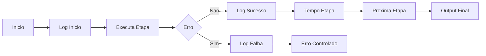

# 🤖 PR 90 — Fase 2: Logs Estruturados por Etapa do Fluxo Avançado

## Observabilidade mínima da execução dos agents com rastreabilidade por etapa

---

<div align="left">


</div>

---

> [!IMPORTANT]
> Esta PR evolui a observabilidade operacional do fluxo avançado ao registrar a execução de cada etapa com contexto mínimo e padronização.
>
> - registra início e fim por etapa
> - adiciona duração simples da execução
> - preserva contrato atual em cenários válidos
>
> **Este PR não introduz tracing distribuído, OpenTelemetry, dashboards, APM externo, novo agent ou redesign do pipeline.**

## Sumário

1. [Síntese Executiva](#1-síntese-executiva)
2. [Objetivo do PR](#2-objetivo-do-pr)
3. [Decisão Arquitetural](#3-decisão-arquitetural)
4. [Escopo](#4-escopo)
5. [Fora de Escopo](#5-fora-de-escopo)
6. [Fluxo Arquitetural](#6-fluxo-arquitetural)
7. [Contratos Mínimos](#7-contratos-mínimos)
8. [Regras de Implementação](#8-regras-de-implementação)
9. [Critérios de Review](#9-critérios-de-review)
10. [Critérios de Aceite](#10-critérios-de-aceite)
11. [Conclusão](#11-conclusão)

# 1. Síntese Executiva

Após consolidar guardrails, normalização e tratamento de falhas, o próximo passo incremental é ampliar a visibilidade operacional da execução do fluxo avançado.

A PR 90 adiciona logs estruturados no `AgentsFlowOrchestratorService`, permitindo identificar início, sucesso, falha e duração de cada etapa sem alterar a lógica funcional do pipeline.

# 2. Objetivo do PR

- registrar início de cada etapa
- registrar sucesso de cada etapa
- registrar falha com contexto mínimo
- medir duração por etapa
- correlacionar a execução por identificador
- preservar contrato atual em cenários válidos

# 3. Decisão Arquitetural

A instrumentação permanece no `AgentsFlowOrchestratorService`, ponto central de coordenação do fluxo avançado.

A decisão evita espalhar logs excessivos dentro dos agents e mantém a observabilidade concentrada onde a sequência do pipeline já é orquestrada.

# 4. Escopo

- logar início da etapa
- logar conclusão da etapa
- logar erro da etapa
- incluir tempo de execução
- incluir identificador de correlação
- adicionar testes do comportamento esperado
- manter output de sucesso inalterado

# 5. Fora de Escopo

- tracing distribuído
- OpenTelemetry
- dashboards
- métricas avançadas
- alertas automáticos
- integração com APM externo
- redesign do pipeline

# 6. Fluxo Arquitetural



# 7. Contratos Mínimos

Sem alteração estrutural no output final:

```ts
{
  legalSearch,
  adaptedStatement,
  answerKey,
  metadata,
  ids
}
```

A PR adiciona apenas telemetria operacional do fluxo interno.

# 8. Regras de Implementação

- concentrar logs no `AgentsFlowOrchestratorService`
- manter mensagens objetivas e consistentes
- evitar duplicidade de logs
- medir duração com baixo acoplamento
- não adicionar dependências externas
- não alterar fluxo de sucesso

# 9. Critérios de Review

- início de etapa é logado
- sucesso de etapa é logado
- falha de etapa é logada
- duração é registrada
- fluxo válido permanece igual
- recorte pequeno foi mantido
- não há overengineering ou reestruturação indevida

# 10. Critérios de Aceite

- [ ] cada etapa registra início
- [ ] cada etapa registra sucesso ou falha
- [ ] duração é capturada
- [ ] correlação da execução está disponível
- [ ] output de sucesso permanece inalterado
- [ ] suíte permanece verde

# 11. Conclusão

A PR 90 evolui a maturidade operacional do fluxo avançado no ponto correto: a orquestração central.

Sem ampliar arquitetura ou contrato, o pipeline passa a oferecer visibilidade real da execução de cada etapa, reduzindo tempo de diagnóstico e aumentando previsibilidade operacional.
