# 🧠 PR 91 — Correção: Cache Redis Mínimo para Resolução de IDs

## Redução de consultas repetidas em lookups estáveis do IdResolutionAgent

---

<div align="left">


</div>

> [!IMPORTANT]
> Esta PR aplica a próxima correção estrutural apontada no review do fluxo de IA: o `IdResolutionAgent` ainda resolve filtros estáveis consultando o banco repetidamente.
> O recorte desta entrega é introduzir cache Redis mínimo para lookups estáveis, preservando o DAO atual, os contratos existentes e o comportamento funcional do pipeline.

---

## Sumário

1. [Síntese Executiva](#1-síntese-executiva)
2. [Objetivo do PR](#2-objetivo-do-pr)
3. [Decisão Arquitetural](#3-decisão-arquitetural)
4. [Escopo da PR](#4-escopo-da-pr)
5. [Fora de Escopo](#5-fora-de-escopo)
6. [Fluxo Arquitetural](#6-fluxo-arquitetural)
7. [Contratos Mínimos](#7-contratos-mínimos)
8. [Regras de Implementação](#8-regras-de-implementação)
9. [Critérios de Review](#9-critérios-de-review)
10. [Critérios de Aceite](#10-critérios-de-aceite)
11. [Conclusão](#11-conclusão)

---

## 1. Síntese Executiva

O `IdResolutionAgent` já centraliza a resolução de IDs a partir dos metadados classificados pela IA.

Após as correções anteriores, o fluxo passou a:

- receber hierarquia de metadados do `ClassificationAgent`;
- reutilizar normalização textual centralizada;
- executar lookups independentes em paralelo.

Ainda existe, porém, um gargalo recorrente: filtros estáveis como banca, ano, instituição, cargo e artigo continuam sendo consultados diretamente no banco a cada execução.

Esta PR introduz uma camada mínima de cache Redis para reduzir leituras repetidas, mantendo fallback para DAO em caso de cache miss.

---

## 2. Objetivo do PR

Adicionar cache Redis para resoluções estáveis do `IdResolutionAgent`.

A intenção é evitar que os mesmos lookups de filtros sejam repetidos continuamente no banco, principalmente em processamento de lotes de questões.

TTL inicial recomendado:

```txt
bank: 24h
year: 7d
institution: 24h
job: 24h
article: 12h
```

A PR deve manter o comportamento externo intacto: quando o valor existir em cache, retorna o ID; quando não existir, consulta o DAO e grava o resultado no Redis.

---

## 3. Decisão Arquitetural

A decisão desta PR é introduzir cache em uma camada auxiliar pequena, sem transformar o `IdResolutionAgent` em dono direto de detalhes de serialização Redis.

Estrutura sugerida:

```txt
src/shared/ai/infra/services/id-resolution-cache.service.ts
```

Responsabilidades:

- montar chaves de cache;
- ler valores cacheados;
- gravar valores resolvidos;
- aplicar TTL conforme tipo de filtro;
- esconder detalhes de Redis do agent.

O `IdResolutionAgent` permanece responsável por orquestrar a resolução de IDs, enquanto o cache service atua apenas como suporte operacional.

---

## 4. Escopo da PR

Incluído nesta PR:

- criação de `IdResolutionCacheService`;
- uso do Redis já existente no projeto;
- cache para filtros estáveis resolvidos por `resolveFilterId`;
- fallback para DAO em cache miss;
- persistência do resultado resolvido no cache;
- TTL por tipo de filtro;
- atualização de providers no módulo de IA;
- testes cobrindo cache hit, cache miss e fallback.

Arquivos prováveis:

```txt
src/shared/ai/infra/services/id-resolution-cache.service.ts
src/shared/ai/infra/agents/id-resolution.agent.ts
src/shared/ai/ai.module.ts
src/__tests__/shared/ai/infra/agents/id-resolution.agent.spec.ts
src/__tests__/shared/ai/infra/services/id-resolution-cache.service.spec.ts
```

---

## 5. Fora de Escopo

Não faz parte desta PR:

- fuzzy search;
- alteração de query SQL;
- mudança no DAO;
- cache para hierarchy lookup de discipline/matter/subMatter;
- invalidação avançada;
- warming de cache;
- job de refresh;
- métricas;
- mudança no orchestrator;
- mudança em contracts;
- alteração de prompts.

A PR deve ser limitada a cache mínimo para lookups de filtros estáveis.

---

## 6. Fluxo Arquitetural

```mermaid
%%{init: {
  "theme": "base",
  "themeVariables": {
    "background": "#050b16",
    "primaryColor": "#0b1220",
    "primaryTextColor": "#ffffff",
    "primaryBorderColor": "#22d3ee",
    "lineColor": "#94a3b8",
    "secondaryColor": "#0b1220",
    "tertiaryColor": "#0b1220",
    "fontFamily": "Inter, Arial, sans-serif"
  },
  "flowchart": {
    "htmlLabels": true,
    "curve": "linear",
    "nodeSpacing": 54,
    "rankSpacing": 68
  }
}}%%
flowchart LR
    A["IdResolutionAgent<br/>resolve filter id"] --> B["IdResolutionCacheService<br/>get cached id"]
    B --> C{"cache hit?"}
    C -->|sim| D["retorna id cacheado"]
    C -->|não| E["IdResolutionDao<br/>lista candidatos"]
    E --> F["match normalizado<br/>normalizeForComparison"]
    F --> G["IdResolutionCacheService<br/>set id com TTL"]
    G --> H["retorna id resolvido"]

    classDef core fill:#111827,stroke:#38bdf8,stroke-width:2px,color:#ffffff;
    classDef cache fill:#0b1325,stroke:#22d3ee,stroke-width:2px,color:#ffffff;
    classDef decision fill:#1e1b4b,stroke:#a78bfa,stroke-width:2px,color:#ffffff;
    classDef output fill:#052e2b,stroke:#2dd4bf,stroke-width:2px,color:#ffffff;

    class A,E,F core;
    class B,G cache;
    class C decision;
    class D,H output;
```



---

## 7. Contratos Mínimos

Contrato sugerido para o serviço de cache:

```ts
export type IdResolutionCacheKeyInput = {
  filterTypeName: string;
  filterName: string;
};

@Injectable()
export class IdResolutionCacheService {
  get(input: IdResolutionCacheKeyInput): Promise<number | null>;

  set(input: IdResolutionCacheKeyInput & { id: number }): Promise<void>;
}
```

O agent deve continuar retornando o mesmo contrato:

```ts
export type IdResolutionAgentOutput = {
  ids: ResolvedIds;
};
```

Não há mudança pública no shape de `ResolvedIds`.

---

## 8. Regras de Implementação

1. Usar Redis apenas para filtros estáveis.
2. Preservar fallback para DAO.
3. Não cachear resultado ambíguo.
4. Cachear apenas ID resolvido.
5. Retornar `null` quando não houver match.
6. Não alterar normalização centralizada.
7. Não reintroduzir helper duplicado.
8. Não alterar contratos externos.
9. Não mover lógica de matching para o cache service.
10. Não misturar otimização SQL nesta PR.

---

## 9. Critérios de Review

Validar se:

- cache hit evita chamada ao DAO;
- cache miss consulta DAO e grava resultado;
- TTL varia conforme tipo de filtro;
- `IdResolutionAgent` não conhece detalhes internos de Redis;
- normalização continua usando `normalizeForComparison`;
- lookups hierárquicos permanecem fora do cache nesta PR;
- testes cobrem o comportamento principal.

---

## 10. Critérios de Aceite

A PR pode ser aceita quando:

- testes passarem;
- cache hit retornar ID corretamente;
- cache miss preservar comportamento anterior;
- cache set aplicar TTL esperado;
- pipeline continuar retornando os mesmos `ResolvedIds`;
- nenhuma mudança funcional externa for introduzida;
- Redis permanecer uma otimização, não uma dependência lógica sem fallback.

---

## 11. Conclusão

Esta PR reduz leituras repetidas no banco durante a resolução de IDs, aplicando cache Redis mínimo e controlado para lookups estáveis.

O recorte mantém o fluxo simples, preserva os contratos existentes e evita misturar cache com otimizações maiores de DAO ou SQL.

Com isso, o pipeline avança em eficiência sem reabrir decisões arquiteturais e sem inflar a responsabilidade do `IdResolutionAgent`.
