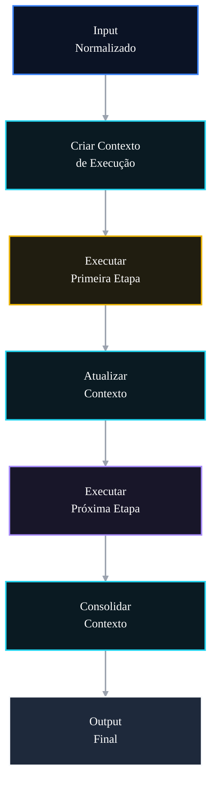

# 🤖 PR 91 — Fase 2: Contexto Compartilhado do Fluxo Avançado

## Contrato interno tipado para execução previsível entre etapas dos agents

---

<div align="left">


</div>

---

> [!IMPORTANT]
> Esta PR organiza o tráfego interno de dados do fluxo avançado por meio de um contexto compartilhado tipado e local ao orchestrator.
>
> - centraliza dados comuns da execução
> - reduz passagem dispersa de parâmetros
> - preserva contrato externo atual
>
> **Este PR não introduz event bus, state machine, saga, persistência de estado, novo agent ou redesign do pipeline.**

## Sumário

1. [Síntese Executiva](#1-síntese-executiva)
2. [Objetivo do PR](#2-objetivo-do-pr)
3. [Decisão Arquitetural](#3-decisão-arquitetural)
4. [Escopo](#4-escopo)
5. [Fora de Escopo](#5-fora-de-escopo)
6. [Fluxo Arquitetural](#6-fluxo-arquitetural)
7. [Contratos Mínimos](#7-contratos-mínimos)
8. [Regras de Implementação](#8-regras-de-implementação)
9. [Critérios de Review](#9-critérios-de-review)
10. [Critérios de Aceite](#10-critérios-de-aceite)
11. [Conclusão](#11-conclusão)

# 1. Síntese Executiva

Após consolidar robustez de entrada, tratamento controlado de falhas e logs por etapa, o próximo passo mínimo é organizar os dados que atravessam a execução do fluxo avançado.

A PR 91 introduz um `AgentsExecutionContext` no `AgentsFlowOrchestratorService`, reunindo informações comuns da execução em um contrato interno simples, previsível e restrito ao recorte atual.

# 2. Objetivo do PR

- criar contexto interno tipado
- centralizar dados comuns da execução
- reduzir passagem solta de parâmetros
- melhorar legibilidade do pipeline
- preservar contrato externo atual

# 3. Decisão Arquitetural

O contexto compartilhado permanece local ao `AgentsFlowOrchestratorService`, que já concentra a coordenação do fluxo avançado.

A decisão adiciona apenas um contrato interno de execução, sem transformar o pipeline em máquina de estados, arquitetura orientada a eventos ou estrutura persistida de estado.

# 4. Escopo

- introduzir `AgentsExecutionContext`
- concentrar `question`, `correlationId`, `metadata` e `ids`
- adaptar chamadas internas para uso do contexto
- atualizar o contexto de forma explícita entre etapas
- manter output de sucesso inalterado
- adicionar testes objetivos do novo contrato interno

# 5. Fora de Escopo

- event bus
- state machine
- saga
- persistência de estado
- cache distribuído
- redesign dos agents
- alteração da response pública

# 6. Fluxo Arquitetural



# 7. Contratos Mínimos

Novo contrato interno:

```ts
type AgentsExecutionContext = {
  question: QuestionInput
  correlationId: string
  metadata: Partial<Metadata>
  ids: Partial<IdsResult>
}
```

Sem alteração estrutural no output final existente:

```ts
{
  legalSearch,
  adaptedStatement,
  answerKey,
  metadata,
  ids
}
```

# 8. Regras de Implementação

- manter contexto local ao orchestrator
- atualizar contexto de forma explícita
- evitar abstrações adicionais
- não criar estado persistido
- não alterar interfaces públicas sem necessidade
- preservar recorte pequeno

# 9. Critérios de Review

- contexto centraliza dados comuns da execução
- passagem dispersa de parâmetros foi reduzida
- pipeline permanece legível
- output público permanece igual
- não há state machine, event bus ou persistência de estado
- recorte segue pequeno e aderente

# 10. Critérios de Aceite

- [ ] contexto interno foi introduzido
- [ ] dados comuns migraram para o contexto
- [ ] atualizações do contexto são explícitas
- [ ] fluxo atual permanece funcional
- [ ] output público permanece inalterado
- [ ] suíte permanece verde

# 11. Conclusão

A PR 91 melhora a organização interna do fluxo avançado no ponto correto: a coordenação central. O pipeline passa a operar com um contexto compartilhado claro e tipado, sem ampliar arquitetura, contrato externo ou responsabilidade dos agents.
