# 🧩 PR 92 — Correção: Consistência Estrutural dos Agents

## Padronização de contrato e integração interna no fluxo multi-agent

---

<div align="left">


</div>

> [!IMPORTANT]
> Esta PR aplica uma correção de consistência estrutural no fluxo multi-agent.
> O objetivo é padronizar o ponto de entrada do `InitialQuestionProcessingAgent` para `execute()`, mantendo alinhamento com os demais agents e preservando o comportamento funcional já validado.

---

## Sumário

1. [Síntese Executiva](#1-síntese-executiva)
2. [Objetivo do PR](#2-objetivo-do-pr)
3. [Decisão Arquitetural](#3-decisão-arquitetural)
4. [Escopo da PR](#4-escopo-da-pr)
5. [Fora de Escopo](#5-fora-de-escopo)
6. [Fluxo Arquitetural](#6-fluxo-arquitetural)
7. [Contratos Mínimos](#7-contratos-mínimos)
8. [Regras de Implementação](#8-regras-de-implementação)
9. [Critérios de Review](#9-critérios-de-review)
10. [Critérios de Aceite](#10-critérios-de-aceite)
11. [Conclusão](#11-conclusão)

---

## 1. Síntese Executiva

O pipeline avançado de IA já opera com uma sequência clara de agents:

- classificação de metadados;
- resolução de IDs;
- processamento inicial da questão;
- geração da chave de resposta.

Apesar disso, o `InitialQuestionProcessingAgent` ainda expunha um método público específico, `executeFromResolvedContext()`, enquanto os demais agents utilizavam `execute()` como ponto de entrada.

Esta PR corrige essa assimetria, mantendo o mesmo contrato de entrada e saída, mas padronizando o método público para `execute()`.

---

## 2. Objetivo do PR

O objetivo desta PR é alinhar a interface pública do `InitialQuestionProcessingAgent` ao padrão já utilizado pelos demais agents.

A correção cobre dois pontos do review técnico:

```txt
AnswerKeyAgent deve estar consistente como provider NestJS
InitialQuestionProcessingAgent deve expor execute()
```

No estado atual, o `AnswerKeyAgent` já está anotado com `@Injectable()`, então a alteração efetiva desta PR se concentra na padronização do método de execução do `InitialQuestionProcessingAgent` e nos pontos de chamada relacionados.

---

## 3. Decisão Arquitetural

A decisão adotada é preservar o fluxo atual e aplicar apenas a correção de superfície pública.

Antes:

```txt
InitialQuestionProcessingAgent.executeFromResolvedContext(...)
```

Depois:

```txt
InitialQuestionProcessingAgent.execute(...)
```

Essa mudança reduz assimetria entre agents sem introduzir abstrações novas, sem alterar o orchestrator estruturalmente e sem modificar o resultado funcional do pipeline.

---

## 4. Escopo da PR

Incluído nesta PR:

- renomear `executeFromResolvedContext()` para `execute()`;
- atualizar chamada no `AgentsFlowOrchestratorService`;
- atualizar specs do `InitialQuestionProcessingAgent`;
- atualizar specs do `AgentsFlowOrchestratorService`;
- preservar o uso dos helpers centralizados de normalização textual.

Arquivos envolvidos:

```txt
src/shared/ai/infra/agents/initial-question-processing.agent.ts
src/shared/ai/infra/services/agents-flow-orchestrator.service.ts
src/__tests__/shared/ai/infra/agents/initial-question-processing.agent.spec.ts
src/__tests__/shared/ai/infra/services/agents-flow-orchestrator.service.spec.ts
```

---

## 5. Fora de Escopo

Não faz parte desta PR:

- alterar prompts;
- mudar contratos externos;
- alterar payload final do pipeline;
- refatorar tipos globais de I/O dos agents;
- alterar cache Redis;
- alterar resolução de IDs;
- alterar LangGraph;
- alterar DAO ou SQL;
- alterar regra de answer key;
- introduzir novo agent.

---

## 6. Fluxo Arquitetural

```mermaid
%%{init: {
  "theme": "base",
  "themeVariables": {
    "background": "#050b16",
    "primaryColor": "#0b1220",
    "primaryTextColor": "#ffffff",
    "primaryBorderColor": "#22d3ee",
    "lineColor": "#94a3b8",
    "secondaryColor": "#0b1220",
    "tertiaryColor": "#0b1220",
    "fontFamily": "Inter, Arial, sans-serif"
  },
  "flowchart": {
    "htmlLabels": true,
    "curve": "linear",
    "nodeSpacing": 54,
    "rankSpacing": 68
  }
}}%%
flowchart LR
    A["AgentsFlowOrchestratorService"] --> B["ClassificationAgent<br/>execute"]
    B --> C["IdResolutionAgent<br/>execute"]
    C --> D["InitialQuestionProcessingAgent<br/>execute"]
    D --> E["AnswerKeyAgent<br/>execute"]
    E --> F["Resultado final<br/>legalSearch + adaptedStatement + answerKey + metadata + ids"]

    classDef core fill:#111827,stroke:#38bdf8,stroke-width:2px,color:#ffffff;
    classDef output fill:#052e2b,stroke:#2dd4bf,stroke-width:2px,color:#ffffff;

    class A,B,C,D,E core;
    class F output;
```



---

## 7. Contratos Mínimos

A entrada do agent permanece a mesma:

```ts
export type ResolvedInitialQuestionProcessingInput = {
  input: InitialQuestionProcessingInput;
  metadata: QuestionMetadata;
  ids: ResolvedIds;
};
```

O retorno também permanece inalterado:

```ts
Promise<InitialQuestionProcessingResult>
```

A mudança é apenas no nome do método público:

```ts
async execute(
  context: ResolvedInitialQuestionProcessingInput,
): Promise<InitialQuestionProcessingResult>
```

---

## 8. Regras de Implementação

1. Não alterar semântica do processamento inicial.
2. Não alterar `answerKeyBase`.
3. Não alterar fallback de `adaptedStatement`.
4. Não alterar normalização textual.
5. Não alterar output do orchestrator.
6. Não introduzir nova abstração.
7. Não modificar agents que já estão consistentes.
8. Atualizar testes apenas para refletir o novo método público.

---

## 9. Critérios de Review

Validar se:

- `InitialQuestionProcessingAgent` expõe `execute()`;
- o orchestrator chama `execute()`;
- não há referência restante a `executeFromResolvedContext`;
- `AnswerKeyAgent` permanece provider NestJS válido;
- os testes preservam o mesmo comportamento;
- não houve alteração funcional no output final.

---

## 10. Critérios de Aceite

A PR pode ser aceita quando:

- testes passarem;
- build passar;
- fluxo avançado continuar retornando o mesmo shape;
- `AgentsFlowOrchestratorService` usar apenas `execute()`;
- specs dos agents e do orchestrator estiverem atualizados;
- nenhuma mudança fora do recorte for introduzida.

---

## 11. Conclusão

Esta PR remove uma assimetria estrutural pequena, mas relevante, no pipeline multi-agent.

Ao padronizar o ponto de entrada do `InitialQuestionProcessingAgent`, o fluxo fica mais previsível, mais coeso e mais alinhado ao padrão dos demais agents, sem alterar comportamento funcional e sem ampliar arquitetura.
