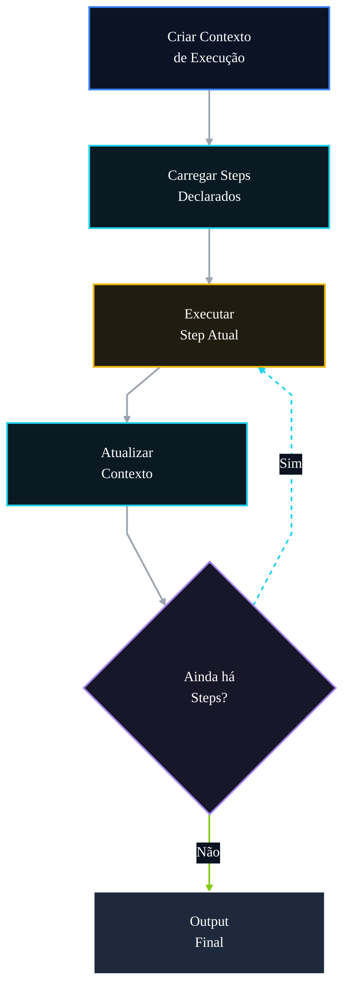

# 🤖 PR 92 — Fase 2: Pipeline Declarativo do Fluxo Avançado

## Sequência explícita de etapas com execução previsível no orchestrator

---

<div align="left">


</div>

---

> [!IMPORTANT]
> Esta PR organiza a sequência do fluxo avançado em um pipeline declarativo local ao orchestrator, mantendo a execução simples e previsível.
>
> - torna a ordem das etapas explícita
> - reutiliza o contexto compartilhado da execução
> - preserva contrato externo atual
>
> **Este PR não introduz workflow engine, DAG, paralelismo, plugin system, novo agent ou redesign do pipeline.**

## Sumário

1. [Síntese Executiva](#1-síntese-executiva)
2. [Objetivo do PR](#2-objetivo-do-pr)
3. [Decisão Arquitetural](#3-decisão-arquitetural)
4. [Escopo](#4-escopo)
5. [Fora de Escopo](#5-fora-de-escopo)
6. [Fluxo Arquitetural](#6-fluxo-arquitetural)
7. [Contratos Mínimos](#7-contratos-mínimos)
8. [Regras de Implementação](#8-regras-de-implementação)
9. [Critérios de Review](#9-critérios-de-review)
10. [Critérios de Aceite](#10-critérios-de-aceite)
11. [Conclusão](#11-conclusão)

# 1. Síntese Executiva

Após a introdução do `AgentsExecutionContext`, o próximo passo mínimo é deixar a sequência de execução do fluxo avançado mais clara sem alterar sua lógica funcional.

A PR 92 substitui chamadas rígidas e dispersas por uma lista declarativa de etapas executadas pelo `AgentsFlowOrchestratorService`, preservando a ordem atual e mantendo o pipeline local, simples e revisável.

# 2. Objetivo do PR

- declarar etapas do pipeline em estrutura única
- tornar a ordem de execução explícita
- reduzir repetição no orchestrator
- reutilizar `AgentsExecutionContext`
- preservar contrato externo atual

# 3. Decisão Arquitetural

A execução continua centralizada no `AgentsFlowOrchestratorService`, porém passa a ser guiada por uma coleção simples de etapas com `name` e `execute`.

A decisão melhora a legibilidade da sequência sem introduzir engine externa, DAG, paralelismo, plugin system ou abstrações desproporcionais ao recorte.

# 4. Escopo

- criar coleção declarativa de etapas
- iterar steps no orchestrator
- manter ordem funcional existente
- reutilizar contexto compartilhado
- manter output de sucesso inalterado
- adicionar testes objetivos do pipeline declarado

# 5. Fora de Escopo

- workflow engine
- DAG execution
- paralelismo
- plugin system
- filas
- state machine
- alteração da response pública

# 6. Fluxo Arquitetural



# 7. Contratos Mínimos

Estrutura interna proposta:

```ts
type FlowStep = {
  name: string
  execute: (context: AgentsExecutionContext) => Promise<void>
}
```

Sem alteração estrutural no output final existente:

```ts
{
  legalSearch,
  adaptedStatement,
  answerKey,
  metadata,
  ids
}
```

# 8. Regras de Implementação

- manter steps simples e locais ao orchestrator
- preservar ordem funcional existente
- reutilizar o contexto compartilhado
- atualizar contexto de forma explícita
- evitar abstrações genéricas excessivas
- não alterar interfaces públicas sem necessidade

# 9. Critérios de Review

- ordem funcional atual foi preservada
- steps ficaram explícitos e legíveis
- contexto compartilhado foi reutilizado
- output público permanece igual
- não há workflow engine, DAG ou plugin system
- recorte segue pequeno e aderente

# 10. Critérios de Aceite

- [ ] pipeline declarado foi introduzido
- [ ] steps executam na ordem esperada
- [ ] contexto compartilhado foi reutilizado
- [ ] output público permanece inalterado
- [ ] suíte permanece verde
- [ ] recorte pequeno foi mantido

# 11. Conclusão

A PR 92 melhora a definição da sequência do fluxo avançado sem ampliar arquitetura. O pipeline passa a operar com etapas explícitas e previsíveis, preservando contrato externo, ordem funcional e simplicidade de review.
