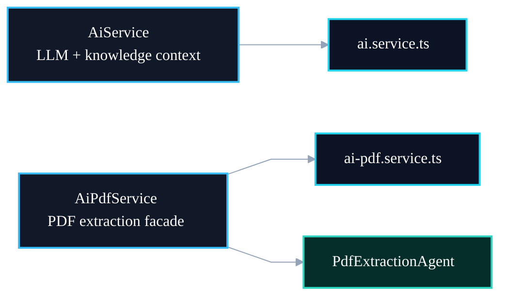

# 📄 PR 93 — Correção: Separação do AiPdfService

## Isolamento do serviço de PDF em arquivo próprio para reduzir acoplamento estrutural

---

<div align="left">


</div>

> [!IMPORTANT]
> Esta PR aplica uma correção estrutural pontual indicada no review do fluxo de IA.
> O objetivo é separar o `AiPdfService` do arquivo `ai.service.ts`, preservando comportamento, providers e testes, sem alterar o fluxo de extração de PDF.

---

## Sumário

1. [Síntese Executiva](#1-síntese-executiva)
2. [Objetivo do PR](#2-objetivo-do-pr)
3. [Decisão Arquitetural](#3-decisão-arquitetural)
4. [Escopo da PR](#4-escopo-da-pr)
5. [Fora de Escopo](#5-fora-de-escopo)
6. [Fluxo Arquitetural](#6-fluxo-arquitetural)
7. [Contratos Mínimos](#7-contratos-mínimos)
8. [Regras de Implementação](#8-regras-de-implementação)
9. [Critérios de Review](#9-critérios-de-review)
10. [Critérios de Aceite](#10-critérios-de-aceite)
11. [Conclusão](#11-conclusão)

---

## 1. Síntese Executiva

O arquivo `ai.service.ts` concentra duas classes de serviço com responsabilidades distintas:

```txt
AiService
AiPdfService
```

Embora isso funcione tecnicamente, a estrutura reduz clareza de leitura e mistura responsabilidades que evoluem por motivos diferentes.

Esta PR move o `AiPdfService` para um arquivo próprio, mantendo o comportamento atual e sem alterar o contrato do serviço.

---

## 2. Objetivo do PR

Separar o `AiPdfService` em arquivo dedicado:

```txt
src/shared/ai/infra/services/ai-pdf.service.ts
```

E manter o `AiService` em:

```txt
src/shared/ai/infra/services/ai.service.ts
```

Com isso, cada arquivo passa a representar uma responsabilidade principal.

---

## 3. Decisão Arquitetural

A decisão é realizar apenas uma separação física de arquivo, sem criar novas abstrações.

Antes:

```txt
ai.service.ts
├── AiService
└── AiPdfService
```

Depois:

```txt
ai.service.ts
└── AiService

ai-pdf.service.ts
└── AiPdfService
```

Essa mudança melhora organização sem alterar a topologia do módulo.

---

## 4. Escopo da PR

Incluído nesta PR:

- mover `AiPdfService` para arquivo próprio;
- ajustar imports;
- manter provider registrado no módulo atual;
- atualizar specs, se necessário;
- preservar comportamento de delegação para `PdfExtractionAgent`.

Arquivos esperados:

```txt
src/shared/ai/infra/services/ai.service.ts
src/shared/ai/infra/services/ai-pdf.service.ts
src/shared/ai/ai.module.ts ou módulo equivalente
src/__tests__/shared/ai/infra/services/ai-pdf.service.spec.ts
```

---

## 5. Fora de Escopo

Não faz parte desta PR:

- alterar `PdfExtractionAgent`;
- alterar fluxo de ingestion;
- alterar prompts;
- alterar contratos de PDF;
- alterar LangGraph;
- alterar Redis;
- alterar DAO;
- alterar orquestração multi-agent;
- remover `AiPdfService`.

---

## 6. Fluxo Arquitetural



---

## 7. Contratos Mínimos

O contrato do `AiPdfService` permanece igual:

```ts
@Injectable()
export class AiPdfService {
  constructor(private readonly pdfExtractionAgent: PdfExtractionAgent) {}

  async execute(input: PdfExtractionAgentInput): Promise<PdfExtractionAgentOutput>
}
```

Nenhum consumidor deve perceber alteração funcional.

---

## 8. Regras de Implementação

1. Não alterar comportamento.
2. Não alterar contrato público.
3. Não introduzir nova abstração.
4. Não mover responsabilidades do `PdfExtractionAgent`.
5. Não alterar o `AiService` além da remoção do serviço secundário.
6. Ajustar imports explicitamente.
7. Preservar testes existentes.
8. Manter recorte pequeno.

---

## 9. Critérios de Review

Validar se:

- `AiService` contém apenas responsabilidade própria;
- `AiPdfService` está em arquivo dedicado;
- imports foram atualizados;
- provider continua registrado;
- specs permanecem verdes;
- não houve mudança funcional no fluxo de PDF.

---

## 10. Critérios de Aceite

A PR pode ser aceita quando:

- build passar;
- testes passarem;
- `AiPdfService` estiver isolado;
- nenhum contrato externo mudar;
- o fluxo de extração de PDF continuar delegando ao `PdfExtractionAgent`.

---

## 11. Conclusão

Esta PR aplica uma correção simples de organização estrutural.

Ao separar o `AiPdfService` do `AiService`, o código fica mais claro e mais alinhado à responsabilidade única por arquivo, sem alterar comportamento e sem expandir a arquitetura.
