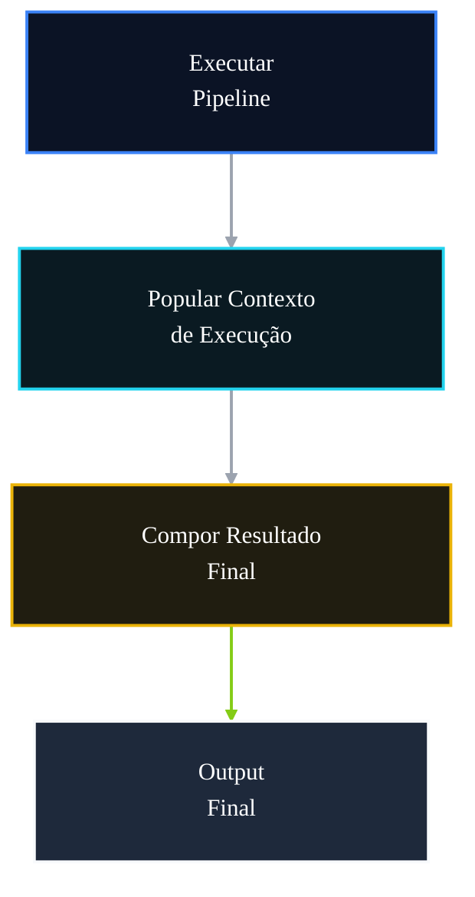

# 🤖 PR 93 — Fase 2: Composição Centralizada do Resultado do Fluxo Avançado

## Montagem explícita e previsível da resposta final a partir do contexto de execução

---

<div align="left">


</div>

---

> [!IMPORTANT]
> Esta PR centraliza a montagem do resultado final do fluxo avançado em um ponto único e previsível, utilizando o contexto acumulado durante a execução.
>
> - organiza a composição do output final
> - reduz montagem espalhada no orchestrator
> - preserva contrato externo atual
>
> **Este PR não introduz novo DTO público, serializer global, mapper genérico, presenter ou redesign do pipeline.**

## Sumário

1. [Síntese Executiva](#1-síntese-executiva)
2. [Objetivo do PR](#2-objetivo-do-pr)
3. [Decisão Arquitetural](#3-decisão-arquitetural)
4. [Escopo](#4-escopo)
5. [Fora de Escopo](#5-fora-de-escopo)
6. [Fluxo Arquitetural](#6-fluxo-arquitetural)
7. [Contratos Mínimos](#7-contratos-mínimos)
8. [Regras de Implementação](#8-regras-de-implementação)
9. [Critérios de Review](#9-critérios-de-review)
10. [Critérios de Aceite](#10-critérios-de-aceite)
11. [Conclusão](#11-conclusão)

# 1. Síntese Executiva

Após consolidar contexto compartilhado e pipeline declarativo, o próximo passo mínimo é explicitar a forma como a resposta final é produzida ao término do fluxo avançado.

A PR 93 move a composição do output para um ponto único no `AgentsFlowOrchestratorService`, utilizando os dados acumulados no contexto de execução e preservando integralmente o contrato público atual.

# 2. Objetivo do PR

- centralizar montagem do resultado final
- ler dados do contexto compartilhado
- reduzir composição espalhada no orchestrator
- tornar saída previsível e legível
- preservar contrato externo atual

# 3. Decisão Arquitetural

A composição permanece local ao `AgentsFlowOrchestratorService`, em método dedicado responsável apenas pela resposta final.

A decisão separa execução de montagem sem criar mappers genéricos, presenters, serializers globais ou camadas adicionais desproporcionais ao slice atual.

# 4. Escopo

- criar método de composição final
- ler `metadata`, `ids` e resultados acumulados no contexto
- retornar contrato atual em ponto único
- remover montagem dispersa
- manter output de sucesso inalterado
- adicionar testes objetivos da composição

# 5. Fora de Escopo

- alteração da response pública
- novo DTO público
- serializer global
- mapper genérico
- presenter
- versionamento de contrato
- redesign do pipeline

# 6. Fluxo Arquitetural



# 7. Contratos Mínimos

Contrato público preservado:

```ts
{
  legalSearch,
  adaptedStatement,
  answerKey,
  metadata,
  ids
}
```

Exemplo interno:

```ts
private buildResult(context: AgentsExecutionContext) {
  return {
    legalSearch,
    adaptedStatement,
    answerKey,
    metadata: context.metadata,
    ids: context.ids
  }
}
```

# 8. Regras de Implementação

- manter composição local ao orchestrator
- separar execução de montagem final
- evitar abstrações adicionais
- preservar contrato atual
- preservar recorte pequeno
- manter leitura simples e direta

# 9. Critérios de Review

- output é montado em ponto único
- composição ficou mais legível
- contrato atual permanece igual
- pipeline não foi alterado indevidamente
- não há mapper genérico ou presenter
- recorte segue pequeno e aderente

# 10. Critérios de Aceite

- [ ] composição centralizada foi introduzida
- [ ] contexto é utilizado na resposta final
- [ ] output público permanece inalterado
- [ ] fluxo atual continua funcional
- [ ] suíte permanece verde
- [ ] recorte pequeno foi mantido

# 11. Conclusão

A PR 93 melhora a clareza estrutural da saída do fluxo avançado no ponto correto. O pipeline passa a encerrar sua execução com uma composição explícita, previsível e fácil de manter, sem ampliar arquitetura ou contrato externo.
