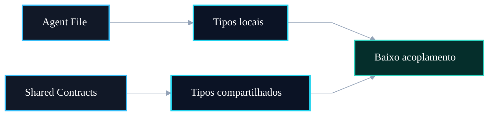

# 🧩 PR 94 — Correção: Padronização Local dos Tipos de I/O dos Agents

## Organização de contratos por responsabilidade e redução de acoplamento estrutural

---

<div align="left">


</div>

> [!IMPORTANT]
> Sim. Esta PR faz parte da sequência de correções do feedback recebido no review técnico.
> O foco aqui é organizar os tipos de entrada e saída dos agents, aproximando contratos locais de suas implementações e reduzindo inconsistência estrutural.

---

## Sumário

1. [Síntese Executiva](#1-síntese-executiva)
2. [Objetivo do PR](#2-objetivo-do-pr)
3. [Decisão Arquitetural](#3-decisão-arquitetural)
4. [Escopo da PR](#4-escopo-da-pr)
5. [Fora de Escopo](#5-fora-de-escopo)
6. [Fluxo Arquitetural](#6-fluxo-arquitetural)
7. [Contratos Mínimos](#7-contratos-mínimos)
8. [Regras de Implementação](#8-regras-de-implementação)
9. [Critérios de Review](#9-critérios-de-review)
10. [Critérios de Aceite](#10-critérios-de-aceite)
11. [Conclusão](#11-conclusão)
---

## 1. Síntese Executiva

Durante a evolução do fluxo multi-agent, parte dos tipos de input/output ficou centralizada em `agent.contracts.ts`, enquanto outra parte permaneceu próxima dos próprios agents.

Essa mistura gera inconsistência estrutural e dificulta manutenção incremental.

Esta PR corrige esse ponto, reorganizando contratos locais sem alterar comportamento funcional.

---

## 2. Objetivo do PR

Aplicar um padrão simples:

- tipos específicos de um agent ficam no próprio arquivo do agent;
- tipos realmente compartilhados permanecem em `agent.contracts.ts`;
- imports ficam mais claros;
- responsabilidade estrutural fica previsível.

---

## 3. Decisão Arquitetural

Separação por responsabilidade:

Antes:

```txt
agent.contracts.ts
├── tipos compartilhados
├── tipos locais do agent A
├── tipos locais do agent B
└── tipos locais do agent C
```

Depois:

```txt
agent.contracts.ts
└── apenas contratos compartilhados

classification.agent.ts
└── ClassificationAgentInput / Output

id-resolution.agent.ts
└── IdResolutionAgentInput / Output

...
```

Sem alterar runtime, apenas organização de tipos.

---

## 4. Escopo da PR

Incluído:

- revisar tipos de I/O dos agents;
- mover tipos locais para arquivos corretos;
- reduzir excesso em `agent.contracts.ts`;
- ajustar imports;
- manter compatibilidade dos testes.

Arquivos esperados:

```txt
src/shared/ai/infra/agents/*.ts
src/shared/ai/model/v1/agent.contracts.ts
specs relacionados
```

---

## 5. Fora de Escopo

Não entra nesta PR:

- regras de negócio;
- prompts;
- SQL;
- Redis;
- LangGraph;
- cache;
- embeddings;
- mudança de payload;
- novos agents;
- alteração de fluxo.

---

## 6. Fluxo Arquitetural



## 7. Contratos Mínimos

Exemplo esperado:

```ts
export type ClassificationAgentInput = { ... };
export type ClassificationAgentOutput = { ... };
```

Enquanto contratos comuns permanecem centralizados:

```ts
export type QuestionMetadata = { ... };
export type AnswerKey = { ... };
```

---

## 8. Regras de Implementação

1. Não alterar runtime.
2. Não alterar payloads.
3. Não mover tipos compartilhados reais.
4. Não criar nova camada.
5. Ajustar imports explicitamente.
6. Preservar testes.
7. Manter recorte pequeno.

---

## 9. Critérios de Review

Validar se:

- tipos locais foram aproximados do agent correto;
- `agent.contracts.ts` ficou mais coeso;
- imports continuam claros;
- testes verdes;
- nenhuma regra funcional mudou.

---

## 10. Critérios de Aceite

- Build OK
- Tests OK
- Sem regressão
- Estrutura mais consistente
- Feedback coberto

---

## 11. Conclusão

Esta PR fecha mais um ponto do feedback técnico com um ajuste estrutural simples e de baixo risco.

O resultado esperado é uma base mais organizada, previsível e fácil de evoluir em novos slices.
