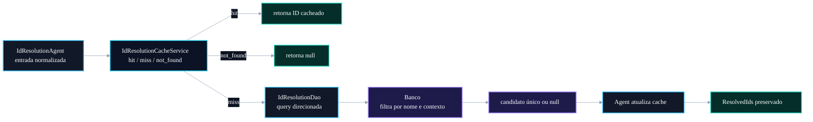

# 🗄️ PR 95 — Correção: Otimização de Queries no IdResolutionDao

## Redução de carregamento em memória na resolução de IDs por nome

---

<div align="left">


</div>

> [!IMPORTANT]
> Esta PR retoma a parte ainda pendente do feedback técnico sobre o `IdResolutionAgent`: reduzir o carregamento amplo de candidatos em memória durante a resolução de IDs.
> Após a PR 91 expandir o cache Redis para filtros e hierarquia, esta entrega atua no DAO para aproximar a filtragem do banco de dados, preservando contratos, cache e comportamento externo.

---

## Sumário

1. [Síntese Executiva](#1-síntese-executiva)
2. [Objetivo do PR](#2-objetivo-do-pr)
3. [Decisão Arquitetural](#3-decisão-arquitetural)
4. [Escopo da PR](#4-escopo-da-pr)
5. [Fora de Escopo](#5-fora-de-escopo)
6. [Fluxo Arquitetural](#6-fluxo-arquitetural)
7. [Contratos Mínimos](#7-contratos-mínimos)
8. [Regras de Implementação](#8-regras-de-implementação)
9. [Critérios de Review](#9-critérios-de-review)
10. [Critérios de Aceite](#10-critérios-de-aceite)
11. [Conclusão](#11-conclusão)

---

## 1. Síntese Executiva

O fluxo de resolução de IDs já recebeu correções incrementais nas PRs anteriores:

- normalização textual centralizada;
- extração de `discipline`, `matter` e `subMatter`;
- paralelização de lookups independentes;
- cache Redis para filtros, hierarquia e resultados não encontrados.

Ainda resta um ponto técnico do feedback original: algumas resoluções continuam partindo de listagens amplas de candidatos e fazem o match final em memória no JavaScript.

Esta PR reduz esse padrão ao adicionar consultas mais direcionadas no `IdResolutionDao`, evitando carregar coleções inteiras quando já existe um nome alvo normalizado.

---

## 2. Objetivo do PR

O objetivo é diminuir o custo operacional da resolução de IDs por nome.

Antes:

```txt
IdResolutionAgent
  -> IdResolutionDao lista candidatos
  -> Agent percorre lista em memória
  -> Agent compara nomes normalizados
```

Depois:

```txt
IdResolutionAgent
  -> IdResolutionDao consulta candidato por nome/contexto
  -> Agent recebe candidato único ou null
  -> Agent preserva montagem de ResolvedIds
```

A mudança deve preservar o comportamento externo do pipeline.

---

## 3. Decisão Arquitetural

A decisão é mover a filtragem objetiva para a camada de persistência, sem transformar o DAO em orquestrador de fluxo.

O `IdResolutionAgent` continua responsável por:

- normalizar entradas;
- consultar cache;
- chamar DAO;
- gravar cache;
- montar `ResolvedIds`.

O `IdResolutionDao` passa a oferecer métodos mais específicos para busca por nome e contexto, reduzindo a necessidade de listagens amplas.

---

## 4. Escopo da PR

Incluído nesta PR:

- adicionar métodos específicos no `IdResolutionDao`;
- reduzir o uso de listagens amplas quando há nome alvo;
- ajustar o `IdResolutionAgent` para consumir os novos métodos;
- preservar cache Redis implementado na PR 91;
- manter fallback seguro onde necessário;
- atualizar specs do DAO;
- atualizar specs do agent.

Arquivos esperados:

```txt
src/shared/ai/infra/dao/id-resolution.dao.ts
src/shared/ai/infra/agents/id-resolution.agent.ts
src/__tests__/shared/ai/infra/dao/id-resolution.dao.spec.ts
src/__tests__/shared/ai/infra/agents/id-resolution.agent.spec.ts
```

---

## 5. Fora de Escopo

Não faz parte desta PR:

- fuzzy search;
- ranking por similaridade;
- mudança de schema;
- criação de índice;
- migration;
- alteração de contratos públicos;
- alteração no `ClassificationAgent`;
- alteração no cache Redis;
- alteração no orchestrator;
- alteração de prompts;
- nova camada de repository/service.

---

## 6. Fluxo Arquitetural



---

## 7. Contratos Mínimos

O contrato público do agent permanece inalterado:

```ts
export type IdResolutionAgentOutput = {
  ids: ResolvedIds;
};
```

Os métodos internos do DAO podem seguir um formato mínimo:

```ts
export type FindFilterCandidateByTypeAndNameInput = {
  filterTypeName: string;
  filterName: string;
};
```

Retorno esperado:

```ts
type IdResolutionCandidate = {
  id: number;
  name: string;
} | null;
```

A PR não altera o shape de `QuestionMetadata`, `ResolvedIds` ou outputs do orchestrator.

---

## 8. Regras de Implementação

1. Não alterar contratos externos.
2. Não alterar o shape de `ResolvedIds`.
3. Preservar cache Redis da PR 91.
4. Não remover normalização centralizada.
5. Não introduzir fuzzy search.
6. Não alterar schema.
7. Não criar nova camada.
8. Não deslocar orquestração para o DAO.
9. Atualizar specs de DAO e agent.
10. Manter o recorte pequeno e proporcional ao feedback.

---

## 9. Critérios de Review

Validar se:

- o DAO reduz listagens amplas nos pontos cobertos;
- o agent continua simples e coordenador;
- cache `hit`, `miss` e `not_found` continua preservado;
- queries direcionadas retornam candidato único ou `null`;
- specs cobrem sucesso e ausência de match;
- output final permanece idêntico;
- não há mudança de regra funcional.

---

## 10. Critérios de Aceite

A PR pode ser aceita quando:

- testes passarem;
- build passar;
- resolução por filtro continuar retornando os mesmos IDs;
- resolução hierárquica continuar estável;
- cache Redis continuar funcionando;
- listagens amplas forem reduzidas nos pontos cobertos;
- nenhuma mudança funcional externa for introduzida.

---

## 11. Conclusão

Esta PR fecha a parte pendente do feedback sobre carregamento excessivo de candidatos em memória no fluxo de resolução de IDs.

A entrega mantém o desenho incremental das PRs anteriores, preserva contratos e melhora a eficiência interna ao aproximar a filtragem do banco de dados, sem introduzir fuzzy search, migrations ou mudanças arquiteturais amplas.
