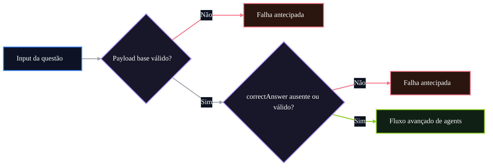

# 🤖 PR 97 — Fase 2: Guardrail Estrutural do Correct Answer
## Validação mínima de `correctAnswer` antes da execução do fluxo avançado

---

<div align="left">


</div>

---

> [!IMPORTANT]
> Esta PR dá continuidade direta à PR 96, mantendo o mesmo eixo de guardrails estruturais mínimos antes da execução do fluxo avançado.
>
> - valida `question.correctAnswer` apenas quando informado
> - rejeita valor vazio ou composto somente por espaços
> - preserva o comportamento atual quando o campo estiver ausente ou válido
>
> **Este PR não valida correspondência com alternativas, não normaliza valores, não cria validator global, não adiciona pipe customizado e não redesenha o pipeline.**

## Sumário

1. [Síntese Executiva](#1-síntese-executiva)
2. [Objetivo do PR](#2-objetivo-do-pr)
3. [Decisão Arquitetural](#3-decisão-arquitetural)
4. [Escopo](#4-escopo)
5. [Fora de Escopo](#5-fora-de-escopo)
6. [Fluxo Arquitetural](#6-fluxo-arquitetural)
7. [Contratos Mínimos](#7-contratos-mínimos)
8. [Regras de Implementação](#8-regras-de-implementação)
9. [Critérios de Review](#9-critérios-de-review)
10. [Critérios de Aceite](#10-critérios-de-aceite)
11. [Conclusão](#11-conclusão)

# 1. Síntese Executiva

A PR 96 consolidou a validação estrutural mínima de `alternatives`, impedindo que o fluxo avançado fosse acionado sem a base necessária para processamento consistente. A PR 97 continua esse mesmo caminho com um guardrail pequeno sobre `correctAnswer`, restrito ao caso em que o campo é explicitamente informado no payload.

O próximo passo mínimo correto é rejeitar valores vazios ou compostos apenas por espaços antes da execução dos agents. Isso evita processamento avançado com uma resposta correta estruturalmente inválida, sem alterar o contrato de sucesso, sem exigir presença obrigatória do campo e sem ampliar a arquitetura já aprovada.

# 2. Objetivo do PR

- validar `question.correctAnswer` quando presente;
- rejeitar `correctAnswer` vazio ou branco;
- interromper o fluxo antes dos agents quando o input for inválido;
- preservar o comportamento atual quando `correctAnswer` estiver ausente ou válido;
- manter a entrega pequena, local e diretamente revisável.

# 3. Decisão Arquitetural

A validação permanece no `AgentsFlowOrchestratorService`, no mesmo ponto em que os guardrails estruturais anteriores já protegem a entrada do fluxo avançado. A decisão é manter a checagem próxima da orquestração real, porque o recorte ainda não exige validator global, pipe customizado, camada adicional ou modelagem nova.

Esta PR não redefine o pipeline nem redistribui responsabilidades. Ela apenas adiciona uma regra estrutural mínima ao fluxo existente, preservando a arquitetura aprovada e evitando antecipar validações sem necessidade para este slice.

# 4. Escopo

- validação de `correctAnswer` opcional quando informado;
- rejeição de string vazia;
- rejeição de string composta apenas por espaços;
- cobertura de teste para os cenários inválidos;
- preservação do fluxo de sucesso existente.

# 5. Fora de Escopo

- validar se `correctAnswer` corresponde a alguma alternativa;
- normalizar caixa, acentuação ou formatação do valor;
- mapear aliases de alternativas;
- deduplicar alternativas;
- tornar `correctAnswer` obrigatório;
- criar validator global, pipe customizado ou decorator adicional;
- redesenhar o fluxo de agents ou a estrutura do orchestrator.

# 6. Fluxo Arquitetural



# 7. Contratos Mínimos

Não há alteração estrutural no contrato de sucesso. `correctAnswer` permanece opcional no input, e a PR apenas define que, quando informado, o valor precisa conter conteúdo útil após remoção de espaços laterais.

```ts
type QuestionInput = {
  correctAnswer?: string;
};
```

A regra mínima adicionada é local ao fluxo de validação: ausência continua válida; string vazia ou branca passa a falhar antes da execução dos agents.

# 8. Regras de Implementação

A implementação deve manter o guardrail no orchestrator, antes de qualquer chamada aos agents, usando uma checagem direta sobre `correctAnswer`. O campo não deve ser normalizado para fins de persistência ou retorno nesta PR; o uso de `trim()` deve existir apenas para decidir se o valor informado é estruturalmente vazio.

O DAO, quando envolvido em fluxos posteriores, permanece restrito à persistência. Esta PR não deve introduzir abstrações, providers, validators globais, pipes customizados ou qualquer fundação paralela para uma regra que ainda é pequena e localizada.

# 9. Critérios de Review

- confirmar que `correctAnswer` vazio falha antes da execução dos agents;
- confirmar que `correctAnswer` branco falha antes da execução dos agents;
- confirmar que a ausência de `correctAnswer` continua aceita;
- confirmar que o fluxo válido permanece sem alteração comportamental;
- confirmar que a validação ficou local, simples e proporcional ao slice;
- confirmar que não houve redesign do pipeline nem granularização arquitetural desnecessária.

# 10. Critérios de Aceite

- [ ] `correctAnswer` vazio é rejeitado antes da orquestração dos agents.
- [ ] `correctAnswer` composto apenas por espaços é rejeitado antes da orquestração dos agents.
- [ ] payload sem `correctAnswer` continua válido.
- [ ] payload com `correctAnswer` válido segue o fluxo atual.
- [ ] agents não são executados quando o guardrail falha.
- [ ] suíte de testes permanece verde.

# 11. Conclusão

A PR 97 mantém a progressão incremental da Fase 2 ao adicionar um guardrail estrutural simples para `correctAnswer`. O fluxo passa a rejeitar um valor explicitamente inválido antes da orquestração, preservando a arquitetura existente, o contrato válido e o recorte pequeno necessário para review direto.
