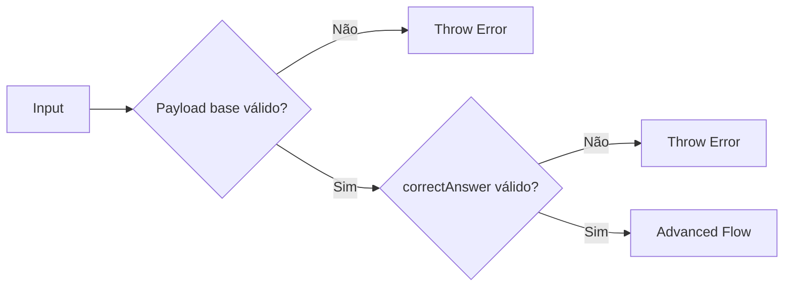

# 🤖 PR 97 — Fase 2: Guardrail Estrutural do Correct Answer

## Validação mínima de `correctAnswer` antes da execução do fluxo avançado

---

---

> [!IMPORTANT]
> Esta PR dá continuidade direta à PR 96, expandindo os guardrails estruturais de entrada sem alterar a arquitetura atual.
>
> - valida `question.correctAnswer` quando informado
> - impede fluxo avançado com valor vazio ou composto apenas por espaços
> - preserva comportamento atual quando o campo estiver ausente ou válido
>
> **Este PR não valida correspondência com alternativas, não normaliza valores, não cria validator global, não adiciona pipe customizado e não redesenha o pipeline.**

## Sumário

1. [Síntese Executiva](#1-síntese-executiva)
2. [Objetivo do PR](#2-objetivo-do-pr)
3. [Decisão Arquitetural](#3-decisão-arquitetural)
4. [Escopo](#4-escopo)
5. [Fora de Escopo](#5-fora-de-escopo)
6. [Fluxo Arquitetural](#6-fluxo-arquitetural)
7. [Contratos Mínimos](#7-contratos-mínimos)
8. [Regras de Implementação](#8-regras-de-implementação)
9. [Critérios de Review](#9-critérios-de-review)
10. [Critérios de Aceite](#10-critérios-de-aceite)
11. [Conclusão](#11-conclusão)

# 1. Síntese Executiva

A PR 96 consolidou a utilidade estrutural mínima de `alternatives`. A PR 97 avança no mesmo eixo de robustez de entrada, adicionando uma validação pequena e localizada para `correctAnswer` quando esse campo vier no payload.

O objetivo é evitar processamento avançado com um valor explicitamente inválido, mantendo o contrato atual para cenários válidos e para inputs que não informam resposta correta.

# 2. Objetivo do PR

- validar `correctAnswer` quando presente
- rejeitar valor vazio ou branco
- falhar antes da execução dos agents em input inválido
- preservar comportamento atual em cenários válidos
- manter recorte pequeno e revisável

# 3. Decisão Arquitetural

A validação permanece no `AgentsFlowOrchestratorService`, junto aos guardrails anteriores. O recorte continua local ao ponto real de orquestração, evitando abstrações prematuras ou expansão de camadas.

# 4. Escopo

- validar `correctAnswer` opcional vazio
- validar `correctAnswer` opcional branco
- adicionar testes do novo guardrail
- manter fluxo de sucesso inalterado

# 5. Fora de Escopo

- validar se existe nas alternativas
- normalizar caixa ou acentuação
- mapear aliases
- deduplicação
- validator global
- pipe customizado
- redesign do pipeline

# 6. Fluxo Arquitetural

# 7. Contratos Mínimos

Sem alteração estrutural no contrato de sucesso. A PR adiciona apenas falha antecipada para `correctAnswer` inválido quando informado.

# 8. Regras de Implementação

- manter validação no orchestrator
- validar antes dos agents
- tratar string vazia/branca como inválida
- permitir ausência do campo
- não alterar fluxo válido

# 9. Critérios de Review

- `correctAnswer` vazio falha antes dos agents
- `correctAnswer` branco falha antes dos agents
- ausência do campo continua válida
- fluxo atual permanece igual
- recorte segue pequeno

# 10. Critérios de Aceite

- [ ] `correctAnswer` vazio falha antes da orquestração
- [ ] `correctAnswer` branco falha antes da orquestração
- [ ] ausência de `correctAnswer` continua válida
- [ ] agents não executam em input inválido
- [ ] suíte permanece verde

# 11. Conclusão

A PR 97 mantém a progressão incremental da fase 2, adicionando mais um guardrail estrutural simples e proporcional. Sem ampliar arquitetura, o fluxo passa a rejeitar `correctAnswer` explicitamente inválido antes da orquestração.
