# 🤖 PR 98 — Fase 2: Fuzzy Matching na Resolução de IDs

## Fallback aproximado após tentativa exata no `IdResolutionAgent`

---

<div align="left">


</div>

---

> [!IMPORTANT]
> Esta PR incorpora o feedback de review sobre a resolução de IDs, mantendo a tentativa exata como caminho principal e adicionando fallback aproximado quando o banco não retornar correspondência direta.
>
> - preserva o match exato como prioridade
> - adiciona fuzzy matching apenas como fallback
> - reduz retornos vazios quando houver candidato semelhante confiável
>
> **Este PR não adiciona LLM, embeddings, novo agent, cache novo, ranking complexo ou redesign da resolução de IDs.**

## Sumário

1. [Síntese Executiva](#1-síntese-executiva)
2. [Objetivo do PR](#2-objetivo-do-pr)
3. [Decisão Arquitetural](#3-decisão-arquitetural)
4. [Escopo](#4-escopo)
5. [Fora de Escopo](#5-fora-de-escopo)
6. [Fluxo Arquitetural](#6-fluxo-arquitetural)
7. [Contratos Mínimos](#7-contratos-mínimos)
8. [Regras de Implementação](#8-regras-de-implementação)
9. [Critérios de Review](#9-critérios-de-review)
10. [Critérios de Aceite](#10-critérios-de-aceite)
11. [Conclusão](#11-conclusão)

# 1. Síntese Executiva

As PRs anteriores fortaleceram a entrada do fluxo avançado antes da execução dos agents. A PR 98 muda o eixo para um ponto levantado em review: a resolução de IDs não deve depender apenas de correspondência exata quando o dado extraído estiver próximo, mas não idêntico ao registro do banco.

Esta PR mantém a estratégia atual como caminho principal e adiciona um fallback pequeno de fuzzy matching no `IdResolutionAgent`. A intenção é reduzir `null` indevido em entidades como banca, lei, artigo ou ano quando houver candidato semelhante suficiente, sem introduzir LLM, embeddings ou uma camada nova de interpretação.

# 2. Objetivo do PR

- manter match exato como primeira tentativa
- aplicar fuzzy matching somente quando o match exato falhar
- selecionar candidato aproximado com similaridade mínima
- preservar retorno atual quando não houver candidato confiável
- cobrir cenários de match exato, fallback aproximado e ausência de match

# 3. Decisão Arquitetural

A decisão é manter a responsabilidade dentro do `IdResolutionAgent`, pois a melhoria pertence à estratégia de resolução de entidades e não à orquestração do fluxo. O agent continua recebendo metadados e devolvendo IDs resolvidos; apenas ganha uma segunda tentativa local e determinística quando a busca exata não encontra resultado.

Esse recorte evita transferir a decisão para o orchestrator, evita acoplar LLM à resolução de IDs e não cria uma foundation paralela. O fallback aproximado é uma continuação controlada da resolução atual, não uma reescrita do agent.

# 4. Escopo

- adicionar fallback de fuzzy matching após falha do match exato
- comparar termo extraído com candidatos retornados do banco
- aplicar limiar mínimo de similaridade
- manter `null` quando nenhum candidato atingir o limiar
- adicionar testes unitários para os novos cenários
- preservar o contrato público do agent

# 5. Fora de Escopo

- uso de LLM para interpretar nomes
- embeddings ou busca vetorial
- novo agent de resolução
- cache adicional
- ranking multiestágio
- normalização semântica avançada
- alteração no orchestrator
- alteração no contrato de output
- persistência de decisões aproximadas
- redesign da camada de dados

# 6. Fluxo Arquitetural

```mermaid
%%{init: {
  "theme": "base",
  "themeVariables": {
    "background": "#050b16",
    "primaryColor": "#0b1220",
    "primaryTextColor": "#ffffff",
    "primaryBorderColor": "#22d3ee",
    "lineColor": "#94a3b8",
    "secondaryColor": "#0b1220",
    "tertiaryColor": "#0b1220",
    "fontFamily": "Inter, Arial, sans-serif"
  },
  "flowchart": {
    "htmlLabels": true,
    "curve": "linear",
    "nodeSpacing": 34,
    "rankSpacing": 44
  }
}}%%
flowchart LR
    A["Metadata extraído"] --> B["Tentativa exata"]
    B --> C{"Encontrou ID?"}
    C -->|Sim| D["Retorna ID exato"]
    C -->|Não| E["Busca candidatos"]
    E --> F["Calcula similaridade"]
    F --> G{"Candidato confiável?"}
    G -->|Sim| H["Retorna ID aproximado"]
    G -->|Não| I["Retorna null"]

    classDef step1 fill:#0b1325,stroke:#3b82f6,stroke-width:2px,color:#ffffff;
    classDef step2 fill:#0a1a22,stroke:#22d3ee,stroke-width:2px,color:#ffffff;
    classDef step3 fill:#201d10,stroke:#eab308,stroke-width:2px,color:#ffffff;
    classDef step4 fill:#181629,stroke:#a78bfa,stroke-width:2px,color:#ffffff;
    classDef step5 fill:#25170f,stroke:#f97316,stroke-width:2px,color:#ffffff;
    classDef step6 fill:#112015,stroke:#84cc16,stroke-width:2px,color:#ffffff;
    classDef step7 fill:#10243a,stroke:#38bdf8,stroke-width:2px,color:#ffffff;
    classDef step8 fill:#221b2f,stroke:#f472b6,stroke-width:2px,color:#ffffff;
    classDef step9 fill:#14281d,stroke:#34d399,stroke-width:2px,color:#ffffff;
    classDef step10 fill:#2a160f,stroke:#fb7185,stroke-width:2px,color:#ffffff;
    classDef step11 fill:#1e293b,stroke:#f8fafc,stroke-width:2px,color:#ffffff;
    classDef decision fill:#181629,stroke:#a78bfa,stroke-width:2px,color:#ffffff;
    classDef successBox fill:#112015,stroke:#84cc16,stroke-width:2px,color:#ffffff;
    classDef failureBox fill:#2a160f,stroke:#fb7185,stroke-width:2px,color:#ffffff;
    classDef outputBox fill:#1e293b,stroke:#f8fafc,stroke-width:2px,color:#ffffff;
    classDef foundationBox fill:#1e293b,stroke:#f8fafc,stroke-width:2px,color:#ffffff;
    classDef coreBox fill:#1e293b,stroke:#f8fafc,stroke-width:2px,color:#ffffff;

    class A step1;
    class B step2;
    class C decision;
    class D successBox;
    class E step4;
    class F step5;
    class G decision;
    class H successBox;
    class I failureBox;

    linkStyle 0 stroke:#9ca3af,stroke-width:2px;
    linkStyle 1 stroke:#9ca3af,stroke-width:2px;
    linkStyle 2 stroke:#84cc16,stroke-width:2px;
    linkStyle 3 stroke:#fb7185,stroke-width:2px;
    linkStyle 4 stroke:#9ca3af,stroke-width:2px;
    linkStyle 5 stroke:#9ca3af,stroke-width:2px;
    linkStyle 6 stroke:#84cc16,stroke-width:2px;
    linkStyle 7 stroke:#fb7185,stroke-width:2px;
```



# 7. Contratos Mínimos

O contrato de saída permanece o mesmo:

```ts
{
  disciplineId,
  matterId,
  subMatterId,
  bankId,
  articleId,
  yearId,
  institutionId,
  jobId
}
```

A mudança é apenas interna ao processo de resolução: quando o match exato falhar, o agent pode preencher o mesmo campo com um candidato aproximado confiável. Caso o limiar não seja atingido, o campo continua retornando `null`.

# 8. Regras de Implementação

- priorizar sempre o match exato
- executar fuzzy matching apenas como fallback
- manter algoritmo simples e determinístico
- aplicar normalização textual mínima antes da comparação
- usar limiar explícito de similaridade
- não chamar LLM dentro do `IdResolutionAgent`
- não alterar o orchestrator
- não alterar o contrato de retorno
- não persistir o candidato aproximado como decisão permanente

# 9. Critérios de Review

- match exato continua tendo precedência
- fallback só roda quando a busca exata falha
- similaridade mínima está explícita e testada
- ausência de candidato confiável mantém retorno `null`
- implementação permanece localizada no `IdResolutionAgent`
- não há novo agent, camada global ou dependência desnecessária
- testes cobrem os caminhos principal, fallback e falha controlada

# 10. Critérios de Aceite

- [ ] match exato continua retornando o mesmo ID de antes
- [ ] quando o match exato falha, o fuzzy matching tenta resolver por similaridade
- [ ] candidato acima do limiar retorna ID aproximado
- [ ] candidato abaixo do limiar mantém retorno `null`
- [ ] resolução não usa LLM, embeddings ou novo agent
- [ ] contrato de saída permanece inalterado
- [ ] suíte permanece verde

# 11. Conclusão

A PR 98 responde diretamente ao feedback de review sem expandir a arquitetura. A resolução de IDs passa a ter uma segunda tentativa simples e controlada quando o match exato falha, reduzindo retornos vazios indevidos e preservando o comportamento atual nos casos já resolvidos corretamente.

O recorte permanece pequeno, localizado e revisável: melhora a capacidade do `IdResolutionAgent` sem redesenhar o pipeline, sem criar nova camada e sem antecipar soluções mais amplas.
