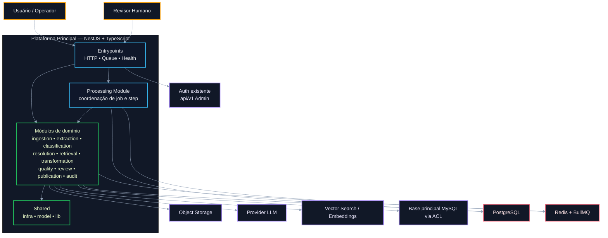
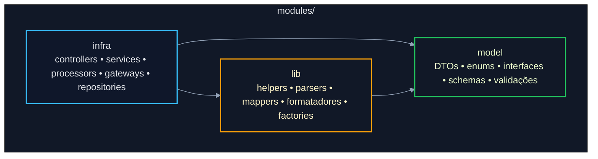
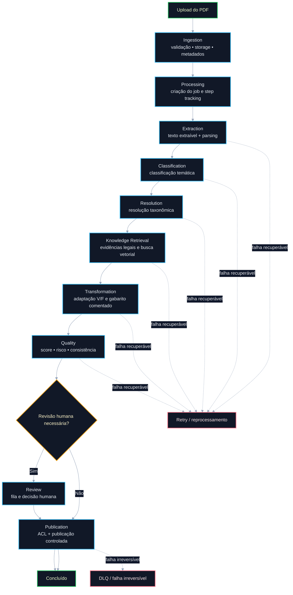
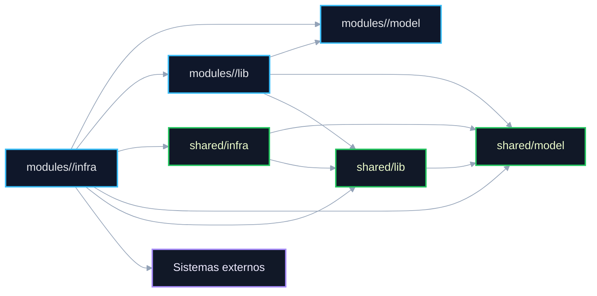
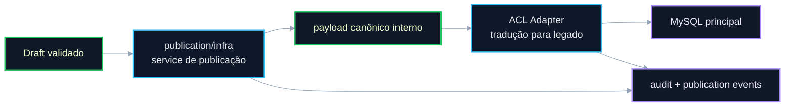

# Arquitetura Geral da Plataforma de Geração de Questões com IA


## Tema

**Arquitetura Geral**

## Tipo da Discussão

Proposta arquitetural para validação técnica e definição da base de implementação da plataforma.

---

## 1. Resumo Executivo

Esta proposta reposiciona a arquitetura da plataforma de geração de questões com IA conforme o realinhamento técnico definido para o projeto:

- **dispensar OCR no fluxo base**, uma vez que o documento-alvo possui **texto extraível**;
- **reaproveitar a autenticação já existente da `api/v1` do admin atual**, evitando duplicação de infraestrutura;
- **adotar um monólito modular em NestJS + TypeScript**, com organização por domínio e camadas pragmáticas por módulo;
- estruturar cada módulo em **`infra`**, **`model`** e **`lib`**, reservando `shared/` apenas para componentes genuinamente reutilizáveis;
- aplicar conceitos de **arquitetura hexagonal** e **Clean Architecture** apenas quando agregarem valor real, sem impor abstrações excessivas desde o início.

A intenção é construir uma base arquitetural que seja:

- simples de navegar;
- fácil de evoluir;
- clara em termos de responsabilidade;
- desacoplada o suficiente para crescer com segurança;
- operacionalmente viável para o estágio atual do projeto.

---

## 2. Contexto

A plataforma tem como objetivo transformar provas em PDF em questões estruturadas no formato **Verdadeiro/Falso**, com suporte a:

- extração textual e parsing do conteúdo;
- classificação temática;
- resolução taxonômica;
- busca de base legal e evidências;
- adaptação semântica do item;
- validação automatizada;
- revisão humana quando necessário;
- publicação controlada na base principal.

A proposta inicial havia partido de uma direção mais próxima de **Clean Architecture** aplicada de forma ampla, somada a OCR como parte do fluxo principal. Após a revisão, a orientação consolidada para o projeto passou a ser mais pragmática:

1. **não usar OCR como etapa base**, pois o cenário atual trabalha com documentos com texto extraível;
2. **reaproveitar a autenticação do admin atual** via `api/v1`;
3. estruturar a solução como **monólito modular**, com separação por domínio e camadas internas por módulo;
4. aplicar conceitos arquiteturais avançados **de forma seletiva**, sem inflar a solução com abstrações desnecessárias.

Esse direcionamento melhora a aderência da arquitetura ao momento do projeto e reduz custo estrutural sem perder qualidade de desenho.

---

## 3. Premissas Validadas

As premissas abaixo passam a ser consideradas de base para a arquitetura:

1. O documento de entrada possui **texto extraível**.
2. O fluxo principal deve operar com **extração textual + parsing**, sem OCR como dependência obrigatória.
3. OCR poderá existir futuramente apenas como **fallback ou extensão excepcional**, se o contexto de entrada mudar.
4. A autenticação deverá **reaproveitar o fluxo já existente da `api/v1`** do admin atual.
5. A plataforma será implementada como **monólito modular**, e não como conjunto de microsserviços.
6. Os módulos devem possuir organização interna por:
   - `infra`
   - `model`
   - `lib`
7. `shared/` deve ser usado apenas para componentes realmente reutilizáveis entre múltiplos módulos.
8. Conceitos de hexagonal e Clean poderão ser adotados **pontualmente**, sem rigidez dogmática.

---

## 4. Objetivo

Definir e validar a **arquitetura geral da plataforma**, incluindo:

- estilo arquitetural predominante;
- organização estrutural do código;
- decomposição por módulos de domínio;
- responsabilidades de cada camada interna;
- relação entre módulos e componentes compartilhados;
- forma de integração com autenticação existente e legado;
- desenho do pipeline assíncrono;
- critérios de escalabilidade, resiliência, observabilidade e evolução futura.

---

## 5. Problema Arquitetural

A solução precisa lidar com um fluxo de processamento composto por múltiplas etapas e múltiplas dependências externas:

1. receber PDFs;
2. validar integridade e metadados;
3. extrair texto do documento;
4. interpretar e segmentar questões;
5. classificar contexto e estrutura do conteúdo;
6. resolver taxonomia e identificadores canônicos;
7. buscar base legal e contexto normativo;
8. adaptar o item para Verdadeiro/Falso;
9. gerar resposta comentada;
10. validar qualidade e risco;
11. encaminhar para revisão humana quando necessário;
12. publicar de forma controlada no legado;
13. registrar rastreabilidade ponta a ponta.

Sem um desenho macro claro, surgem riscos relevantes:

- mistura entre lógica de domínio e detalhes de framework;
- crescimento desordenado de services e helpers;
- módulos sem ownership claro;
- acoplamento excessivo entre etapas do pipeline;
- contaminação do modelo interno pelo legado;
- pouca governança sobre contratos internos;
- dificuldade de reprocessamento e troubleshooting;
- complexidade operacional desnecessária para o estágio atual do projeto.

A pergunta central desta discussão é:

> **como estruturar a plataforma para suportar um pipeline assíncrono, rastreável e evolutivo, sem cair em overengineering nem em acoplamento estrutural prematuro?**

---

## 6. Drivers Arquiteturais

### 6.1 Funcionais

- upload e validação de PDF;
- extração textual e parsing;
- criação e acompanhamento de jobs;
- classificação e resolução taxonômica;
- recuperação de evidências legais;
- transformação semântica para V/F;
- validação de qualidade;
- revisão humana;
- publicação controlada;
- retry e reprocessamento por job e por etapa.

### 6.2 Não funcionais

- baixo acoplamento entre módulos;
- alta coesão por domínio;
- rastreabilidade por request, job, step e publicação;
- idempotência em operações críticas;
- resiliência a falhas parciais de providers;
- observabilidade end-to-end;
- segurança por padrão;
- testabilidade;
- navegabilidade do código;
- simplicidade operacional;
- evolução incremental sem reescrita da base.

---

## 7. Decisões Arquiteturais Explícitas

### 7.1 Fluxo base sem OCR

A arquitetura passa a assumir **extração textual e parsing direto** como caminho principal.

#### Implicações

- reduz complexidade operacional;
- reduz custo técnico;
- remove uma dependência desnecessária do caminho crítico;
- simplifica debug, testes e observabilidade;
- deixa a extração mais aderente ao cenário atual.

#### Diretriz

OCR não compõe o pipeline principal nesta fase. Caso seja necessário no futuro, deve entrar como **capacidade opcional**, isolada e com justificativa própria.

---

### 7.2 Reaproveitamento da autenticação da `api/v1`

A autenticação da plataforma não deve reinventar o fluxo já existente no admin.

#### Diretriz

- validação de identidade e autorização deve reaproveitar a autenticação disponível na `api/v1`;
- o módulo `auth` da nova plataforma deve funcionar como **camada de integração e adaptação**, e não como sistema de identidade paralelo;
- a plataforma deve manter consistência com a infraestrutura já utilizada.

#### Benefícios

- menor esforço de implementação;
- menor dispersão arquitetural;
- menor duplicação de regras;
- maior consistência operacional.

---

### 7.3 Monólito modular como base

A plataforma será organizada como **um único deployment unit principal**, com separação interna por módulos de domínio.

#### Diretriz

- um serviço principal em NestJS + TypeScript;
- módulos especializados por capacidade;
- filas e workers desacoplando etapas do pipeline;
- módulos com responsabilidades explícitas;
- shared restrito a componentes realmente transversais.

#### Benefícios

- simplicidade operacional;
- menor custo inicial de plataforma;
- melhor navegabilidade;
- facilidade de tracing;
- evolução incremental mais controlada.

---

### 7.4 Camadas por módulo: `infra`, `model` e `lib`

Cada módulo deverá seguir uma organização interna simples e consistente.

#### `modules/<modulo>/model`

Responsável por definir **forma, estrutura e contrato interno** do módulo:

- DTOs;
- enums;
- types;
- interfaces;
- schemas;
- validações;
- contratos internos entre camadas.

#### `modules/<modulo>/infra`

Responsável por implementação concreta e pontos de entrada/saída:

- controllers;
- services;
- processors;
- gateways;
- repositories;
- clients;
- adapters;
- integrações externas.

#### `modules/<modulo>/lib`

Responsável por código de apoio específico do domínio:

- helpers;
- parsers;
- mapeadores;
- normalizadores;
- formatadores;
- factories;
- utilitários do módulo.

---

### 7.5 Shared com uso disciplinado

A camada `shared/` deve existir, mas com restrição de uso.

#### Diretriz

Somente entram em `shared/` elementos que sejam:

- reutilizados por múltiplos módulos;
- estáveis o suficiente para serem compartilhados;
- verdadeiramente transversais.

#### Exemplos válidos

- tipos globais;
- contratos compartilhados;
- middlewares reutilizáveis;
- clients compartilháveis;
- utilitários genéricos;
- validações comuns;
- telemetria transversal.

#### Exemplo inválido

Mover para `shared/` qualquer helper ou mapper apenas para “organizar melhor” quando ele pertence a um único domínio.

---

## 8. Stack Arquitetural Base

### Runtime e linguagem

- **NestJS**
- **TypeScript**

### Processamento

- **BullMQ** para filas e workers;
- processamento orientado a jobs e steps;
- execução assíncrona por etapa.

### Persistência e coordenação

- **PostgreSQL** para estado operacional e rastreabilidade;
- **Redis** para coordenação, locks, idempotência e apoio às filas;
- **MySQL** apenas via ACL para publicação na base principal.

### Integrações externas

- autenticação existente da `api/v1`;
- provider LLM;
- storage de objetos;
- busca vetorial / embeddings;
- serviços auxiliares de catálogo e taxonomia;
- publicação via ACL.

### Observabilidade

- logs estruturados;
- métricas;
- tracing;
- health endpoints;
- DLQ e trilhas de falha.

---

## 9. Terminologia

- **Módulo**: bounded context técnico implementado como módulo NestJS.
- **Model**: camada de contrato e estrutura de dados do módulo.
- **Infra**: camada de execução e integração do módulo.
- **Lib**: camada de apoio específica do módulo.
- **Shared**: recursos transversais reutilizáveis entre módulos.
- **Job**: unidade macro de processamento.
- **Step**: etapa rastreável do job.
- **ACL**: anti-corruption layer entre a plataforma e a base principal.
- **Auth existente**: autenticação reaproveitada da `api/v1` do admin atual.

---

## 10. Escopo desta Issue

Esta discussão cobre:

- arquitetura macro da plataforma;
- organização por módulos e camadas;
- desenho estrutural do pipeline;
- critérios de integração entre módulos;
- reaproveitamento da autenticação existente;
- posicionamento da ACL;
- estratégia geral de escalabilidade, resiliência e observabilidade;
- tree view arquitetural da solução.

---

## 11. Fora de Escopo

Esta issue não fecha em detalhe:

- modelo físico final de banco;
- payloads completos da API;
- regras detalhadas de prompt engineering;
- detalhamento fino de revisão humana;
- taxonomia pedagógica final;
- política final de dashboards e alertas;
- tuning específico de LLM;
- regras definitivas de priorização de filas.

---

## 12. Opções Arquiteturais Avaliadas

### Opção A — Monólito Modular Pragmático por Domínio e Camadas por Módulo

**Conceito**

Um único serviço principal em NestJS + TypeScript, organizado por módulos de domínio, com estrutura interna em `infra`, `model` e `lib`, usando filas para desacoplar etapas do pipeline e reaproveitando a autenticação existente.

#### Vantagens

- melhor aderência ao momento do projeto;
- menor overhead operacional;
- boa clareza de ownership;
- fácil navegação da base;
- baixo custo inicial de coordenação;
- compatível com crescimento incremental;
- boa combinação entre simplicidade e separação de responsabilidades.

#### Desvantagens

- exige disciplina para preservar boundaries;
- risco de crescimento excessivo do monólito se módulos não forem respeitados;
- requer revisão criteriosa para evitar que `shared` vire dumping ground.

#### Avaliação

**Recomendada**.

---

### Opção B — Monólito com Clean Architecture aplicada de forma rígida

**Conceito**

Manter um monólito, mas impor separações mais densas por `interfaces`, `application`, `domain`, `infrastructure`, contratos detalhados e abstrações extensivas desde a primeira versão.

#### Vantagens

- forte formalização estrutural;
- alto potencial de isolamento entre regras e detalhes técnicos;
- excelente base para times já acostumados ao padrão.

#### Desvantagens

- maior carga de abstração no início;
- aumento de boilerplate;
- maior custo cognitivo;
- risco de formalismo excessivo para o estágio atual do projeto.

#### Avaliação

Arquiteturalmente válida, porém **mais sofisticada do que o necessário neste momento**.

---

### Opção C — Microsserviços por etapa do pipeline

**Conceito**

Separar ingestion, extraction, classification, resolution, retrieval, transformation, quality, review e publication em serviços independentes desde o início.

#### Vantagens

- escalabilidade técnica independente por serviço;
- isolamento de falhas mais forte;
- separação de deployment mais explícita.

#### Desvantagens

- overhead operacional elevado;
- maior custo de tracing, retries, contratos e observabilidade;
- maior complexidade para um domínio ainda em consolidação;
- mais latência, mais pontos de falha e mais custo de operação.

#### Avaliação

Válida em outro estágio de maturidade, mas **prematura para o momento atual**.

---

## 13. Comparação das Opções

| Critério | Opção A — Monólito Modular Pragmático | Opção B — Monólito com Clean Rígida | Opção C — Microsserviços |
| --- | --- | --- | --- |
| Simplicidade operacional | Alta | Média | Baixa |
| Aderência ao contexto atual | Alta | Média | Baixa |
| Clareza de ownership | Alta | Alta | Alta |
| Custo cognitivo inicial | Baixo | Alto | Alto |
| Escalabilidade evolutiva | Alta | Alta | Alta |
| Overengineering inicial | Baixo | Médio/Alto | Alto |
| Aderência ao direcionamento | Alta | Média | Baixa |
| Facilidade de navegação | Alta | Média | Média |
| Tempo de implementação | Melhor | Médio | Pior |

---

## 14. Direção Arquitetural Recomendada

A direção mais coerente com o cenário atual é a **Opção A — Monólito Modular Pragmático por Domínio**, com:

- **NestJS + TypeScript** como stack principal;
- **módulos por domínio**;
- organização interna em **`infra`**, **`model`** e **`lib`**;
- **BullMQ** para pipeline assíncrono;
- **PostgreSQL** como base operacional;
- **Redis** como apoio operacional;
- **ACL** para publicação no legado;
- **reaproveitamento da auth da `api/v1`**;
- uso **pontual** de princípios de Clean e hexagonal.

Essa direção oferece o melhor equilíbrio entre:

- robustez;
- clareza;
- baixo acoplamento;
- simplicidade de manutenção;
- alinhamento com o estágio do projeto.

---

## 15. Princípios Arquiteturais

1. **Organização por domínio**
   Cada módulo deve representar uma capacidade clara da plataforma.

2. **Camadas internas simples e consistentes**
   Todo módulo deve seguir `infra`, `model` e `lib`.

3. **Baixo acoplamento entre módulos**
   Dependências devem ser explícitas e controladas.

4. **Shared apenas para transversalidade real**
   Reuso não deve virar centralização indevida.

5. **Pipeline assíncrono com estado persistido**
   O sistema deve operar por jobs e steps rastreáveis.

6. **Integrações externas encapsuladas**
   Providers e gateways devem ficar na camada `infra`.

7. **Legado sempre atrás de ACL**
   O modelo interno não deve falar a semântica do legado.

8. **Segurança, observabilidade e resiliência são estruturais**
   Não são etapas posteriores de refinamento.

9. **Pragmatismo acima de dogma**
   Conceitos arquiteturais só devem ser aplicados quando gerarem ganho real.

---

## 16. Visão Arquitetural Consolidada



### Leitura do diagrama

- a plataforma é **um único serviço principal**;
- autenticação externa é **reaproveitada**, não recriada;
- `processing` coordena job e step, mas não substitui os módulos de domínio;
- módulos especializados executam capacidades específicas;
- integrações externas ficam nas bordas;
- estado operacional é persistido em Postgres e coordenado com Redis/BullMQ.

---

## 17. Visão Interna do Módulo



### Interpretação

- `model` define a forma e as regras do dado;
- `infra` executa, integra, orquestra e expõe entradas;
- `lib` apoia o domínio do módulo com código auxiliar específico;
- `infra` pode usar `model` e `lib`;
- `lib` pode usar `model`;
- `model` não depende de `infra`.

---

## 18. Fluxo Arquitetural do Pipeline



### Observação importante

O pipeline não deve ser implementado como encadeamento síncrono rígido entre módulos. Ele deve operar com:

- steps persistidos;
- filas desacoplando etapas;
- política explícita de retry;
- capacidade de reprocessamento por job e por etapa.

---

## 19. Diagrama de Dependências Permitidas



### Regras derivadas

- `model` não conhece infraestrutura;
- `lib` não chama sistemas externos;
- integrações externas entram apenas via `infra`;
- `shared` não substitui domínio nem ownership de módulo;
- compartilhamento só é permitido quando for transversal e estável.

---

## 20. Diagrama de Publicação via ACL



### Diretriz

O domínio publica **intenção e payload canônico**. A ACL traduz esse payload para o modelo da base principal. O legado não deve ditar a semântica interna da plataforma.

---

## 21. Responsabilidade dos Módulos

### `auth`
Integração e adaptação da autenticação já existente da `api/v1`.

### `ingestion`
Validação do arquivo, metadados, persistência inicial e armazenamento.

### `processing`
Gestão de jobs, steps, retries, reprocessamento e coordenação do pipeline.

### `extraction`
Extração textual e parsing das questões a partir do PDF.

### `classification`
Classificação temática, estrutural e contextual do conteúdo.

### `resolution`
Mapeamento para taxonomia, matérias, submatérias e identificadores canônicos.

### `knowledge-retrieval`
Busca de contexto legal, evidências e recuperação semântica.

### `transformation`
Conversão do item para Verdadeiro/Falso e geração de comentário.

### `quality`
Validação de qualidade, score, consistência e sinalização de risco.

### `review`
Fila humana, claim, decisão, ajuste e aprovação.

### `publication`
Publicação controlada via ACL.

### `audit`
Registro de eventos críticos e trilhas relevantes.

### `health`
Exposição de saúde operacional da plataforma.

### `observability`
Telemetria, correlação, métricas, tracing e apoio diagnóstico.

### `governance`
Políticas, contratos operacionais, convenções e evolução controlada do pipeline.

---

## 22. Tree View Arquitetural Proposta

```text
src/
├── main.ts
├── app.module.ts
├── bootstrap/
│   ├── app.bootstrap.ts
│   ├── config.bootstrap.ts
│   ├── logger.bootstrap.ts
│   ├── validation.bootstrap.ts
│   ├── exception-filters.bootstrap.ts
│   ├── metrics.bootstrap.ts
│   ├── tracing.bootstrap.ts
│   ├── queues.bootstrap.ts
│   ├── swagger.bootstrap.ts
│   └── shutdown.bootstrap.ts
├── config/
│   ├── app.config.ts
│   ├── auth.config.ts
│   ├── db.config.ts
│   ├── redis.config.ts
│   ├── queue.config.ts
│   ├── storage.config.ts
│   ├── llm.config.ts
│   ├── vector.config.ts
│   ├── observability.config.ts
│   ├── security.config.ts
│   ├── feature-flags.config.ts
│   └── review-policy.config.ts
├── modules/
│   ├── auth/
│   │   ├── infra/
│   │   │   ├── controllers/
│   │   │   ├── services/
│   │   │   ├── gateways/
│   │   │   └── clients/
│   │   ├── model/
│   │   │   ├── dto/
│   │   │   ├── enums/
│   │   │   ├── interfaces/
│   │   │   ├── schemas/
│   │   │   └── validators/
│   │   └── lib/
│   │       ├── helpers/
│   │       ├── mappers/
│   │       └── normalizers/
│   ├── ingestion/
│   │   ├── infra/
│   │   │   ├── controllers/
│   │   │   ├── services/
│   │   │   ├── gateways/
│   │   │   ├── repositories/
│   │   │   └── clients/
│   │   ├── model/
│   │   │   ├── dto/
│   │   │   ├── enums/
│   │   │   ├── interfaces/
│   │   │   ├── schemas/
│   │   │   └── validators/
│   │   └── lib/
│   │       ├── helpers/
│   │       ├── mappers/
│   │       ├── parsers/
│   │       └── normalizers/
│   ├── processing/
│   │   ├── infra/
│   │   │   ├── controllers/
│   │   │   ├── processors/
│   │   │   ├── services/
│   │   │   ├── repositories/
│   │   │   └── gateways/
│   │   ├── model/
│   │   │   ├── dto/
│   │   │   ├── enums/
│   │   │   ├── interfaces/
│   │   │   ├── schemas/
│   │   │   └── validators/
│   │   └── lib/
│   │       ├── helpers/
│   │       ├── mappers/
│   │       └── factories/
│   ├── extraction/
│   │   ├── infra/
│   │   │   ├── processors/
│   │   │   ├── services/
│   │   │   ├── repositories/
│   │   │   └── gateways/
│   │   ├── model/
│   │   │   ├── dto/
│   │   │   ├── enums/
│   │   │   ├── interfaces/
│   │   │   ├── schemas/
│   │   │   └── validators/
│   │   └── lib/
│   │       ├── parsers/
│   │       ├── mappers/
│   │       ├── helpers/
│   │       └── normalizers/
│   ├── classification/
│   │   ├── infra/
│   │   │   ├── processors/
│   │   │   ├── services/
│   │   │   ├── repositories/
│   │   │   └── gateways/
│   │   ├── model/
│   │   │   ├── dto/
│   │   │   ├── enums/
│   │   │   ├── interfaces/
│   │   │   ├── schemas/
│   │   │   └── validators/
│   │   └── lib/
│   │       ├── helpers/
│   │       ├── mappers/
│   │       └── normalizers/
│   ├── resolution/
│   │   ├── infra/
│   │   │   ├── processors/
│   │   │   ├── services/
│   │   │   ├── repositories/
│   │   │   └── gateways/
│   │   ├── model/
│   │   │   ├── dto/
│   │   │   ├── enums/
│   │   │   ├── interfaces/
│   │   │   ├── schemas/
│   │   │   └── validators/
│   │   └── lib/
│   │       ├── helpers/
│   │       ├── mappers/
│   │       └── normalizers/
│   ├── knowledge-retrieval/
│   │   ├── infra/
│   │   │   ├── processors/
│   │   │   ├── services/
│   │   │   ├── repositories/
│   │   │   ├── gateways/
│   │   │   └── clients/
│   │   ├── model/
│   │   │   ├── dto/
│   │   │   ├── enums/
│   │   │   ├── interfaces/
│   │   │   ├── schemas/
│   │   │   └── validators/
│   │   └── lib/
│   │       ├── helpers/
│   │       ├── mappers/
│   │       ├── normalizers/
│   │       └── formatters/
│   ├── transformation/
│   │   ├── infra/
│   │   │   ├── processors/
│   │   │   ├── services/
│   │   │   ├── repositories/
│   │   │   └── gateways/
│   │   ├── model/
│   │   │   ├── dto/
│   │   │   ├── enums/
│   │   │   ├── interfaces/
│   │   │   ├── schemas/
│   │   │   └── validators/
│   │   └── lib/
│   │       ├── helpers/
│   │       ├── mappers/
│   │       ├── formatters/
│   │       └── factories/
│   ├── quality/
│   │   ├── infra/
│   │   │   ├── processors/
│   │   │   ├── services/
│   │   │   ├── repositories/
│   │   │   └── gateways/
│   │   ├── model/
│   │   │   ├── dto/
│   │   │   ├── enums/
│   │   │   ├── interfaces/
│   │   │   ├── schemas/
│   │   │   └── validators/
│   │   └── lib/
│   │       ├── helpers/
│   │       ├── mappers/
│   │       └── scorers/
│   ├── review/
│   │   ├── infra/
│   │   │   ├── controllers/
│   │   │   ├── processors/
│   │   │   ├── services/
│   │   │   ├── repositories/
│   │   │   └── gateways/
│   │   ├── model/
│   │   │   ├── dto/
│   │   │   ├── enums/
│   │   │   ├── interfaces/
│   │   │   ├── schemas/
│   │   │   └── validators/
│   │   └── lib/
│   │       ├── helpers/
│   │       ├── mappers/
│   │       └── normalizers/
│   ├── publication/
│   │   ├── infra/
│   │   │   ├── controllers/
│   │   │   ├── processors/
│   │   │   ├── services/
│   │   │   ├── gateways/
│   │   │   ├── repositories/
│   │   │   └── acl/
│   │   ├── model/
│   │   │   ├── dto/
│   │   │   ├── enums/
│   │   │   ├── interfaces/
│   │   │   ├── schemas/
│   │   │   └── validators/
│   │   └── lib/
│   │       ├── helpers/
│   │       ├── mappers/
│   │       └── formatters/
│   ├── audit/
│   │   ├── infra/
│   │   │   ├── controllers/
│   │   │   ├── services/
│   │   │   ├── repositories/
│   │   │   └── gateways/
│   │   ├── model/
│   │   │   ├── dto/
│   │   │   ├── enums/
│   │   │   ├── interfaces/
│   │   │   ├── schemas/
│   │   │   └── validators/
│   │   └── lib/
│   │       ├── helpers/
│   │       ├── mappers/
│   │       └── formatters/
│   ├── observability/
│   │   ├── infra/
│   │   │   ├── services/
│   │   │   ├── gateways/
│   │   │   └── providers/
│   │   ├── model/
│   │   │   ├── dto/
│   │   │   ├── enums/
│   │   │   └── interfaces/
│   │   └── lib/
│   │       ├── helpers/
│   │       └── mappers/
│   ├── governance/
│   │   ├── infra/
│   │   │   ├── services/
│   │   │   ├── repositories/
│   │   │   └── gateways/
│   │   ├── model/
│   │   │   ├── dto/
│   │   │   ├── enums/
│   │   │   ├── interfaces/
│   │   │   ├── schemas/
│   │   │   └── validators/
│   │   └── lib/
│   │       ├── helpers/
│   │       ├── mappers/
│   │       └── factories/
│   └── health/
│       ├── infra/
│       │   ├── controllers/
│       │   └── services/
│       ├── model/
│       │   ├── dto/
│       │   └── interfaces/
│       └── lib/
│           └── helpers/
├── shared/
│   ├── infra/
│   │   ├── clients/
│   │   ├── providers/
│   │   ├── middlewares/
│   │   ├── guards/
│   │   ├── interceptors/
│   │   ├── filters/
│   │   └── telemetry/
│   ├── model/
│   │   ├── dto/
│   │   ├── enums/
│   │   ├── interfaces/
│   │   ├── schemas/
│   │   ├── validators/
│   │   └── constants/
│   └── lib/
│       ├── helpers/
│       ├── utils/
│       ├── mappers/
│       ├── normalizers/
│       ├── parsers/
│       └── formatters/
├── docs/
│   ├── architecture/
│   ├── adr/
│   ├── contracts/
│   └── runbooks/
└── test/
    ├── fixtures/
    ├── factories/
    ├── unit/
    ├── integration/
    ├── contract/
    ├── e2e/
    ├── resilience/
    └── load/
```

---

## 23. Leitura Arquitetural da Tree View

### `bootstrap`
Responsável pela composição da aplicação: configuração, tracing, métricas, filas, validação, swagger e shutdown.

### `config`
Isola configuração por responsabilidade técnica, facilitando governança operacional.

### `modules`
É o centro da arquitetura. Cada bounded context segue a mesma disciplina estrutural: `infra`, `model` e `lib`.

### `shared`
Concentra apenas o que é transversal e reutilizável entre múltiplos módulos.

### `docs`
Preserva material arquitetural e operacional do projeto.

### `test`
Indica maturidade na estratégia de testes por nível.

---

## 24. Regras Arquiteturais Obrigatórias

1. Toda integração externa entra via `infra`.
2. `model` não depende de `infra`.
3. `lib` não acessa sistemas externos.
4. Nenhum módulo deve publicar diretamente no legado sem ACL.
5. `processing` coordena fluxo, mas não centraliza regra de domínio dos demais módulos.
6. Reprocessamento deve existir por job e por step.
7. Estado do pipeline deve ser persistido.
8. `shared` só recebe itens realmente transversais.
9. Dependências entre módulos devem ser mínimas, explícitas e revisáveis.
10. Autenticação deve reutilizar a `api/v1`, sem duplicar mecanismo de identidade.

---

## 25. Estratégia de Escalabilidade

A escalabilidade proposta é **horizontal por fila, step e worker**, sem fragmentar o sistema em múltiplos serviços desde o início.

### Implicações

- etapas mais pesadas podem ganhar workers dedicados;
- filas podem ser separadas por criticidade ou tipo de carga;
- reprocessamento reduz custo de recomputação;
- a plataforma mantém simplicidade operacional enquanto cresce.

---

## 26. Estratégia de Resiliência

A arquitetura deve suportar falhas transitórias e parciais em:

- LLM;
- storage;
- vetor;
- filas;
- publicação;
- autenticação externa;
- conectividade com legado.

### Mecanismos mínimos

- timeout por integração;
- retry controlado;
- backoff;
- idempotência;
- locks distribuídos quando necessário;
- DLQ;
- estados persistidos;
- reprocessamento controlado.

---

## 27. Estratégia de Observabilidade

Toda operação crítica deve ser rastreável por:

- request;
- job;
- step;
- draft;
- publicação;
- retry;
- erro;
- provider chamado;
- correlação de fluxo.

### Diretriz

A observabilidade deve ser transversal e não opcional. O pipeline não pode depender de inferência manual para diagnóstico.

---

## 28. Estratégia de Segurança

A arquitetura deve prever:

- integração com auth existente;
- autorização por escopo/perfil;
- validação de entrada;
- sanitização de payloads;
- masking de dados sensíveis;
- proteção de segredos;
- hardening de integrações;
- proteção operacional de filas e rotas sensíveis.

---

## 29. Trade-offs da Decisão

| Decisão | Ganho | Custo |
| --- | --- | --- |
| Remover OCR do fluxo base | menos complexidade e menor custo | cobertura menor para PDFs não textuais |
| Reaproveitar auth existente | consistência e menor esforço | dependência da infraestrutura já existente |
| Monólito modular | simplicidade operacional com boundaries claros | exige disciplina contínua sobre modularização |
| `infra/model/lib` | navegação previsível e pragmática | menos formalismo do que uma clean “pura” |
| Shared restrito | menos acoplamento acidental | exige critério maior nas revisões |

---

## 30. Riscos e Mitigações

| Risco | Impacto | Mitigação |
| --- | --- | --- |
| `processing` virar módulo excessivamente centralizador | Alto | limitar ao papel de coordenação e estado |
| `shared` crescer sem critério | Médio/Alto | política explícita de transversalidade |
| serviços em `infra` virarem “god services” | Alto | dividir por responsabilidade e revisar ownership |
| acoplamento entre módulos | Alto | contratos explícitos e revisão de dependência |
| dependência excessiva da auth externa | Médio | camada de adaptação clara e isolamento do gateway |
| necessidade futura de OCR | Médio | manter OCR apenas como fallback futuro, não como base |
| contaminação pelo legado | Alto | ACL obrigatória com payload canônico interno |

---

## 31. Critérios de Aceite

Esta issue será considerada alinhada quando houver consenso sobre:

- adoção de **monólito modular** como base;
- organização dos módulos em **`infra`**, **`model`** e **`lib`**;
- uso disciplinado de `shared`;
- reaproveitamento da autenticação da `api/v1`;
- remoção do OCR do fluxo base;
- uso de pipeline assíncrono com jobs e steps;
- preservação de ACL no fluxo de publicação;
- segurança, resiliência e observabilidade como requisitos estruturais.

---

## 32. Melhorias Aplicadas em Relação à Proposta Anterior

Em relação à proposta arquitetural anterior, os principais avanços desta versão são:

- simplificação do fluxo base com remoção de OCR do caminho principal;
- alinhamento explícito com a autenticação existente;
- substituição do eixo “clean + hexagonal integral” por uma arquitetura mais pragmática;
- reforço de ownership por módulo;
- padronização estrutural mais simples e navegável;
- fortalecimento das regras de dependência;
- tree view totalmente compatível com o novo direcionamento;
- maior clareza entre o que é domínio, o que é infraestrutura e o que é apoio local.

---

## 33. Próximas Discussões Recomendadas

Após validação desta arquitetura geral, recomenda-se abrir discussões específicas sobre:

1. modelo de dados operacional;
2. contratos de API;
3. estratégia de filas, retries e prioridades;
4. política de publicação e ACL;
5. observabilidade e correlação ponta a ponta;
6. segurança transversal;
7. taxonomia e resolução canônica;
8. estratégia de testes e hardening operacional.

---

## 34. Conclusão

A arquitetura mais aderente ao contexto atual do projeto é um **monólito modular em NestJS + TypeScript**, organizado por domínio, com camadas internas **`infra`**, **`model`** e **`lib`**, reaproveitando a autenticação já existente da `api/v1`, operando com **extração textual + parsing** no fluxo base e preservando o legado atrás de uma **ACL explícita**.

Essa direção entrega uma base:

- técnica e estruturalmente sólida;
- mais simples de manter;
- mais fácil de navegar;
- mais compatível com o estágio atual do projeto;
- preparada para crescer sem impor abstrações excessivas cedo demais.
