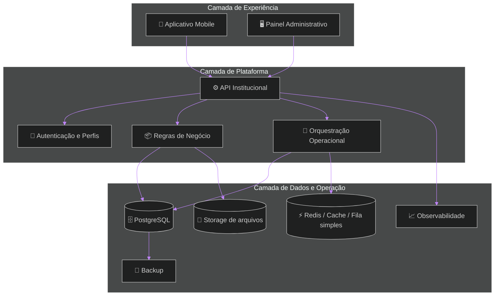
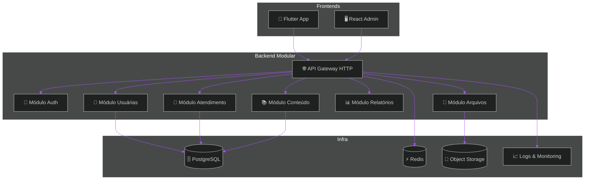
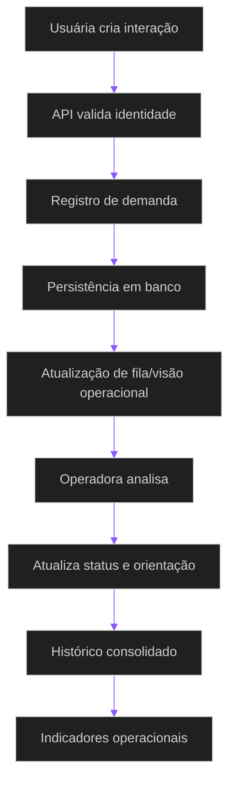
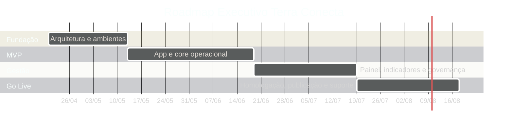

# 🚀 Terra Conecta — Proposta Institucional, Comercial e Técnica
## Plataforma digital enterprise para assistência técnica, gestão operacional, inteligência de dados e evolução comercial no ambiente rural

> [!IMPORTANT]
> O **Terra Conecta** foi concebido como uma plataforma institucional de transformação operacional para o ambiente rural, com foco em **adoção real**, **controle de execução**, **governança de informação** e **capacidade de expansão futura**.

> [!NOTE]
> Esta proposta parte de uma premissa objetiva: o projeto precisa caber em um orçamento realista, produzir ganho operacional perceptível e permanecer tecnicamente sustentável após o go live.

> [!TIP]
> A diretriz central desta proposta é simples: **menos complexidade desnecessária, mais valor operacional entregue com disciplina de escopo**.

---

# 📚 Sumário Navegável

1. [Resumo Executivo](#1-resumo-executivo)  
2. [Contexto Estratégico e Oportunidade](#2-contexto-estratégico-e-oportunidade)  
3. [Objetivos de Negócio](#3-objetivos-de-negócio)  
4. [Proposta de Valor](#4-proposta-de-valor)  
5. [Visão da Solução](#5-visão-da-solução)  
6. [Escopo Funcional Consolidado](#6-escopo-funcional-consolidado)  
7. [Requisitos Funcionais](#7-requisitos-funcionais)  
8. [Requisitos Não Funcionais](#8-requisitos-não-funcionais)  
9. [Regras de Negócio](#9-regras-de-negócio)  
10. [Perfis, Governança e Operação](#10-perfis-governança-e-operação)  
11. [Arquitetura Corporativa Recomendada](#11-arquitetura-corporativa-recomendada)  
12. [Diagramas Técnicos e Fluxos](#12-diagramas-técnicos-e-fluxos)  
13. [Stack Recomendada e Justificativas](#13-stack-recomendada-e-justificativas)  
14. [Matrizes Comparativas e de Decisão](#14-matrizes-comparativas-e-de-decisão)  
15. [Plano de Entrega, Marcos e Critérios](#15-plano-de-entrega-marcos-e-critérios)  
16. [Qualidade, Testes e Homologação](#16-qualidade-testes-e-homologação)  
17. [Custos Operacionais Estimados](#17-custos-operacionais-estimados)  
18. [Investimento Comercial](#18-investimento-comercial)  
19. [Riscos, Dependências e Mitigações](#19-riscos-dependências-e-mitigações)  
20. [Modelo de Sustentação Pós-Go-Live](#20-modelo-de-sustentação-pós-go-live)  
21. [Recomendação Executiva Final](#21-recomendação-executiva-final)  

---

# 1. Resumo Executivo

O **Terra Conecta** é uma plataforma digital voltada à estruturação da assistência técnica, do acompanhamento operacional e da geração de inteligência de gestão no ambiente rural, com foco especial na organização da jornada de atendimento de mulheres produtoras.

A proposta combina três camadas integradas:

- **aplicativo mobile** para atendimento, comunicação, mídia, histórico e relacionamento;
- **painel administrativo web** para gestão, triagem, conteúdo, indicadores e governança;
- **plataforma central** para segurança, regras de negócio, persistência, integrações e observabilidade.

## Resultado esperado desta fase

Ao final da implantação, a instituição passa a ter:

- um canal digital oficial e rastreável;
- histórico operacional centralizado;
- maior previsibilidade de atendimento;
- dados mínimos para gestão e priorização;
- base tecnológica confiável para evolução futura.

> [!IMPORTANT]
> O objetivo desta proposta não é criar um ecossistema inflado. É estabelecer um **núcleo digital institucionalmente confiável**, com entrega realista, boa governança e expansão posterior orientada por uso.

---

# 2. Contexto Estratégico e Oportunidade

Em operações rurais com atendimento distribuído, é comum encontrar:

- comunicação fragmentada entre equipes e usuárias;
- dependência de controles informais;
- dificuldade para consolidar histórico de atendimento;
- baixa rastreabilidade de demandas;
- ausência de indicadores operacionais confiáveis;
- dificuldade de escalar acompanhamento com consistência.

Esse cenário produz perda de contexto, retrabalho, baixa previsibilidade e pouca capacidade de leitura executiva da operação.

## Oportunidade institucional

O Terra Conecta endereça esse cenário por meio de uma estrutura digital que:

- converte interações dispersas em fluxo institucional;
- formaliza registros que hoje se perdem;
- reduz dependência de memória operacional;
- fortalece governança e accountability;
- cria base para novos produtos, relatórios e serviços digitais.

---

# 3. Objetivos de Negócio

## Objetivos centrais

1. **estruturar a operação** em torno de um fluxo digital oficial;
2. **reduzir perda de contexto** entre atendimentos;
3. **melhorar visibilidade gerencial** sobre demandas, uso e produtividade;
4. **permitir crescimento organizado** sem ruptura arquitetural;
5. **criar base institucional confiável** para novos serviços e integrações.

## Indicadores de sucesso esperados

- aumento do percentual de atendimentos registrados em plataforma;
- redução do tempo para localizar histórico de uma usuária;
- aumento da rastreabilidade de demandas e interações;
- disponibilidade de indicadores básicos de operação;
- redução de retrabalho administrativo.

---

# 4. Proposta de Valor

## Valor institucional

- profissionalização da operação;
- fortalecimento da governança;
- centralização de informação crítica;
- base tecnológica própria e reutilizável.

## Valor operacional

- padronização de atendimento;
- registro consistente de mídia e histórico;
- gestão mais eficiente da fila de demandas;
- menor dependência de planilhas e mensagens dispersas.

## Valor estratégico

- leitura consolidada da operação;
- insumos para priorização e tomada de decisão;
- base para evolução comercial e novos produtos;
- redução de risco na expansão futura.

> [!NOTE]
> O maior ativo gerado não é apenas o software. É a **capacidade institucional de operar com método, memória e visibilidade**.

---

# 5. Visão da Solução

A solução foi desenhada em arquitetura de **três frentes integradas**, com separação clara entre experiência de usuária, gestão institucional e núcleo transacional.

## Frentes entregues nesta fase

### 5.1 Aplicativo Mobile
Canal principal das usuárias finais para acesso, interação, envio de mídia, consulta de histórico e recebimento de conteúdo/notificações.

### 5.2 Painel Administrativo
Ferramenta de gestão institucional para operação, triagem, conteúdo, relatórios, usuários e permissões.

### 5.3 Plataforma Central
Camada responsável por segurança, APIs, regras, persistência, observabilidade e bases de integração futura.

---

# 6. Escopo Funcional Consolidado

## 6.1 Escopo do Aplicativo Mobile

### Acesso e identidade
- login seguro;
- recuperação de acesso;
- manutenção de sessão;
- perfil básico da usuária;
- consentimentos e aceite de uso.

### Onboarding e jornada inicial
- apresentação institucional;
- cadastro inicial orientado;
- captura de dados mínimos;
- organização inicial da jornada.

### Atendimento e relacionamento
- abertura de solicitações;
- registro de contexto;
- status básico de acompanhamento;
- visualização de interações anteriores.

### Mídia e evidências
- envio de fotos;
- envio de áudios;
- envio de vídeos;
- anexos vinculados ao histórico;
- visualização de mídias associadas à usuária.

### Conteúdo e orientação
- biblioteca de materiais;
- guias práticos;
- conteúdos educativos;
- categorização por tema.

### Comunicação e engajamento
- notificações push;
- alertas operacionais;
- comunicados institucionais;
- lembretes relevantes.

### Histórico
- linha do tempo individual;
- consultas anteriores;
- eventos importantes;
- continuidade de acompanhamento.

---

## 6.2 Escopo do Painel Administrativo

### Gestão de usuárias
- cadastro manual ou assistido;
- consulta e edição controlada;
- filtros por perfil, localidade, status e atividade;
- visão individual consolidada.

### Operação e atendimento
- triagem de demandas;
- acompanhamento de solicitações;
- atualização de status;
- priorização operacional;
- visão consolidada do funil.

### Conteúdo
- cadastro e atualização de materiais;
- organização por categoria;
- publicação controlada;
- ativação ou desativação de conteúdos.

### Indicadores
- métricas operacionais;
- dashboards executivos;
- relatórios resumidos;
- leitura por período.

### Segurança e governança
- perfis de acesso;
- permissões administrativas;
- rastreio de ações críticas;
- segregação mínima de responsabilidades.

---

## 6.3 Escopo da Plataforma Central

### Core transacional
- APIs REST;
- contratos versionáveis;
- persistência estruturada;
- regras de negócio centralizadas.

### Segurança
- autenticação;
- autorização por perfil;
- controle de sessão;
- proteção de rotas e operações críticas.

### Dados
- banco relacional principal;
- consistência transacional;
- rastreabilidade;
- guarda estruturada de histórico.

### Performance e estabilidade
- cache para leituras estratégicas;
- fila simples para rotinas assíncronas;
- armazenamento de arquivos;
- controle de erros e observabilidade.

### Operação
- logs centralizados;
- monitoramento básico;
- backup;
- pipeline de deploy;
- ambientes segregados.

---

# 7. Requisitos Funcionais

## 7.1 Requisitos do aplicativo

| ID | Requisito |
|---|---|
| RF-01 | A plataforma deve permitir autenticação segura da usuária. |
| RF-02 | A usuária deve conseguir recuperar acesso por fluxo controlado. |
| RF-03 | A usuária deve visualizar e atualizar dados básicos permitidos. |
| RF-04 | A usuária deve registrar solicitações e interações vinculadas ao seu histórico. |
| RF-05 | A usuária deve anexar imagens, áudios e vídeos às interações permitidas. |
| RF-06 | A usuária deve visualizar conteúdos publicados pela administração. |
| RF-07 | A usuária deve receber notificações relevantes da operação. |
| RF-08 | A usuária deve consultar sua linha do tempo básica de acompanhamento. |

## 7.2 Requisitos do painel

| ID | Requisito |
|---|---|
| RF-09 | A equipe deve conseguir cadastrar, localizar e atualizar usuárias. |
| RF-10 | A equipe deve visualizar demandas em lista e por status. |
| RF-11 | A equipe deve registrar movimentações relevantes no atendimento. |
| RF-12 | A equipe deve publicar e gerenciar conteúdos institucionais. |
| RF-13 | A equipe deve visualizar indicadores operacionais essenciais. |
| RF-14 | A plataforma deve registrar auditoria mínima de operações críticas. |
| RF-15 | A plataforma deve controlar acesso administrativo por perfil. |

## 7.3 Requisitos de plataforma

| ID | Requisito |
|---|---|
| RF-16 | A API deve expor contratos claros para mobile e painel. |
| RF-17 | A plataforma deve armazenar histórico e anexos associados à usuária. |
| RF-18 | A plataforma deve permitir processamento assíncrono de tarefas selecionadas. |
| RF-19 | A plataforma deve manter ambientes separados de desenvolvimento, homologação e produção. |
| RF-20 | A solução deve oferecer backup e observabilidade mínima operacional. |

---

# 8. Requisitos Não Funcionais

| ID | Categoria | Requisito |
|---|---|---|
| RNF-01 | Segurança | Dados devem ser acessíveis apenas conforme perfil e permissão. |
| RNF-02 | Segurança | Operações críticas devem ser auditáveis. |
| RNF-03 | Performance | Leituras principais devem responder com tempo adequado para uso cotidiano. |
| RNF-04 | Disponibilidade | A solução deve operar com boa confiabilidade para a rotina institucional. |
| RNF-05 | Manutenibilidade | Código, contratos e módulos devem ser organizados para evolução incremental. |
| RNF-06 | Escalabilidade | A arquitetura deve suportar crescimento controlado sem exigir ruptura imediata. |
| RNF-07 | Observabilidade | Erros relevantes e eventos operacionais devem ser rastreáveis. |
| RNF-08 | Backup | Dados e anexos críticos devem possuir política de backup adequada. |
| RNF-09 | Usabilidade | A experiência precisa ser simples para usuárias com variados níveis de familiaridade digital. |
| RNF-10 | Portabilidade | A solução deve permitir evolução futura para novas integrações e canais. |

> [!TIP]
> Nesta proposta, requisitos não funcionais não são acessórios. Eles são parte do valor institucional do projeto.

---

# 9. Regras de Negócio

## 9.1 Regras de cadastro e identidade
- cada usuária deve possuir um identificador único na plataforma;
- cadastros duplicados devem ser evitados por regras de validação e conferência operacional;
- alterações sensíveis de cadastro devem ficar restritas a perfis autorizados.

## 9.2 Regras de atendimento
- todo atendimento relevante deve ficar vinculado à usuária correspondente;
- movimentações de status devem respeitar fluxo operacional definido;
- toda interação relevante deve preservar data, responsável e contexto mínimo.

## 9.3 Regras de conteúdo
- conteúdos publicados devem possuir categoria, status e responsável editorial;
- somente perfis autorizados podem publicar ou retirar conteúdos do ar;
- alterações editoriais relevantes devem ser rastreáveis.

## 9.4 Regras de mídia
- anexos devem estar vinculados ao contexto operacional correto;
- arquivos inválidos, excessivos ou não suportados devem ser recusados;
- mídias devem obedecer política de retenção e acesso definida.

## 9.5 Regras de governança e aceite
- cada fase depende de critério de aceite objetivo;
- mudanças que alterem escopo, prazo ou custo devem ser formalizadas;
- backlog de evolução deve ser separado do escopo contratado;
- incidentes e riscos relevantes devem ser comunicados na governança periódica.

---

# 10. Perfis, Governança e Operação

## 10.1 Perfis principais

| Perfil | Responsabilidade principal |
|---|---|
| Usuária Final | Consumo da jornada, abertura de solicitações, consulta de histórico e conteúdos |
| Operadora | Atendimento, atualização de demandas, manutenção de registros |
| Gestora | Supervisão de operação, leitura de indicadores, priorização |
| Administradora | Gestão de acessos, parâmetros, conteúdos e visões críticas |

## 10.2 Modelo de governança

- **checkpoint semanal** para execução, riscos e pendências;
- **review quinzenal** para validação de fase e priorização;
- **backlog controlado** para solicitações novas;
- **registro de decisão** para mudanças relevantes;
- **aceite formal** por marco.

## 10.3 Princípios de operação

- simplicidade operacional antes de sofisticação;
- rastreabilidade acima de informalidade;
- dados confiáveis acima de automação prematura;
- evolução por uso real, não por hipótese excessiva.

---

# 11. Arquitetura Corporativa Recomendada

## Escolha arquitetural: monólito modular

A recomendação para este contexto é um **monólito modular**, com domínios separados internamente e infraestrutura preparada para crescimento gradual.

Essa escolha é a mais adequada para o estágio atual porque equilibra:

- custo de implantação;
- velocidade de entrega;
- previsibilidade operacional;
- simplicidade de manutenção;
- menor risco de arquitetura excessiva.

## Quando evoluir além disso

A adoção de microserviços só faria sentido quando houver:

- múltiplos times independentes;
- carga significativamente maior;
- necessidades muito distintas de escalabilidade;
- operação madura para observabilidade distribuída.

Nesta fase, antecipar esse movimento elevaria custo e risco sem benefício proporcional.

---

# 12. Diagramas Técnicos e Fluxos

## 12.1 Jornada da usuária final

## 12.2 Fluxo operacional do atendimento

## 12.3 Fluxo de conteúdo institucional

## 12.4 Fluxo de deploy e promoção entre ambientes

---

# 13. Stack Recomendada e Justificativas

## 13.1 Frontend mobile — Flutter
Recomendado para reduzir custo de desenvolvimento multi-plataforma, manter consistência visual e acelerar a evolução do aplicativo com base única.

## 13.2 Painel web — React
Adequado para interfaces administrativas, ecossistema amplo e boa produtividade em dashboards, formulários e gestão de estado.

## 13.3 Backend — NestJS
Recomendado por organização modular, alinhamento com TypeScript, clareza de contratos e melhor sustentação de crescimento por domínio.

## 13.4 Banco relacional — PostgreSQL
Adequado para dados transacionais, histórico estruturado, integridade e evolução segura do modelo relacional.

## 13.5 Cache e fila simples — Redis
Útil para leituras estratégicas, controle de sessões e rotinas assíncronas leves sem elevar complexidade.

## 13.6 Arquivos e mídias — Object Storage
Adoção de storage orientado a objetos para anexos, evidências e materiais de conteúdo, evitando sobrecarga no banco principal.

## 13.7 Push notifications — Firebase Cloud Messaging
Solução apropriada para envio de notificações móveis com baixa barreira de adoção.

## 13.8 Observabilidade
Logs, alertas e monitoramento devem existir desde o início, ainda que em configuração enxuta.

> [!NOTE]
> A pilha recomendada foi selecionada por equilíbrio entre **maturidade**, **custo**, **produtividade**, **manutenção** e **capacidade de expansão**.

---

# 14. Matrizes Comparativas e de Decisão

## 14.1 Matriz comparativa — Mobile

| Critério | Peso | Flutter | React Native | Nativo |
|---|---:|---:|---:|---:|
| Velocidade de entrega | 5 | 5 | 4 | 2 |
| Consistência visual | 4 | 5 | 4 | 5 |
| Reuso de código | 5 | 5 | 5 | 1 |
| Custo de manutenção | 5 | 5 | 4 | 2 |
| Performance percebida | 4 | 4 | 4 | 5 |
| Curva operacional do projeto | 3 | 4 | 4 | 2 |
| **Score ponderado** |  | **91** | **80** | **54** |

**Decisão:** Flutter.

---

## 14.2 Matriz comparativa — Backend

| Critério | Peso | NestJS | Laravel | Django |
|---|---:|---:|---:|---:|
| Estrutura modular | 5 | 5 | 4 | 4 |
| Tipagem/contratos | 5 | 5 | 3 | 3 |
| Produtividade API | 4 | 5 | 4 | 4 |
| Manutenção a médio prazo | 5 | 5 | 4 | 4 |
| Alinhamento com front moderno | 4 | 5 | 4 | 4 |
| Escalabilidade organizada | 4 | 5 | 4 | 4 |
| **Score ponderado** |  | **96** | **76** | **76** |

**Decisão:** NestJS.

---

## 14.3 Matriz comparativa — Banco

| Critério | Peso | PostgreSQL | MySQL | Firestore |
|---|---:|---:|---:|---:|
| Integridade relacional | 5 | 5 | 4 | 2 |
| Flexibilidade de consulta | 4 | 5 | 4 | 2 |
| Confiabilidade transacional | 5 | 5 | 4 | 2 |
| Escalabilidade controlada | 4 | 4 | 4 | 4 |
| Adequação ao domínio | 5 | 5 | 4 | 2 |
| **Score ponderado** |  | **91** | **76** | **44** |

**Decisão:** PostgreSQL.

---

## 14.4 Matriz comparativa — Arquitetura

| Critério | Peso | Monólito Modular | Microserviços | Serverless Extensivo |
|---|---:|---:|---:|---:|
| Custo inicial | 5 | 5 | 2 | 3 |
| Velocidade de entrega | 5 | 5 | 2 | 4 |
| Complexidade operacional | 5 | 5 | 1 | 3 |
| Observabilidade inicial | 4 | 4 | 2 | 3 |
| Evolução progressiva | 4 | 4 | 5 | 3 |
| Adequação ao porte do projeto | 5 | 5 | 2 | 3 |
| **Score ponderado** |  | **94** | **49** | **63** |

**Decisão:** Monólito modular.

---

## 14.5 Matriz de decisão executiva — stack final recomendada

| Camada | Opção recomendada | Motivo dominante |
|---|---|---|
| Mobile | Flutter | melhor equilíbrio entre velocidade, custo e consistência |
| Painel web | React | alta produtividade e ecossistema consolidado |
| Backend | NestJS | organização modular, TypeScript e contratos claros |
| Banco | PostgreSQL | integridade e aderência ao domínio transacional |
| Cache/Fila simples | Redis | suporte a performance e assíncrono enxuto |
| Mídias | Object Storage | melhor custo e escalabilidade para anexos |
| Push | Firebase Cloud Messaging | adoção simples e custo baixo |
| Observabilidade | stack enxuta de logs/monitoramento | controle operacional desde o início |

---

# 15. Plano de Entrega, Marcos e Critérios

## Estrutura de entrega

A proposta está organizada em **quatro fases**, cada uma com objetivo, entregáveis, critérios de aceite e janela de estabilização.

| Fase | Objetivo | Duração estimada |
|---|---|---|
| 1 | Fundação técnica e arquitetura operacional | 3 semanas + 2 dias |
| 2 | MVP funcional do app e core administrativo | 5 semanas + 2 dias |
| 3 | Gestão ampliada, indicadores e ajustes institucionais | 4 semanas + 2 dias |
| 4 | Homologação final, go live e suporte inicial | 4 semanas + 2 dias |

## 15.1 Fase 1 — Fundação técnica
**Entregáveis**
- arquitetura inicial implantada;
- ambientes principais configurados;
- autenticação base;
- estrutura modular do backend;
- persistência inicial;
- pipeline de deploy;
- observabilidade mínima.

**Critério de aceite**
- ambiente homologável;
- login funcional;
- base técnica apta à evolução das fases seguintes.

## 15.2 Fase 2 — MVP operacional
**Entregáveis**
- app mobile com jornada principal;
- cadastro e consulta de usuárias;
- registro de interações;
- anexos básicos;
- painel com visão inicial;
- conteúdo inicial publicado;
- notificações básicas.

**Critério de aceite**
- fluxo principal operacional do ponto de vista da usuária e da equipe.

## 15.3 Fase 3 — Gestão ampliada
**Entregáveis**
- indicadores essenciais;
- filtros operacionais;
- governança de perfis;
- relatórios resumidos;
- melhorias de UX;
- refinamentos de regras.

**Critério de aceite**
- operação gerencial utilizável com leitura básica de produtividade e acompanhamento.

## 15.4 Fase 4 — Go live e suporte inicial
**Entregáveis**
- homologação final;
- checklist de produção;
- treinamento orientado;
- publicação;
- suporte assistido pós-entrada.

**Critério de aceite**
- produção ativa com monitoramento e correção inicial controlada.

---

# 16. Qualidade, Testes e Homologação

## Estratégia de qualidade

- testes unitários nos componentes críticos;
- testes de integração nos fluxos principais;
- smoke tests por ambiente;
- validação funcional assistida;
- homologação guiada por checklist;
- go live monitorado.

## Foco de validação

1. autenticação e controle de acesso;  
2. cadastro e atualização de usuárias;  
3. registro de atendimento e histórico;  
4. upload e recuperação de anexos;  
5. painel e indicadores essenciais;  
6. estabilidade em ambiente de produção.  

## Critérios mínimos por marco
- ausência de falhas bloqueantes nos fluxos centrais;
- estabilidade aceitável em homologação;
- rastreio mínimo de erros;
- documentação operacional básica entregue.

> [!TIP]
> O esforço de qualidade deve ser concentrado nos fluxos que sustentam a rotina da operação, não em excesso de cobertura sem impacto prático.

---

# 17. Custos Operacionais Estimados

## Premissa
Os custos abaixo são **estimativas mensais projetadas** para uma operação inicial enxuta, com margem para crescimento controlado, considerando hospedagem, banco, armazenamento, notificações, monitoramento e rotinas essenciais.

### Cenário recomendado — operação inicial profissional

| Item | Faixa estimada |
|---|---:|
| Hospedagem backend / app services | R$ 180 a R$ 420 |
| Banco de dados gerenciado | R$ 150 a R$ 380 |
| Redis / cache / fila simples | R$ 60 a R$ 180 |
| Storage de arquivos e anexos | R$ 40 a R$ 180 |
| Monitoramento e logs | R$ 80 a R$ 250 |
| Backup e retenção | R$ 50 a R$ 150 |
| Domínio, e-mail transacional e serviços auxiliares | R$ 60 a R$ 180 |
| **Total mensal estimado** | **R$ 620 a R$ 1.740** |

### Cenário com folga operacional e maior observabilidade

| Item | Faixa estimada |
|---|---:|
| Infra principal reforçada | R$ 400 a R$ 850 |
| Banco e storage com maior margem | R$ 250 a R$ 600 |
| Observabilidade e backup ampliados | R$ 180 a R$ 420 |
| Serviços auxiliares | R$ 100 a R$ 250 |
| **Total mensal estimado** | **R$ 930 a R$ 2.120** |

## Leitura executiva
Para o porte desta fase, faz sentido trabalhar com **projeção prática entre R$ 900 e R$ 1.800/mês** como referência realista de operação estável, preservando margem para logs, storage, backup e crescimento moderado.

> [!IMPORTANT]
> O custo mensal não deve ser comprimido ao ponto de comprometer backup, monitoramento e disponibilidade. Economizar demais na base costuma gerar custo maior depois.

---

# 18. Investimento Comercial

# 💎 Investimento Proposto: **R$ 30.000,00**

## Distribuição recomendada por marco

| Marco | Percentual | Valor |
|---|---:|---:|
| Assinatura + Kickoff + descoberta orientada | 35% | R$ 10.500 |
| Entrega e aceite da Fase 1 | 20% | R$ 6.000 |
| Entrega e aceite da Fase 2 | 20% | R$ 6.000 |
| Entrega e aceite da Fase 3 | 15% | R$ 4.500 |
| Go Live + encerramento da implantação | 10% | R$ 3.000 |

## Motivos para esse modelo
- melhora equilíbrio de caixa entre execução e validação;
- reduz concentração excessiva no pagamento inicial;
- alinha pagamento a valor efetivamente entregue;
- cria governança comercial mais saudável.

## O que está incluído
- arquitetura e setup inicial;
- desenvolvimento do app, painel e backend dentro do escopo;
- homologação assistida;
- publicação e entrada inicial em produção;
- suporte inicial pós-go-live conforme janela acordada.

## O que não está incluído
- custos mensais de infraestrutura;
- expansão de escopo fora do contratado;
- integrações legadas não previstas;
- operação contínua prolongada após a implantação inicial.

---

# 19. Riscos, Dependências e Mitigações

## 19.1 Matriz de risco

| Risco | Probabilidade | Impacto | Nível | Mitigação |
|---|---|---|---|---|
| Crescimento não controlado de escopo | Alta | Alto | Crítico | backlog separado, aprovação formal e corte de escopo por fase |
| Atrasos por validação externa | Média | Alto | Alto | checkpoints frequentes, agenda de validação e buffer por fase |
| Adoção abaixo do esperado | Média | Alto | Alto | UX simples, treinamento e priorização do fluxo principal |
| Infra subdimensionada | Média | Médio | Médio | monitoramento, revisão mensal e margem de capacidade |
| Mudanças tardias de regra | Alta | Médio | Alto | congelamento por fase e governança de mudança |
| Dados incompletos/inconsistentes | Média | Médio | Médio | definição de dados mínimos e validação operacional |
| Dependência excessiva de pessoas-chave | Média | Alto | Alto | documentação mínima, registro de decisão e handoff claro |
| Publicação com pendências | Baixa | Alto | Médio | checklist de go live e homologação formal |

## 19.2 Dependências críticas
- definição ágil de responsáveis institucionais;
- validação tempestiva de fluxos e telas;
- disponibilidade de conteúdo inicial;
- clareza sobre política de uso e governança de dados;
- resposta adequada durante homologação.

## 19.3 Estratégia de mitigação executiva
- governança curta e frequente;
- escopo protegido;
- entrega por marcos;
- validação contínua em vez de validação tardia;
- documentação operacional mínima desde cedo.

---

# 20. Modelo de Sustentação Pós-Go-Live

## 20.1 Janela inicial recomendada
Após a entrada em produção, recomenda-se uma janela de estabilização com foco em:

- correções de maior prioridade;
- ajustes finos de operação;
- acompanhamento do uso;
- leitura de incidentes;
- coleta de oportunidades para fase futura.

## 20.2 Evoluções naturais após esta fase
- relatórios mais avançados;
- regras de automação mais robustas;
- integrações externas;
- analytics ampliado;
- módulos comerciais adicionais;
- capacidades inteligentes orientadas por dados reais.

## 20.3 Recomendação de continuidade
O projeto se beneficia de evolução em ciclos curtos, com priorização trimestral baseada em:

- uso efetivo;
- gargalos reais da operação;
- oportunidades de impacto;
- custo-benefício de cada incremento.

---

# 21. Recomendação Executiva Final

O **Terra Conecta** apresenta uma combinação tecnicamente adequada e financeiramente plausível para o momento institucional descrito.

## Síntese da recomendação

- **arquitetura correta para o estágio atual**;
- **escopo funcional relevante e realista**;
- **investimento compatível com uma implantação enxuta, porém profissional**;
- **capacidade concreta de elevar o nível de governança da operação**;
- **base sólida para expansão posterior sem desperdício inicial**.

## Conclusão objetiva

Com investimento de **R$ 30.000,00**, execução em fases, controle formal de escopo e operação inicial entre **R$ 900 e R$ 1.800/mês**, o projeto possui condições reais de gerar valor operacional, institucional e estratégico.

> [!IMPORTANT]
> O sucesso desta iniciativa dependerá menos de “adicionar mais funcionalidades” e mais de **executar com precisão o núcleo certo**, com disciplina de entrega, validação contínua e boa governança.

---

# 📎 Anexo Executivo — Decisão resumida

| Tema | Escolha |
|---|---|
| Estratégia de produto | MVP institucional com crescimento controlado |
| Mobile | Flutter |
| Painel | React |
| Backend | NestJS |
| Banco | PostgreSQL |
| Arquitetura | Monólito modular |
| Assíncrono leve | Redis |
| Mídias | Object Storage |
| Push | Firebase Cloud Messaging |
| Prazo | 16 a 18 semanas |
| Investimento | R$ 30.000,00 |
| Opex mensal sugerido | R$ 900 a R$ 1.800 |

