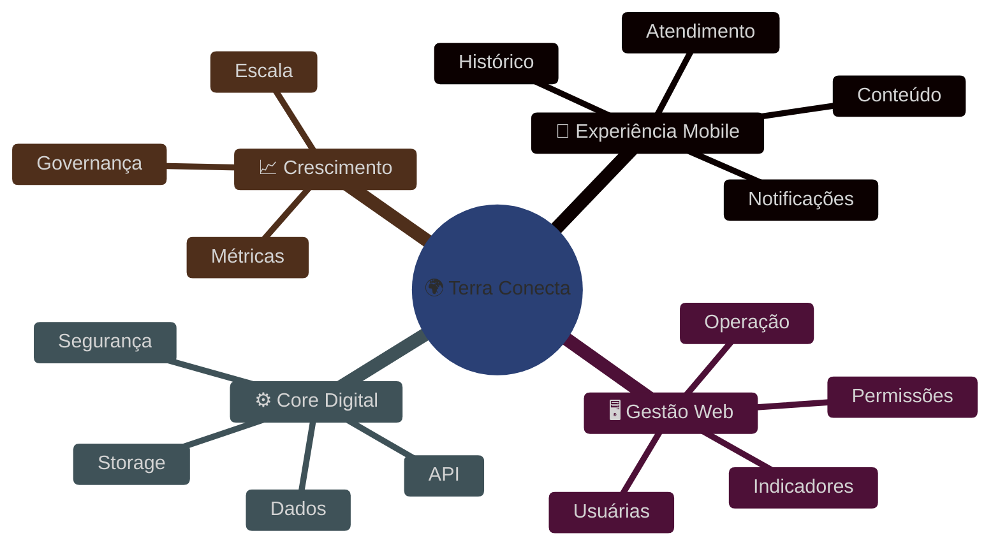
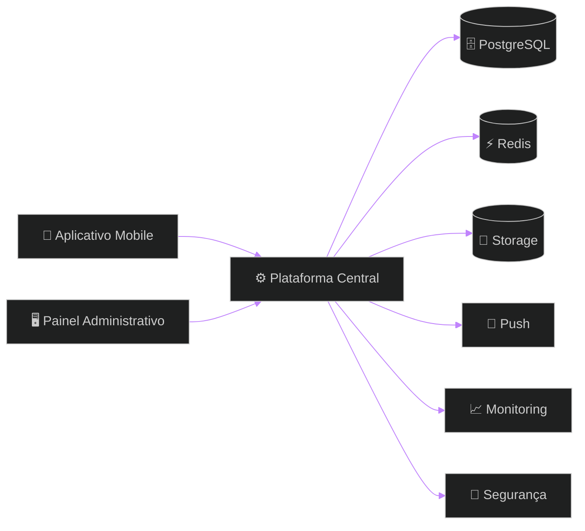
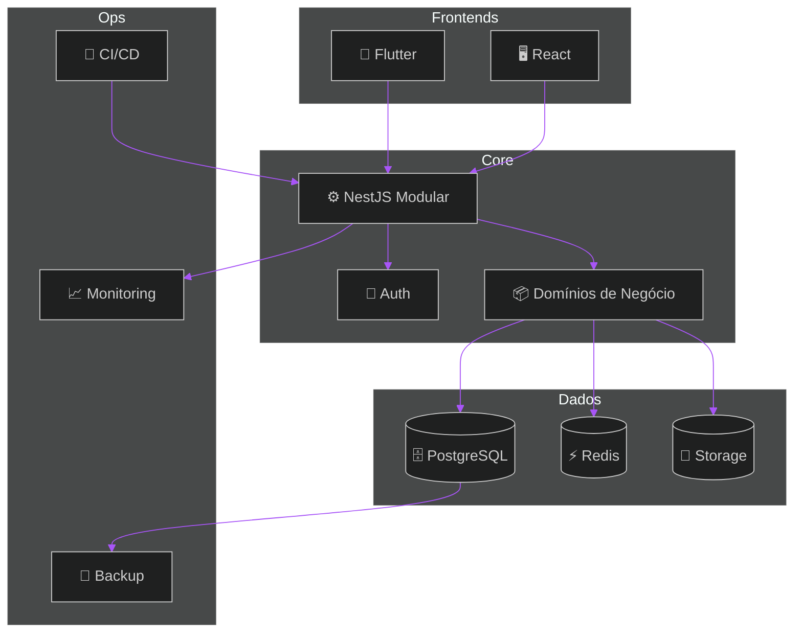
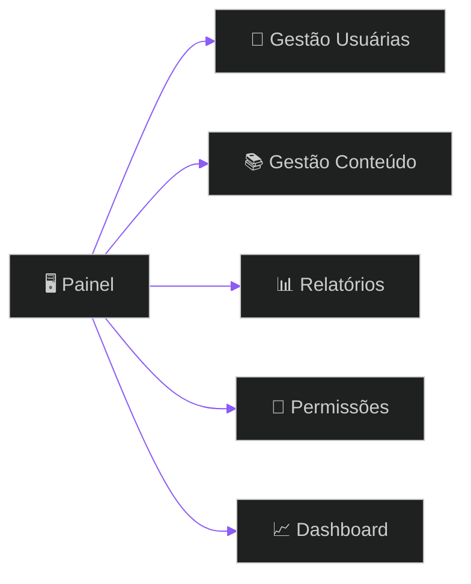
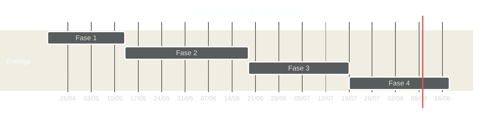

# 🚀 Terra Conecta — Proposta Institucional, Comercial e Técnica
## Plataforma digital enterprise para assistência técnica, gestão operacional, inteligência de dados e evolução comercial no ambiente rural

> [!IMPORTANT]
> O Terra Conecta foi estruturado para resolver gargalos operacionais reais com uma abordagem pragmática: **entregar valor concreto agora**, consolidar adoção e preparar a base tecnológica para ciclos futuros de expansão.

> [!NOTE]
> O objetivo desta proposta não é vender complexidade. É implantar uma solução robusta, sustentável e institucionalmente confiável.

> [!TIP]
> Projetos com maior taxa de sucesso iniciam com escopo controlado, boa governança e evolução guiada por uso real. Essa é a diretriz adotada nesta proposta.

---

# 📚 Sumário Executivo

1. Visão Estratégica  
2. Proposta de Valor  
3. Contexto Atual e Oportunidade  
4. Escopo Executivo da Solução  
5. Escopo Funcional Detalhado  
6. Fora de Escopo  
7. Arquitetura Corporativa Recomendada  
8. Diagramas Técnicos e Fluxos  
9. Matrizes Comparativas de Tecnologia  
10. Plano de Entrega e Cronograma  
11. Requisitos Funcionais  
12. Requisitos Não Funcionais  
13. Regras de Negócio e Governança  
14. Qualidade, Testes e Homologação  
15. Operação, Deploy e Sustentação  
16. Custos Operacionais  
17. Investimento Comercial  
18. Riscos e Mitigações  
19. Recomendação Final

---

# 1. Visão Estratégica

O **Terra Conecta** é uma plataforma digital desenhada para fortalecer mulheres produtoras rurais por meio de um ecossistema integrado de atendimento, gestão, conteúdo, rastreabilidade e oportunidades de crescimento.

A solução centraliza processos hoje descentralizados e transforma interações informais em fluxos estruturados, auditáveis e escaláveis.

## Impactos Esperados

- aumento da capacidade operacional;
- melhoria do acompanhamento individual;
- histórico confiável e consultável;
- gestão baseada em indicadores;
- comunicação mais eficiente;
- base sólida para novas frentes de negócio.

---

# 2. Proposta de Valor

## Valor Institucional
- profissionalização da operação;
- base tecnológica própria;
- capacidade de expansão organizada;
- melhoria de governança.

## Valor Operacional
- menos retrabalho;
- menos perda de contexto;
- processos padronizados;
- visibilidade da execução.

## Valor Estratégico
- dados para decisão;
- capacidade de priorização;
- evolução orientada por evidência;
- novas oportunidades digitais futuras.

> [!IMPORTANT]
> O principal ativo gerado pelo projeto não é apenas o software. É a capacidade operacional estruturada que ele viabiliza.

---

# 3. Contexto Atual e Oportunidade

## Cenário recorrente sem plataforma dedicada

- atendimento espalhado em canais diversos;
- histórico fragmentado;
- ausência de indicadores consolidados;
- baixa previsibilidade;
- dependência excessiva de controle manual;
- dificuldade de escala institucional.

## Oportunidade imediata

Com o Terra Conecta, a operação passa a contar com:

- canal oficial digital;
- rastreabilidade de interações;
- base única de dados;
- gestão ativa;
- visão executiva;
- evolução tecnológica planejada.

---

# 4. Escopo Executivo da Solução

A solução será composta por três frentes integradas.

## Frentes Entregues

### 📱 Aplicativo Mobile
Canal principal das usuárias finais.

### 🖥️ Painel Administrativo
Camada de gestão institucional e operacional.

### ⚙️ Plataforma Central
Núcleo de regras, integrações, persistência e segurança.

---

# 5. Escopo Funcional Detalhado

# 📱 Aplicativo Mobile

## Módulos previstos

### Acesso e Identidade
- login seguro;
- recuperação de acesso;
- sessão autenticada;
- perfil básico.

### Jornada Inicial
- onboarding simplificado;
- apresentação orientada;
- entrada guiada.

### Atendimento
- abertura de solicitações;
- registro de contexto;
- acompanhamento básico.

### Mídia
- envio de foto;
- envio de áudio;
- envio de vídeo;
- histórico de anexos.

### Conteúdo
- biblioteca de materiais;
- guias práticos;
- materiais educativos.

### Comunicação
- notificações push;
- alertas operacionais;
- comunicados relevantes.

### Histórico
- linha do tempo individual;
- consultas anteriores;
- continuidade de acompanhamento.

---

# 🖥️ Painel Administrativo

## Módulos previstos

### Gestão de Usuárias
- cadastro;
- consulta;
- atualização;
- filtros básicos.

### Gestão Operacional
- acompanhamento de demandas;
- visão consolidada;
- organização de rotinas.

### Conteúdo
- cadastro de materiais;
- atualização de conteúdos;
- publicação controlada.

### Indicadores
- dashboards executivos;
- relatórios operacionais;
- métricas essenciais.

### Segurança
- perfis de acesso;
- permissões;
- segregação administrativa.

---

# ⚙️ Plataforma Central

## Capacidades previstas

### Core API
- APIs REST;
- contratos claros;
- versionamento evolutivo.

### Segurança
- autenticação;
- autorização;
- controle de acesso;
- boas práticas de proteção.

### Dados
- persistência relacional;
- consistência;
- rastreabilidade.

### Performance
- cache;
- filas simples;
- respostas eficientes.

### Operação
- logs;
- monitoramento;
- backup;
- deploy contínuo.

> [!NOTE]
> Todo o escopo foi desenhado para ser funcional, sustentável e compatível com o investimento proposto. Recursos avançados podem ser incorporados em ondas futuras.

---

# 6. Fora de Escopo

Itens não contemplados nesta fase:

- marketplace transacional avançado;
- BI corporativo avançado;
- IA generativa embarcada;
- ERP rural completo;
- integrações legadas extensas;
- IoT e sensores de campo;
- automações comerciais complexas;
- multiempresa avançado;
- offline enterprise completo;
- customizações extensas não previstas.

> [!IMPORTANT]
> O fora de escopo protege o projeto. Sem essa disciplina, custo, prazo e qualidade se deterioram rapidamente.

---

# 7. Arquitetura Corporativa Recomendada

## Escolha Central: Monólito Modular

A melhor relação custo-benefício para este estágio é um **monólito modular**, organizado por domínios e preparado para expansão futura.

## Benefícios

- menor custo inicial;
- maior velocidade de entrega;
- manutenção simplificada;
- menos sobrecarga operacional;
- observabilidade centralizada;
- menor risco arquitetural.

---

# 8. Diagramas Técnicos e Fluxos

## Jornada da Usuária

## Fluxo Administrativo

## Fluxo de Deploy

---

# 9. Matrizes Comparativas de Tecnologia

## Mobile

| Critério | Flutter | React Native | Resultado |
|---|---:|---:|---|
| Performance | 9 | 7 | Flutter |
| Consistência UI | 9 | 8 | Flutter |
| Reuso | 10 | 10 | Empate |
| Produtividade | 9 | 9 | Empate |
| Manutenção | 9 | 8 | Flutter |
| Total | **46** | **42** | **Escolha: Flutter** |

## Backend

| Critério | NestJS | Laravel | Resultado |
|---|---:|---:|---|
| Organização | 10 | 8 | NestJS |
| Tipagem | 10 | 6 | NestJS |
| Escala | 9 | 8 | NestJS |
| Contratos | 10 | 7 | NestJS |
| Total | **39** | **29** | **Escolha: NestJS** |

## Banco

| Critério | PostgreSQL | MySQL | Resultado |
|---|---:|---:|---|
| Robustez | 10 | 8 | PostgreSQL |
| Recursos | 9 | 7 | PostgreSQL |
| Crescimento | 9 | 8 | PostgreSQL |
| Total | **28** | **23** | **Escolha: PostgreSQL** |

## Arquitetura

| Critério | Monólito Modular | Microserviços | Resultado |
|---|---:|---:|---|
| Custo Inicial | 10 | 4 | Monólito |
| Velocidade | 10 | 5 | Monólito |
| Operação | 9 | 5 | Monólito |
| Complexidade | 9 | 4 | Monólito |
| Evolução Futura | 8 | 9 | Microserviços |
| Total | **46** | **27** | **Escolha: Monólito Modular** |

---

# 10. Plano de Entrega e Cronograma

| Fase | Objetivo | Prazo |
|---|---|---|
| 1 | Fundação Técnica | 3 semanas + 2 dias |
| 2 | MVP Operacional | 5 semanas + 2 dias |
| 3 | Gestão + Comercial | 4 semanas + 2 dias |
| 4 | Go Live + Suporte | 4 semanas + 2 dias |

---

# 11. Requisitos Funcionais

- autenticação;
- gestão de usuárias;
- atendimento técnico;
- upload de mídia;
- histórico;
- conteúdo;
- produtos;
- relatórios;
- dashboard;
- notificações;
- perfis e permissões;
- painel administrativo.

# 12. Requisitos Não Funcionais

- segurança;
- performance;
- disponibilidade;
- backup;
- observabilidade;
- escalabilidade controlada;
- manutenibilidade;
- boa experiência de uso;
- rastreabilidade.

---

# 13. Regras de Negócio e Governança

## Regras

- cada usuária possui histórico próprio;
- ações relevantes devem ser registradas;
- acesso administrativo é controlado por perfil;
- conteúdos dependem de governança;
- entregas dependem de aceite formal;
- mudanças relevantes impactam prazo/custo.

## Governança

- checkpoint semanal;
- review quinzenal;
- backlog priorizado;
- decisões formalizadas;
- gestão de risco contínua.

---

# 14. Qualidade, Testes e Homologação

## Estratégia

- testes funcionais;
- integração;
- regressão;
- smoke test;
- staging;
- homologação assistida;
- go live monitorado.

> [!TIP]
> O foco é testar profundamente o que sustenta o negócio, e não dispersar esforço em cenários de baixo impacto.

---

# 15. Operação, Deploy e Sustentação

## Operação prevista

- logs centralizados;
- monitoramento;
- backup recorrente;
- acompanhamento pós go live;
- correções críticas iniciais.

## Ambientes

- desenvolvimento;
- staging;
- produção.

---

# 16. Custos Operacionais

| Item | Valor Médio |
|---|---:|
| Cloud / API | R$ 650 |
| Banco | R$ 400 |
| Storage | R$ 180 |
| Monitoramento | R$ 270 |
| Backup | R$ 120 |
| Diversos | R$ 80 |
| **Total Médio** | **R$ 1.700/mês** |

---

# 17. Investimento Comercial

# 💎 R$ 30.000,00

| Marco | Percentual | Valor |
|---|---:|---:|
| Assinatura + Kickoff | 50% | R$ 15.000 |
| Aprovação Fase 1 | 15% | R$ 4.500 |
| Aprovação Fase 2 | 15% | R$ 4.500 |
| Aprovação Fase 3 | 10% | R$ 3.000 |
| Go Live | 10% | R$ 3.000 |

> [!NOTE]
> O valor considera entrega completa do escopo proposto, com organização técnica, governança e entrada assistida em produção.

---

# 18. Riscos e Mitigações

| Risco | Impacto | Mitigação |
|---|---|---|
| Crescimento de escopo | Alto | controle formal |
| Atrasos externos | Médio | buffers e replanejamento |
| Baixa adoção | Alto | validação contínua |
| Infra inadequada | Médio | monitoramento |
| Mudanças tardias | Alto | gestão de mudanças |

---

# 19. Recomendação Final

O **Terra Conecta** apresenta uma combinação rara entre:

- valor institucional;
- viabilidade financeira;
- arquitetura correta para o momento;
- escopo realista;
- capacidade de expansão futura.

## Síntese Final

Com investimento de **R$ 30.000,00**, execução em fases e disciplina de escopo, o projeto possui alto potencial de gerar resultado concreto e posicionar a operação em um novo nível de maturidade digital.

> [!IMPORTANT]
> O sucesso não dependerá de adicionar mais funcionalidades. Dependerá de executar com excelência o que realmente importa nesta fase.

