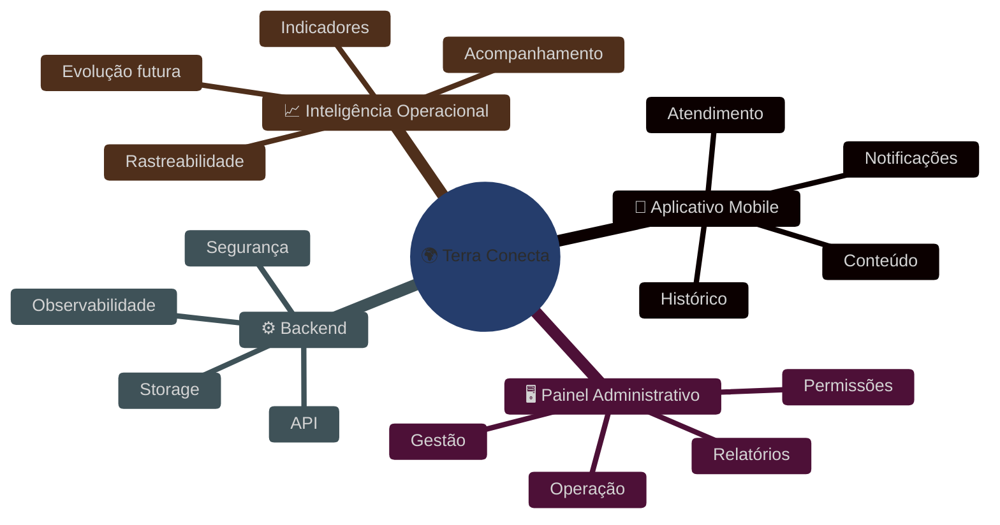
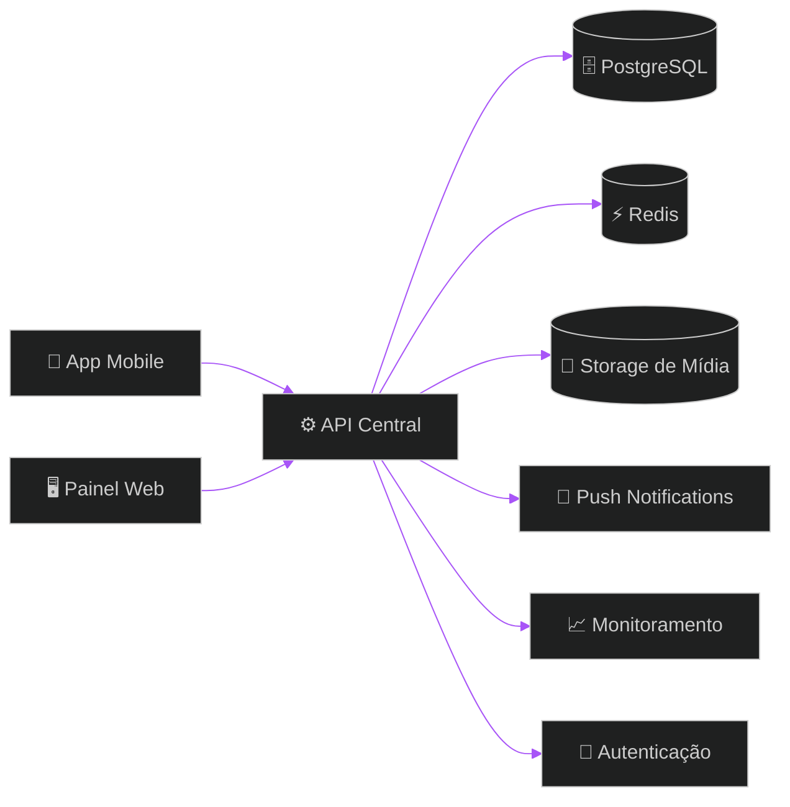
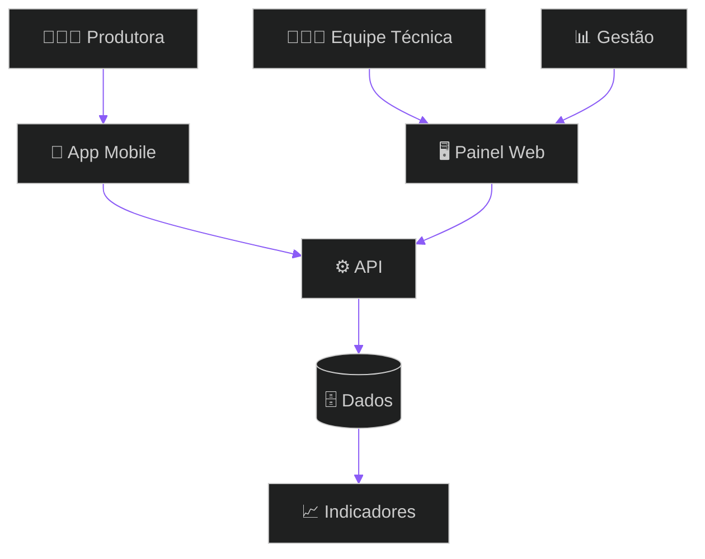
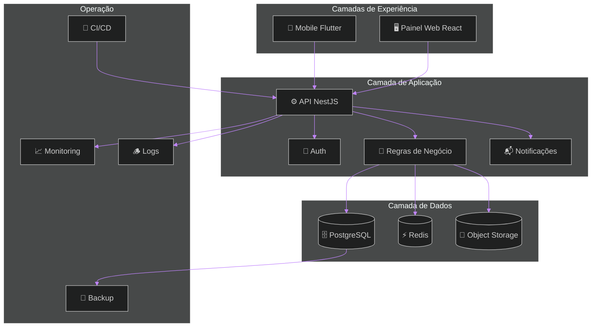
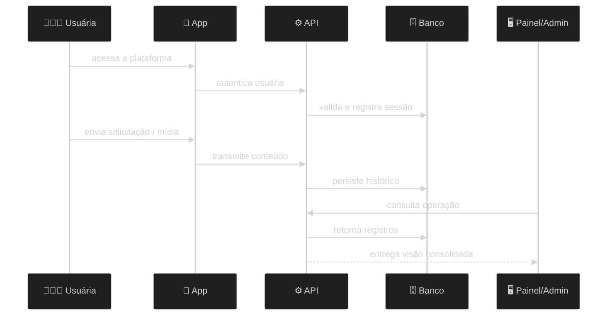
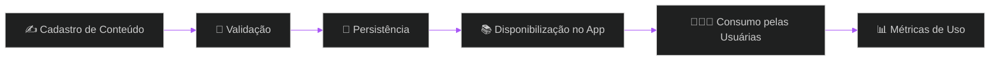
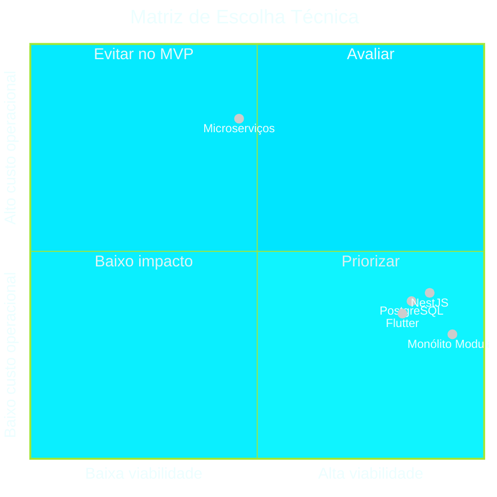
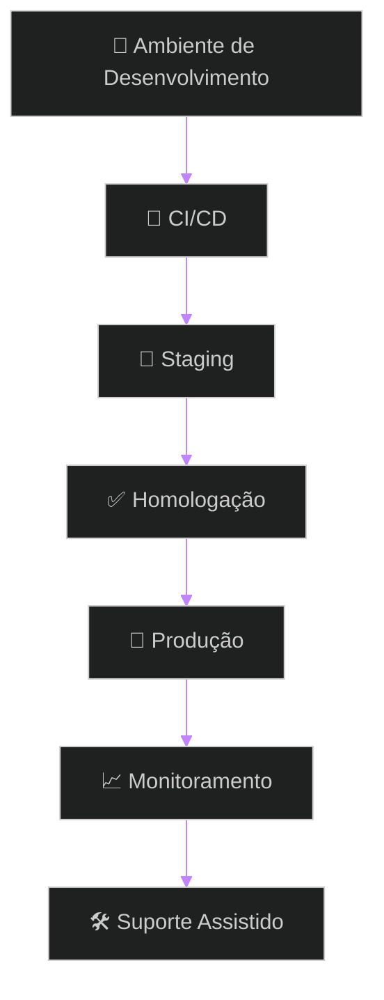
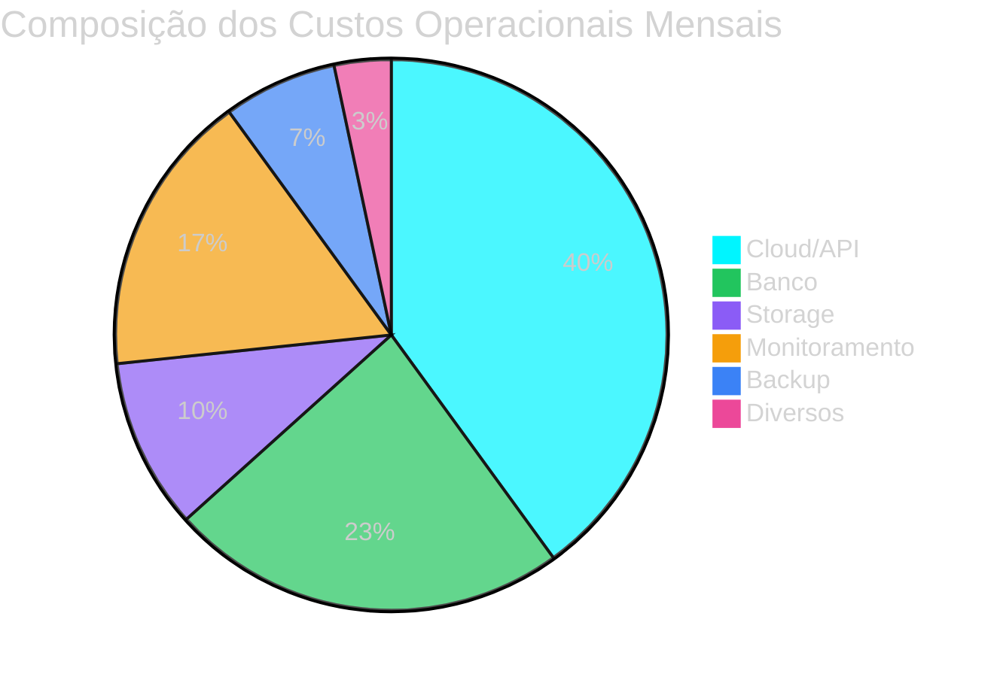

# 🚀 Terra Conecta — Proposta Institucional, Comercial e Técnica
## Plataforma digital para fortalecimento produtivo, assistência técnica, gestão operacional e evolução comercial no contexto rural

> [!IMPORTANT]
> Esta proposta foi estruturada para equilibrar **viabilidade comercial**, **execução realista**, **robustez técnica** e **clareza de evolução futura**, evitando arquitetura prematura, escopo inflado e custo incompatível com a realidade de implantação.

> [!NOTE]
> O documento foi elaborado com foco em **apresentação institucional**, **contratação**, **tomada de decisão executiva** e **alinhamento técnico-comercial**.

> [!TIP]
> A recomendação central é executar o projeto em **fases controladas**, com **aceite formal por etapa**, preservando prazo, previsibilidade financeira e foco no que gera valor imediato para operação e adoção.

---

# 📚 Sumário Navegável

- [1. Visão Estratégica](#1-visão-estratégica)
- [2. Resumo Executivo](#2-resumo-executivo)
- [3. Contexto do Problema e Oportunidade](#3-contexto-do-problema-e-oportunidade)
- [4. Objetivos da Solução](#4-objetivos-da-solução)
- [5. Escopo Geral do Produto](#5-escopo-geral-do-produto)
- [6. Escopo Detalhado por Frente](#6-escopo-detalhado-por-frente)
- [7. Fora de Escopo](#7-fora-de-escopo)
- [8. Público-Alvo e Perfis de Uso](#8-público-alvo-e-perfis-de-uso)
- [9. Jornada Operacional da Plataforma](#9-jornada-operacional-da-plataforma)
- [10. Arquitetura Recomendada](#10-arquitetura-recomendada)
- [11. Diagramas Técnicos e Fluxos](#11-diagramas-técnicos-e-fluxos)
- [12. Comparativos Técnicos e Matrizes de Escolha](#12-comparativos-técnicos-e-matrizes-de-escolha)
- [13. Plano de Entrega por Fases](#13-plano-de-entrega-por-fases)
- [14. Requisitos Funcionais](#14-requisitos-funcionais)
- [15. Requisitos Não Funcionais](#15-requisitos-não-funcionais)
- [16. Regras de Negócio](#16-regras-de-negócio)
- [17. Qualidade, Testes e Homologação](#17-qualidade-testes-e-homologação)
- [18. Deploy, Operação e Sustentação](#18-deploy-operação-e-sustentação)
- [19. Estimativas de Custos Operacionais](#19-estimativas-de-custos-operacionais)
- [20. Investimento do Projeto e Condição Comercial](#20-investimento-do-projeto-e-condição-comercial)
- [21. Governança do Projeto](#21-governança-do-projeto)
- [22. Riscos e Mitigações](#22-riscos-e-mitigações)
- [23. Premissas, Dependências e Limites](#23-premissas-dependências-e-limites)
- [24. Recomendação Final](#24-recomendação-final)

---

# 1. Visão Estratégica

O **Terra Conecta** é uma plataforma digital concebida para fortalecer a atuação de mulheres produtoras rurais por meio de um ecossistema integrado de:

- atendimento técnico;
- organização operacional;
- comunicação estruturada;
- distribuição de conteúdo;
- rastreabilidade de histórico;
- indicadores gerenciais;
- ativação comercial progressiva.

A proposta não se limita a um aplicativo. Trata-se de uma **base digital institucional** capaz de transformar rotinas hoje dispersas, manuais e pouco auditáveis em um fluxo estruturado, mensurável e escalável.

## Visão de Valor

A plataforma tem potencial para:

- ampliar alcance técnico sem ampliação proporcional da carga manual;
- reduzir perda de histórico e retrabalho;
- gerar base de dados para decisão;
- profissionalizar atendimento e acompanhamento;
- estruturar jornada digital com possibilidade de evolução futura.

---

# 2. Resumo Executivo

## Entregáveis Principais

- **Aplicativo mobile** com foco inicial em Android
- **Painel administrativo web**
- **Backend/API central**
- **Banco de dados relacional**
- **Gestão de mídia e anexos**
- **Dashboards e relatórios operacionais**
- **Infraestrutura em nuvem**
- **Observabilidade, backup e base de continuidade**

## Prazo Global

**16 a 18 semanas**, considerando:
- execução por fases;
- validações intermediárias;
- janela de testes;
- adendo operacional de **+2 dias por fase**.

## Investimento Fixo

# 💎 **R$ 28.800,00**

## Modelo de Pagamento

| Marco | Percentual | Valor |
|---|---:|---:|
| Assinatura + Kickoff | 50% | R$ 14.400,00 |
| Aprovação Fase 1 | 15% | R$ 4.320,00 |
| Aprovação Fase 2 | 15% | R$ 4.320,00 |
| Aprovação Fase 3 | 10% | R$ 2.880,00 |
| Go Live / Encerramento | 10% | R$ 2.880,00 |

> [!IMPORTANT]
> O valor foi dimensionado para caber em uma realidade comercial mais aderente ao contexto do projeto, mantendo entrega séria, organizada e tecnicamente sustentável, porém com disciplina rigorosa de escopo.

---

# 3. Contexto do Problema e Oportunidade

## Situação Atual

Hoje, operações semelhantes ao contexto do Terra Conecta costumam sofrer com:

- comunicação pulverizada em múltiplos canais;
- ausência de histórico consolidado por usuária;
- baixa rastreabilidade de atendimentos;
- dificuldade de priorização operacional;
- dependência elevada de esforço humano manual;
- inexistência de indicadores consistentes;
- pouca governança de conteúdo e acompanhamento;
- baixa previsibilidade para expansão.

## Consequências Diretas

- retrabalho recorrente;
- perda de contexto;
- dificuldade de medir impacto;
- redução da qualidade de atendimento;
- limitação de escala;
- gestão reativa, não orientada por dados.

## Oportunidade

A digitalização proposta pelo Terra Conecta permite construir uma operação com:

- histórico persistente;
- visão centralizada;
- jornada mais organizada;
- relacionamento mais contínuo com usuárias;
- dados para tomada de decisão;
- base institucional para crescimento.

---

# 4. Objetivos da Solução

## Objetivo Principal

Disponibilizar uma plataforma digital funcional, realista e sustentável para estruturar a relação entre equipe gestora/técnica e produtoras rurais, criando uma base operacional com potencial de expansão.

## Objetivos Específicos

- centralizar interações e histórico;
- padronizar fluxos essenciais;
- habilitar distribuição de conteúdo;
- registrar evidências operacionais por mídia;
- organizar visão administrativa;
- oferecer leitura gerencial da operação;
- criar base tecnológica para evolução comercial.

---

# 5. Escopo Geral do Produto

## Macroescopo

O produto será composto por três frentes principais:

### 5.1 Aplicativo Mobile
Canal primário de uso para as produtoras, com foco em praticidade, acessibilidade e continuidade operacional.

### 5.2 Painel Web Administrativo
Camada de gestão para equipe interna, com visão operacional, governança de conteúdo, acompanhamento e indicadores.

### 5.3 Plataforma Backend
Base central de integração, persistência, autenticação, lógica de negócio, relatórios e infraestrutura.

---

# 6. Escopo Detalhado por Frente

## 6.1 📱 Aplicativo Mobile

### Funcionalidades previstas
- login e autenticação;
- onboarding inicial simplificado;
- perfil básico da usuária;
- atendimento técnico digital;
- envio de fotos;
- envio de áudios;
- envio de vídeos;
- histórico individual de interações;
- biblioteca de conteúdo;
- guias e materiais educativos;
- notificações push;
- visualização de produtos e informações associadas;
- experiência orientada a mobile first.

### Diretrizes de produto
- simplicidade de navegação;
- foco em poucos fluxos bem resolvidos;
- redução de fricção operacional;
- legibilidade e clareza visual;
- preparação para futura ampliação funcional.

## 6.2 🖥️ Painel Administrativo Web

### Funcionalidades previstas
- gestão de usuárias;
- gestão de conteúdos;
- acompanhamento operacional;
- visualização de demandas;
- administração de perfis e permissões;
- consultas de histórico;
- relatórios básicos;
- dashboards operacionais;
- visão comercial inicial;
- apoio a governança da operação.

### Diretrizes de gestão
- visão consolidada;
- rastreabilidade;
- redução de informalidade;
- base para auditoria e acompanhamento.

## 6.3 ⚙️ Plataforma Backend

### Componentes previstos
- API central REST;
- autenticação e autorização;
- banco de dados relacional;
- gestão de mídia/anexos;
- filas e cache;
- logs e rastreamento;
- backups;
- monitoramento;
- pipelines de deploy;
- base para evolução futura.

### Diretrizes técnicas
- monólito modular;
- separação clara por domínio;
- segurança básica bem resolvida;
- observabilidade suficiente para produção;
- custo operacional controlado.

---

# 7. Fora de Escopo

Para preservar prazo, custo e viabilidade real do projeto, **não estão contemplados nesta proposta**, salvo contratação complementar:

- marketplace completo com meios de pagamento transacionais avançados;
- motor de recomendação com IA generativa embarcada;
- atendimento omnichannel completo com integrações profundas em múltiplos provedores;
- BI corporativo avançado;
- ERP rural;
- integração com hardware de campo/IoT;
- operação offline complexa com sincronização total bidirecional;
- multiempresa/multitenancy sofisticado;
- aplicativo iOS como prioridade inicial de lançamento, caso impacte o cronograma base;
- trilha extensa de automação comercial avançada;
- integração extensa com sistemas legados não mapeados;
- esteira regulatória complexa além do necessário para o MVP.

> [!NOTE]
> A exclusão desses itens não reduz o valor do projeto. Ela protege a execução. A estratégia correta é consolidar um **MVP operacional forte**, validar uso real e só então ampliar camadas de sofisticação.

---

# 8. Público-Alvo e Perfis de Uso

## Perfis principais

| Perfil | Papel | Necessidade Principal |
|---|---|---|
| Produtora rural | Usuária final do app | acesso simples, suporte, histórico, conteúdo |
| Equipe técnica | Atendimento e orientação | acompanhamento, registro, evidência |
| Gestão administrativa | Controle da operação | visão consolidada, relatórios, governança |
| Coordenação institucional | Decisão e expansão | indicadores, previsibilidade, base de escala |

## Mapa de Perfis

---

# 9. Jornada Operacional da Plataforma

## Fluxo macro de uso

## Leitura operacional

1. A usuária acessa a plataforma com autenticação simples e segura.  
2. Realiza sua entrada e navega pelos fluxos centrais.  
3. Pode solicitar apoio, registrar contexto e anexar mídia.  
4. A operação registra histórico e organiza continuidade.  
5. Conteúdos e orientações ficam acessíveis de forma estruturada.  
6. A equipe administrativa acompanha, organiza e mede a operação.

---

# 10. Arquitetura Recomendada

## Decisão Arquitetural Central

A recomendação é um **monólito modular**, com separação por domínios funcionais, evitando microserviços ou arquitetura distribuída prematura.

## Justificativas

- menor custo de implantação;
- menor custo de manutenção;
- velocidade superior de entrega;
- simplicidade de observabilidade;
- menos atrito operacional;
- melhor adequação ao orçamento;
- evolução futura possível sem recomeço.

> [!IMPORTANT]
> Para este porte de projeto, distribuir a arquitetura cedo demais tende a gerar custo, complexidade e atraso sem contrapartida real de valor.

## Camadas propostas

- **Frontend Mobile**
- **Frontend Web Administrativo**
- **API / Regras de Negócio**
- **Persistência**
- **Storage**
- **Infraestrutura Operacional**
- **Monitoramento e Backup**

---

# 11. Diagramas Técnicos e Fluxos

## 11.1 Arquitetura Lógica

## 11.2 Fluxo de Atendimento e Registro

## 11.3 Fluxo de Publicação de Conteúdo

## 11.4 Fluxo de Deploy

---

# 12. Comparativos Técnicos e Matrizes de Escolha

## 12.1 Matriz — Tecnologia Mobile

| Critério | Flutter | React Native | Observação |
|---|---:|---:|---|
| Performance | 9 | 7 | Flutter tende a oferecer maior consistência |
| Padronização visual | 9 | 8 | Widgets mais controlados |
| Reuso futuro | 10 | 10 | Ambos entregam bom reaproveitamento |
| Produtividade | 9 | 9 | Ambos são viáveis |
| Manutenção | 9 | 8 | Menor variação de comportamento visual |
| Curva operacional | 8 | 8 | Equilíbrio prático |
| Total | **54** | **50** | **Flutter recomendado** |

## 12.2 Matriz — Backend

| Critério | NestJS | Laravel | Observação |
|---|---:|---:|---|
| Organização por módulos | 10 | 8 | NestJS favorece arquitetura mais previsível |
| Tipagem | 10 | 6 | TS traz ganhos relevantes |
| Escalabilidade de código | 9 | 8 | Melhor encaixe para domínio em crescimento |
| Clareza de contratos | 10 | 7 | DTOs e interfaces mais explícitos |
| Integração com frontend moderno | 9 | 8 | Boa sinergia com stack JS/TS |
| Total | **48** | **37** | **NestJS recomendado** |

## 12.3 Matriz — Banco de Dados

| Critério | PostgreSQL | MySQL | Observação |
|---|---:|---:|---|
| Integridade e robustez | 10 | 8 | PostgreSQL é mais sólido para crescimento |
| Recursos analíticos | 9 | 7 | Melhor capacidade futura |
| Flexibilidade de modelagem | 9 | 8 | Bom equilíbrio entre estrutura e expansão |
| Confiabilidade operacional | 9 | 8 | Forte maturidade |
| Total | **37** | **31** | **PostgreSQL recomendado** |

## 12.4 Matriz — Arquitetura

| Critério | Monólito Modular | Microserviços | Observação |
|---|---:|---:|---|
| Custo inicial | 10 | 4 | Monólito é muito mais aderente |
| Velocidade de entrega | 10 | 5 | Menor sobrecarga estrutural |
| Operação | 9 | 5 | Menos componentes para sustentar |
| Observabilidade | 9 | 6 | Mais simples e centralizada |
| Evolução futura | 8 | 9 | Microserviços ganham só em estágio mais maduro |
| Total | **46** | **29** | **Monólito modular recomendado** |

## 12.5 Matriz — Hospedagem

| Critério | Cloud Gerenciada | VPS Convencional | Observação |
|---|---:|---:|---|
| Tempo de implantação | 9 | 7 | Cloud gerenciada acelera setup |
| Resiliência | 9 | 6 | Serviços gerenciados reduzem risco |
| Escalabilidade | 9 | 6 | Melhor elasticidade |
| Complexidade operacional | 8 | 5 | Menor fricção para equipe enxuta |
| Custo bruto | 7 | 9 | VPS pode ser mais barata, mas menos segura/fluida |
| Total | **42** | **33** | **Cloud gerenciada recomendada** |

## 12.6 Quadro Consolidado de Escolhas

| Frente | Escolha Recomendada | Justificativa |
|---|---|---|
| Mobile | Flutter | melhor consistência visual e performance |
| Painel Web | React | alta produtividade e maturidade |
| Backend | NestJS | organização, tipagem e boa evolução |
| Banco | PostgreSQL | robustez e boa perspectiva de crescimento |
| Cache/Fila | Redis | simplicidade e eficiência |
| Storage | Object Storage | baixo custo e boa adequação para mídia |
| Arquitetura | Monólito modular | custo-benefício superior no estágio atual |

---

# 13. Plano de Entrega por Fases

## Visão Geral

| Fase | Objetivo | Prazo Base | Adendo Operacional | Prazo Final |
|---|---|---|---|---|
| Fase 1 | Fundação Técnica | 3 semanas | +2 dias | 3 semanas + 2 dias |
| Fase 2 | MVP Operacional | 5 semanas | +2 dias | 5 semanas + 2 dias |
| Fase 3 | Comercial + Gestão | 4 semanas | +2 dias | 4 semanas + 2 dias |
| Fase 4 | Go Live, Homologação e Suporte Assistido | 4 semanas | +2 dias | 4 semanas + 2 dias |

## Linha de Evolução

## Fase 1 — Fundação Técnica

### Entregas
- definição e setup da arquitetura;
- estrutura backend;
- estrutura painel web;
- estrutura app mobile;
- autenticação inicial;
- banco de dados base;
- pipeline inicial;
- ambientes e organização técnica.

### Resultado esperado
Base pronta para construção funcional consistente.

## Fase 2 — MVP Operacional

### Entregas
- fluxos centrais de atendimento;
- envio e gestão de anexos;
- histórico persistente;
- biblioteca de conteúdos;
- notificações;
- fluxos principais do uso real.

### Resultado esperado
Produto já utilizável em cenário controlado.

## Fase 3 — Comercial + Gestão

### Entregas
- catálogo/produtos;
- visão comercial básica;
- dashboards;
- relatórios;
- gestão administrativa mais madura;
- governança operacional.

### Resultado esperado
Camada gerencial e de expansão mais estruturada.

## Fase 4 — Go Live, Homologação e Suporte Assistido

### Entregas
- refinamentos finais;
- testes de homologação;
- preparação para publicação;
- apoio à entrada em produção;
- treinamento básico;
- suporte assistido inicial.

### Resultado esperado
Entrada em produção com acompanhamento e segurança operacional.

> [!TIP]
> O fracionamento por fases reduz risco, protege caixa, melhora aceitação do projeto e permite validar aderência com o uso real antes de ampliar escopo.

---

# 14. Requisitos Funcionais

| Código | Requisito | Descrição |
|---|---|---|
| RF-01 | Autenticação | acesso seguro ao sistema |
| RF-02 | Gestão de Usuárias | cadastro, consulta e atualização |
| RF-03 | Atendimento Técnico | registro e acompanhamento de interações |
| RF-04 | Upload de Mídia | envio de foto, áudio e vídeo |
| RF-05 | Histórico | visualização de registros anteriores |
| RF-06 | Conteúdo | biblioteca de materiais e orientações |
| RF-07 | Produtos | registro e visualização de itens/produtos |
| RF-08 | Relatórios | consultas e extração de indicadores |
| RF-09 | Dashboard | visão consolidada da operação |
| RF-10 | Notificações | comunicação ativa com usuárias |
| RF-11 | Gestão de Perfis | níveis de acesso e permissão |
| RF-12 | Painel Administrativo | gestão operacional central |

---

# 15. Requisitos Não Funcionais

| Código | Requisito | Descrição |
|---|---|---|
| RNF-01 | Segurança | autenticação, proteção de dados e acesso controlado |
| RNF-02 | Performance | tempo de resposta adequado para uso cotidiano |
| RNF-03 | Escalabilidade | base preparada para crescimento controlado |
| RNF-04 | Backup | políticas mínimas de restauração e proteção |
| RNF-05 | Observabilidade | logs, monitoramento e rastreabilidade |
| RNF-06 | Manutenibilidade | código organizado e sustentável |
| RNF-07 | Disponibilidade | operação estável em produção |
| RNF-08 | Usabilidade | foco em simplicidade de uso |
| RNF-09 | Auditabilidade | rastreabilidade mínima de ações relevantes |

---

# 16. Regras de Negócio

## Regras Estruturantes

- cada usuária deve possuir registro individual identificável;
- interações relevantes devem permanecer consultáveis em histórico;
- conteúdos publicados devem seguir governança administrativa;
- upload de mídia deve respeitar limites técnicos definidos;
- acessos administrativos devem ser segregados por perfil;
- notificações devem obedecer regras de uso e pertinência operacional;
- relatórios devem refletir dados persistidos e não informação informal;
- entregas fora do escopo não entram automaticamente no projeto;
- mudanças significativas dependem de reavaliação de prazo e custo.

## Regras de Operação

- aceite formal encerra cada fase;
- backlog evolutivo não altera automaticamente contrato vigente;
- validações de homologação precisam ocorrer em janela combinada;
- dependências externas podem impactar datas e priorização;
- decisões de escopo precisam de registro formal.

---

# 17. Qualidade, Testes e Homologação

## Estratégia de Qualidade

A qualidade será tratada como prática contínua ao longo do ciclo, e não apenas como etapa final.

## Camadas previstas

- testes funcionais;
- testes de integração;
- testes de regressão;
- smoke test pós deploy;
- homologação assistida;
- checklist de go live.

## Etapas de validação

| Etapa | Objetivo |
|---|---|
| Validação interna | verificar consistência técnica |
| Staging | validar comportamento integrado |
| Homologação | validar aderência operacional |
| Go Live assistido | acompanhar entrada em produção |

> [!NOTE]
> Em projetos de orçamento enxuto, a melhor estratégia não é “testar tudo infinitamente”, e sim testar de forma inteligente o que sustenta os fluxos críticos de operação.

---

# 18. Deploy, Operação e Sustentação

## Estratégia de Deploy

### Ambientes recomendados
- desenvolvimento;
- staging/homologação;
- produção.

### Pipeline proposto
- versionamento em repositório;
- revisão de código;
- pipeline automatizado;
- deploy em ambiente de homologação;
- validação;
- publicação controlada em produção.

## Itens operacionais previstos

- monitoramento básico;
- logs centralizados;
- rotina mínima de backup;
- observação de falhas críticas;
- suporte assistido inicial após publicação.

## Plano de Produção

## Sustentação inicial

- monitoramento de incidentes críticos;
- acompanhamento inicial de estabilidade;
- correções pontuais de entrada em produção;
- apoio de transição para uso real.

---

# 19. Estimativas de Custos Operacionais

## Estimativa mensal média

| Item | Valor Médio |
|---|---:|
| Cloud / API | R$ 600,00 |
| Banco de Dados | R$ 350,00 |
| Storage de Mídia | R$ 150,00 |
| Monitoramento / Logs | R$ 250,00 |
| Backup | R$ 100,00 |
| Serviços diversos | R$ 50,00 |
| **Total Médio** | **R$ 1.500,00 / mês** |

## Observações

- custos podem variar conforme volume de uso;
- anexos e mídia são os fatores de maior sensibilidade de crescimento;
- ambiente inicial deve ser dimensionado de forma conservadora;
- expansão futura pode exigir revisão da estrutura de custos.

## Faixa anual estimada

| Cenário | Custo Médio Mensal | Custo Anual Aproximado |
|---|---:|---:|
| Conservador | R$ 1.300,00 | R$ 15.600,00 |
| Base | R$ 1.500,00 | R$ 18.000,00 |
| Expansão inicial | R$ 2.100,00 | R$ 25.200,00 |

---

# 20. Investimento do Projeto e Condição Comercial

## Investimento fechado

# 💎 **R$ 28.800,00**

## Distribuição financeira

| Etapa | Percentual | Valor |
|---|---:|---:|
| Assinatura + Kickoff | 50% | R$ 14.400,00 |
| Entrega e aceite Fase 1 | 15% | R$ 4.320,00 |
| Entrega e aceite Fase 2 | 15% | R$ 4.320,00 |
| Entrega e aceite Fase 3 | 10% | R$ 2.880,00 |
| Go Live / Encerramento | 10% | R$ 2.880,00 |

## Leitura comercial

Este modelo:
- protege início do projeto;
- permite fluxo de caixa de execução;
- reduz risco contratual;
- vincula pagamento a entregas concretas;
- preserva equilíbrio entre custo e responsabilidade.

## Regras comerciais

- alterações fora do escopo serão orçadas à parte;
- aceite formal por fase é obrigatório;
- custos de terceiros não estão incluídos, salvo acordo expresso;
- atrasos por dependências externas podem impactar o cronograma;
- mudanças estruturais relevantes podem exigir replanejamento.

---

# 21. Governança do Projeto

## Modelo proposto

- checkpoint semanal;
- review quinzenal;
- backlog priorizado;
- registro formal de decisões;
- aceite por fase;
- acompanhamento de riscos;
- gestão de mudanças.

## Ritual mínimo recomendado

| Ritual | Frequência | Objetivo |
|---|---|---|
| Checkpoint executivo | semanal | visibilidade de andamento |
| Review funcional | quinzenal | validação incremental |
| Aceite de fase | por etapa | controle formal de entrega |
| Revisão de backlog | recorrente | priorização e ajustes |

---

# 22. Riscos e Mitigações

| Risco | Probabilidade | Impacto | Mitigação |
|---|---|---|---|
| Crescimento indevido de escopo | Alta | Alto | controle formal por fase |
| Atrasos por dependências externas | Média | Médio | planejamento com folga e validação antecipada |
| Baixa adoção inicial | Média | Alto | validação contínua com usuárias |
| Infra subdimensionada | Média | Médio | monitoramento e ajustes graduais |
| Excesso de personalização precoce | Alta | Alto | manter MVP disciplinado |
| Falhas de conteúdo/processo | Média | Médio | governança e revisão operacional |

---

# 23. Premissas, Dependências e Limites

## Premissas
- disponibilidade mínima da equipe decisora;
- validações dentro dos prazos combinados;
- acesso a insumos de conteúdo e operação;
- definição razoável de prioridades;
- aceite formal ao final das fases.

## Dependências
- disponibilidade de contas e acessos;
- disponibilidade de infraestrutura;
- disponibilidade de equipe para homologação;
- organização de conteúdo institucional;
- alinhamento sobre regras operacionais essenciais.

## Limites
- orçamento exige foco em MVP disciplinado;
- expansão excessiva compromete custo e cronograma;
- funcionalidades sofisticadas devem ficar para onda posterior;
- integrações externas relevantes precisam de avaliação específica.

> [!IMPORTANT]
> O sucesso desta proposta depende menos de “colocar tudo” e mais de **selecionar bem o que entra agora**. A disciplina de escopo é parte central da viabilidade do projeto.

---

# 24. Recomendação Final

## Estratégia Recomendada

- adotar execução em fases;
- priorizar mobile first;
- construir MVP funcional e rastreável;
- estruturar base administrativa sólida;
- operar com arquitetura simples e robusta;
- evoluir conforme uso real, não por antecipação.

## Síntese Executiva Final

O **Terra Conecta** é plenamente viável dentro do investimento proposto **desde que conduzido com rigor de escopo, governança de entrega, validação progressiva e foco no valor operacional imediato**.

A combinação de:
- aplicativo mobile,
- painel administrativo,
- backend estruturado,
- banco de dados relacional,
- storage,
- monitoramento,
- relatórios e governança mínima,

forma uma base realista, consistente e institucionalmente apresentável para colocar a operação em outro patamar de organização e capacidade de crescimento.

> [!TIP]
> A melhor versão desta proposta não é a mais “grandiosa” no papel. É a que consegue ser **entregue de verdade**, adotada de verdade e evoluída com segurança após o uso real.

---

## ✅ Conclusão

Esta proposta posiciona o **Terra Conecta** como uma iniciativa:
- tecnicamente sólida;
- comercialmente plausível;
- visualmente apresentável;
- operacionalmente viável;
- estrategicamente escalável.

