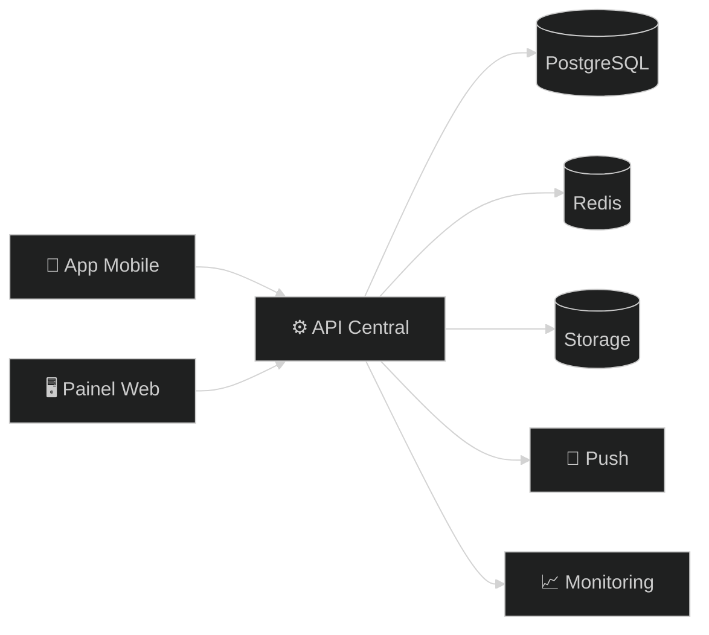
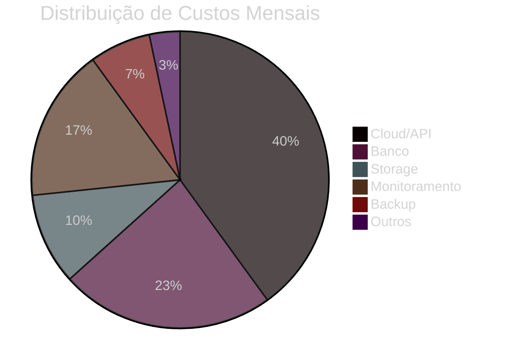

# 🚀 Terra Conecta — Proposta Institucional, Comercial e Técnica (Versão Executiva Enterprise)

> Documento executivo para apresentação institucional, contratação, captação e tomada de decisão.  
> Estruturado para equilibrar **viabilidade comercial**, **robustez técnica** e **execução realista**.

---

# 🌍 Visão Estratégica

O **Terra Conecta** é uma plataforma digital orientada ao fortalecimento de mulheres produtoras rurais, conectando atendimento técnico, gestão operacional, conteúdo, inteligência de dados e oportunidades de mercado em um único ecossistema digital.

Mais do que um aplicativo, trata-se de uma base tecnológica para escala sustentável.

---

# 📌 Resumo Executivo

## Entregáveis
- Aplicativo Mobile (Android prioritário)
- Painel Administrativo Web
- Backend / API Central
- Banco de Dados Estruturado
- Relatórios e Dashboards
- Infraestrutura em Nuvem
- Observabilidade e Backup
- Base pronta para evolução futura

## Prazo Total
**16 a 18 semanas**  
(com adendo operacional de +2 dias por fase)

## Investimento
# 💎 R$ 28.800,00

## Modelo de Pagamento

| Marco | Percentual | Valor |
|---|---:|---:|
| Assinatura + Kickoff | 50% | R$ 14.400 |
| Aprovação Fase 1 | 15% | R$ 4.320 |
| Aprovação Fase 2 | 15% | R$ 4.320 |
| Aprovação Fase 3 | 10% | R$ 2.880 |
| Go Live | 10% | R$ 2.880 |

---

# 🎯 Problema de Negócio

## Cenário Atual
- atendimento descentralizado;
- histórico pulverizado em canais informais;
- baixa previsibilidade operacional;
- pouca mensuração de resultados;
- dificuldade de expansão;
- dependência manual elevada.

## Resultado Esperado
- operação rastreável;
- gestão baseada em dados;
- maior alcance técnico;
- padronização operacional;
- canal comercial digital;
- redução de retrabalho.

---

# 🧩 Escopo Macro da Solução

## 📱 Aplicativo Mobile
- login seguro;
- onboarding simplificado;
- atendimento técnico;
- envio de fotos, áudio e vídeo;
- notificações push;
- biblioteca de conteúdos;
- guia prático;
- cadastro de produtos;
- histórico individual.

## 🖥️ Painel Administrativo
- gestão de usuários;
- gestão de conteúdos;
- dashboards;
- relatórios;
- visão operacional;
- permissões e perfis;
- visão comercial básica.

## ⚙️ Backend / Plataforma
- autenticação;
- API REST;
- banco relacional;
- storage;
- filas/cache;
- logs;
- backup;
- deploy contínuo;
- observabilidade.

---

# 🛠️ Plano de Entrega por Fases

| Fase | Objetivo | Prazo Base | Adendo | Prazo Final |
|---|---|---|---|---|
| 1 | Fundação Técnica | 3 semanas | +2 dias | 3s +2d |
| 2 | MVP Operacional | 5 semanas | +2 dias | 5s +2d |
| 3 | Comercial + Gestão | 4 semanas | +2 dias | 4s +2d |
| 4 | Go Live | 4 semanas | +2 dias | 4s +2d |

## Fluxo Evolutivo

## Fase 1 — Fundação Técnica
- arquitetura base;
- setup ambientes;
- autenticação;
- banco inicial;
- CI/CD;
- estrutura mobile/web.

## Fase 2 — MVP Operacional
- atendimento;
- anexos;
- notificações;
- histórico;
- conteúdos;
- fluxos principais.

## Fase 3 — Comercial + Gestão
- catálogo;
- produtos;
- relatórios;
- dashboards;
- gestão administrativa.

## Fase 4 — Go Live
- homologação;
- treinamento;
- publicação;
- suporte assistido.

---

# 🧠 Decisão Arquitetural

Para este porte de projeto, recomenda-se **monólito modular**.

## Motivos
- menor custo inicial;
- entrega mais rápida;
- manutenção simplificada;
- governança centralizada;
- permite futura extração de módulos.

---

# ⚖️ Matriz Tecnológica

## Mobile

| Critério | Flutter | React Native |
|---|---:|---:|
| Performance | 9 | 7 |
| Reuso | 10 | 10 |
| UI Consistente | 9 | 8 |
| Manutenção | 9 | 8 |
| Total | **37** | **33** |

## Backend

| Critério | NestJS | Laravel |
|---|---:|---:|
| Organização | 10 | 8 |
| Tipagem | 10 | 6 |
| Escala | 9 | 8 |
| Total | **29** | **22** |

## Banco

| Critério | PostgreSQL | MySQL |
|---|---:|---:|
| Integridade | 10 | 8 |
| Recursos | 10 | 8 |
| Escala | 9 | 8 |
| Total | **29** | **24** |

---

# 💰 Custos Operacionais Estimados

| Item | Valor Médio |
|---|---:|
| Cloud / API | R$ 600 |
| Banco | R$ 350 |
| Storage | R$ 150 |
| Monitoramento | R$ 250 |
| Backup | R$ 100 |
| Serviços diversos | R$ 50 |
| **Total Médio** | **R$ 1.500/mês** |

---

# 🧪 Qualidade e Testes

- testes funcionais;
- integração;
- regressão;
- homologação;
- smoke test;
- checklist go-live.

## Diretriz
Qualidade distribuída ao longo do projeto, não concentrada no final.

---

# 📐 Requisitos Funcionais

| Código | Descrição |
|---|---|
| RF-01 | Autenticação |
| RF-02 | Gestão de usuários |
| RF-03 | Atendimento técnico |
| RF-04 | Upload de mídia |
| RF-05 | Histórico |
| RF-06 | Conteúdo |
| RF-07 | Produtos |
| RF-08 | Relatórios |
| RF-09 | Push notifications |

# ⚙️ Requisitos Não Funcionais

| Código | Descrição |
|---|---|
| RNF-01 | Segurança |
| RNF-02 | Performance |
| RNF-03 | Escalabilidade |
| RNF-04 | Backup |
| RNF-05 | Observabilidade |
| RNF-06 | Código manutenível |

---

# 🏛️ Governança

- checkpoint semanal;
- review quinzenal;
- backlog priorizado;
- aceite por fase;
- gestão de riscos;
- canal formal de decisões.

---

# 📉 Riscos e Mitigação

| Risco | Impacto | Mitigação |
|---|---|---|
| Escopo crescer | Alto | controle por fase |
| Dependência externa | Médio | replanejamento |
| Baixa adoção | Alto | validação contínua |
| Infra instável | Médio | monitoramento |

---

# 🔐 Regras Comerciais

- itens fora do escopo serão orçados separadamente;
- cada fase depende de aceite formal;
- custos de terceiros não inclusos salvo acordo;
- mudanças estruturais podem impactar prazo;
- suporte inicial incluso no encerramento.

---

# 🏁 Recomendação Final

## Estratégia
- entrega em fases;
- MVP disciplinado;
- mobile first;
- arquitetura simples e sólida;
- evolução guiada por uso real.

## Síntese
O **Terra Conecta** é viável dentro do orçamento proposto quando executado com disciplina de escopo, validação contínua e foco em valor imediato.
